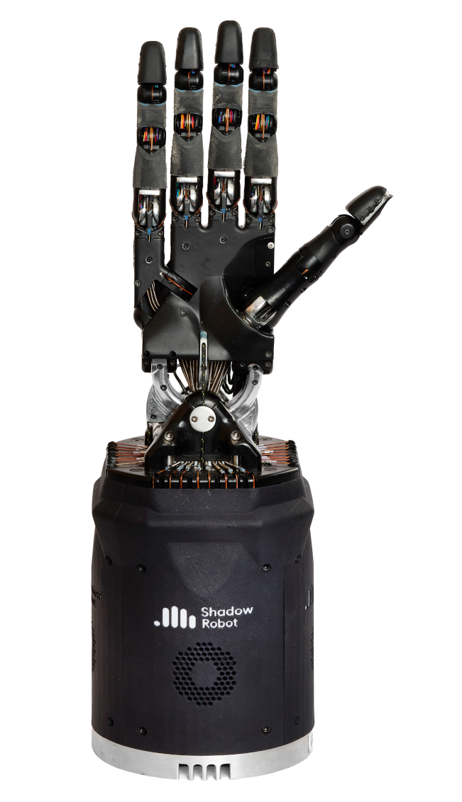

Dexterous Hand documentation
============================

Preface
--------

This is the starting point for the Shadow Dexterous Hand Documentation.
The Shadow Dexterous Hand is an advanced humanoid robot hand system that provides 24
movements to reproduce as closely as possible the kinematics and dexterity of the human hand. It
has been designed to provide comparable force output and movement precision to the human hand.
Shadow Hand systems have been used for research in grasping, manipulation, neural control, brain
computer interface, industrial quality control, and hazardous material handling.

The Shadow Dexterous Hand is a self-contained system - all actuation and sensing is built into the
hand and forearm. All versions of the Hand use an EtherCAT bus (Ethernet for Control Automation Technology),
providing a 100Mbps Ethernet-based communications field-bus, and full integration into ROS
(Robot Operating System).

The Hands use Shadow's electric “Smart Motor” actuation system and integrates force and position
control electronics, motor drive electronics, motor, gearbox, force sensing and communications into
a compact module, 20 of which are packed into the Hand base.

Overview
--------

* :doc:`/user_guide/ov_pelicase_contents`
* :doc:`/user_guide/ov_laptopbox_contents`
* :doc:`/user_guide/ov_abbreviations`

.. toctree::
   :maxdepth: 2
   :hidden:
   :caption: Overview
   
   user_guide/ov_pelicase_contents
   user_guide/ov_laptopbox_contents
   user_guide/ov_abbreviations

   
Setting up the hand
--------------------

* :doc:`/user_guide/sh_connecting_cables`
* :doc:`/user_guide/sh_desktop_icons`
* :doc:`/user_guide/sh_mounting_hand_arm`
* :doc:`/user_guide/sh_launching_hand`
* :doc:`/user_guide/sh_lights`
* :doc:`/user_guide/sh_uploading_logs`
   
.. toctree::
   :maxdepth: 2
   :hidden:
   :caption: Setting up the hand
   
   user_guide/sh_connecting_cables
   user_guide/sh_desktop_icons
   user_guide/sh_mounting_hand_arm
   user_guide/sh_launching_hand
   user_guide/sh_lights
   user_guide/sh_uploading_logs
   
Simulation
--------------------------------

* :doc:`/user_guide/sim_gazebo`

.. toctree::
   :maxdepth: 2
   :hidden:
   :caption: Simulation
   
   user_guide/sim_gazebo

Software description
---------------------

* :doc:`/user_guide/sd_first_time_users`
* :doc:`/user_guide/sd_controling_hand`
* :doc:`/user_guide/sd_accesing_data`
* :doc:`/user_guide/sd_user_interface`
* :doc:`/user_guide/sd_command_line`
* :doc:`/user_guide/sd_repositories`
* :doc:`/user_guide/sd_robot_commander`
* :doc:`/user_guide/sd_saving_states`
* :doc:`/user_guide/sd_autodetection`
* :doc:`/user_guide/sd_robot_description`
* :doc:`/user_guide/sd_fingertips`
* :doc:`/user_guide/sd_firmware`
   
.. toctree::
   :maxdepth: 2
   :hidden:
   :caption: Software description
   
   user_guide/sd_first_time_users
   user_guide/sd_controling_hand
   user_guide/sd_accesing_data
   user_guide/sd_user_interface
   user_guide/sd_command_line
   user_guide/sd_repositories
   user_guide/sd_robot_commander
   user_guide/sd_saving_states
   user_guide/sd_autodetection
   user_guide/sd_robot_description
   user_guide/sd_fingertips
   user_guide/sd_firmware

Mechanical description
-----------------------------------

* :doc:`/user_guide/md_dimensions`
* :doc:`/user_guide/md_kinematics`
* :doc:`/user_guide/md_finger`
* :doc:`/user_guide/md_thumb`
* :doc:`/user_guide/md_wrist`
* :doc:`/user_guide/md_ranges`
* :doc:`/user_guide/md_position_sensors`
* :doc:`/user_guide/md_motor_unit`
* :doc:`/user_guide/md_motor_layout`
   
.. toctree::
   :maxdepth: 2
   :hidden:
   :caption: Mechanical description

   user_guide/md_dimensions
   user_guide/md_kinematics
   user_guide/md_finger
   user_guide/md_thumb
   user_guide/md_wrist
   user_guide/md_ranges
   user_guide/md_position_sensors
   user_guide/md_motor_unit
   user_guide/md_motor_layout

Electrical description
-----------------------------------

* :doc:`user_guide/ed_chipset`
* :doc:`user_guide/ed_dataflow`
* :doc:`user_guide/ed_control_description`
   
.. toctree::
   :maxdepth: 2
   :hidden:
   :caption: Electrical description

   user_guide/ed_chipset
   user_guide/ed_dataflow
   user_guide/ed_control_description
   
Connectors and Pinouts
-----------------------------------

* :doc:`user_guide/cp_external_connectors`
* :doc:`user_guide/cp_internal_connectors`

.. toctree::
   :maxdepth: 2
   :hidden:
   :caption: Connectors and Pinouts

   user_guide/cp_external_connectors
   user_guide/cp_internal_connectors
   
Maintaining the system
-----------------------

* :doc:`/user_guide/mh_mechanical_maintenance`
* :doc:`/user_guide/mh_electronic_maintenance`
* :doc:`/user_guide/mh_re_installing_the_software`

.. toctree::
   :maxdepth: 2
   :hidden:
   :caption: Maintaining the hand
   
   user_guide/mh_mechanical_maintenance
   user_guide/mh_electronic_maintenance
   user_guide/mh_re_installing_the_software

Reinforcement Learning
-----------------------

* :doc:`/user_guide/rl_introduction`
* :doc:`/user_guide/rl_installation_instructions`
* :doc:`/user_guide/rl_isaac_mjcf_importer`
* :doc:`/user_guide/rl_omni_isaac_gym_envs_code_changes`

.. toctree::
   :maxdepth: 2
   :hidden:
   :caption: Reinforcement learning

   user_guide/rl_introduction
   user_guide/rl_installation_instructions
   user_guide/rl_isaac_mjcf_importer
   user_guide/rl_omni_isaac_gym_envs_code_changes

FAQ & Changelog
----------------

* :doc:`/user_guide/fc_FAQ`
* :doc:`/user_guide/fc_nuc_server`
* :doc:`/user_guide/fc_changelog`
   
.. toctree::
   :maxdepth: 2
   :hidden:
   :caption: FAQ & Changelog
   
   user_guide/fc_FAQ
   user_guide/fc_nuc_server
   user_guide/fc_changelog

Support & Teamviewer
---------------------

* :doc:`/user_guide/sp_support`
* :doc:`/user_guide/sp_restore_backup`

.. toctree::
   :maxdepth: 2
   :hidden:
   :caption: Support & Teamviewer
   
   user_guide/sp_support
   user_guide/sp_restore_backup
