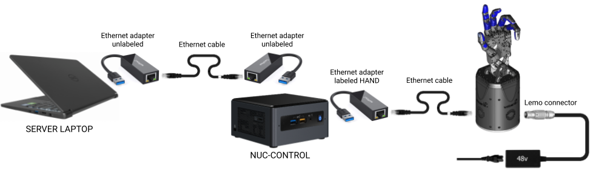

Setting up the hand
====================

Pelicase contents
------------------

When you receive your Dexterous Hand, this is what you will find in the pelicase:

.. figure:: ../img/Pelicase_contents.png
    :width: 100%

Connecting Cables
------------------

* Connect one Ethernet cable to the hand's Ethernet socket, and connect the other end to the USB->Ethernet adapter with a label ``HAND RIGHT`` or ``HAND LEFT`` (depending of your hand side).
* Connect the USB end of the adapter to any of the USB ports in the ``NUC-CONTROL``.
* Connect one of the unlabeled USB->Ethernet adapters to another USB port on the ``NUC-CONTROL`` and the other unlabeled USB->Ethernet to any of the ports in your ``SERVER`` Laptop (provided by Shadow or a custom one).
* Connect the two adaptors together with an Ethernet cable.

You have been supplied with medium length Ethernet leads, but if you require a different length, you can simply use a standard commercial Ethernet Cat 5 cable, available from most computer parts suppliers. If you require internet connection in the laptop, connect an ethernet cable providing external internet connection to the back of the laptop, to an ethernet port labelled ``INTERNET``.

    Connections diagram

.. Source to edit the diagram: https://docs.google.com/drawings/d/1IOYFVruiCEKmIZpWwnUS8AJ-SWSNJJGQQxWrUoBa2Hk/edit?usp=sharing

* Finally, connect the external power supply to the hand using the metal Lemo connector, making sure to line up the red dots. If you require a longer or shorter cable, please contact us at support@shadowrobot.com.

Mounting the hand to an arm
-----------------------------
Shadow Robot supplies an elbow adaptor plate to adapt the Hand to most robot arms. The Hand's elbow plate contains eight screw holes which accept M6 bolts to a depth of 12mm. The holes are spaced equally from the centre on a circle with diameter 100mm. The overall diameter of the elbow plate is 135mm

.. figure:: ../img/mounting_hand.png
    :width: 80%
    :align: center
    :alt: Mounting the hand

To mount the hand properly to an UR arm so that it is aligned with our xacros, you need to rotate it as shown in the picture below:

.. figure:: ../img/arm_hand.png
    :width: 100%
    :align: center
    :alt: Aligning the hand

    Correct way to align the hand to the UR arms

The hand's palm points in the direction of the TCP point of the arm. 

Powering up
-----------
You can power up the hand and PCs in any order. You do not have to power up one before the other. When power is applied to the hand, the fans will be heard immediately.

Lights
^^^^^^

On power up, the lights will be in the following state:

=======================   =============       ================    =================================
Item                      Color               Activity            Meaning
=======================   =============       ================    =================================
Power LEDs                White               On                  Power good
EC Link Active            Green               On                  EtherCAT link established
EC Link Error             Red                 Off                 No EtherCAT link error
Run                       Green               Off                 Hand is in Init state
Application Layer Error   Red                 On (during boot)    Verifying ET1200 EEPROM
Application Layer Error   Red                 Then off            No EtherCAT packet error
ET1200 chip select        Yellow              On                  PIC32 communicating with ET1200
=======================   =============       ================    =================================

Lights will also appear inside the base, indicating 5v, 6v and 24v (or 28v) supplies. These can only be seen by removing the covers.

Jiggling
^^^^^^^^

On reset, all of the strain gauges (torque sensors) in the
motors need to be zeroed. This happens automatically. The motors are driven back and forth
to try to relieve any tension on the tendons. Then both gauges are zeroed. You will therefore
see all joints of the hand move slightly on power up or reset.
