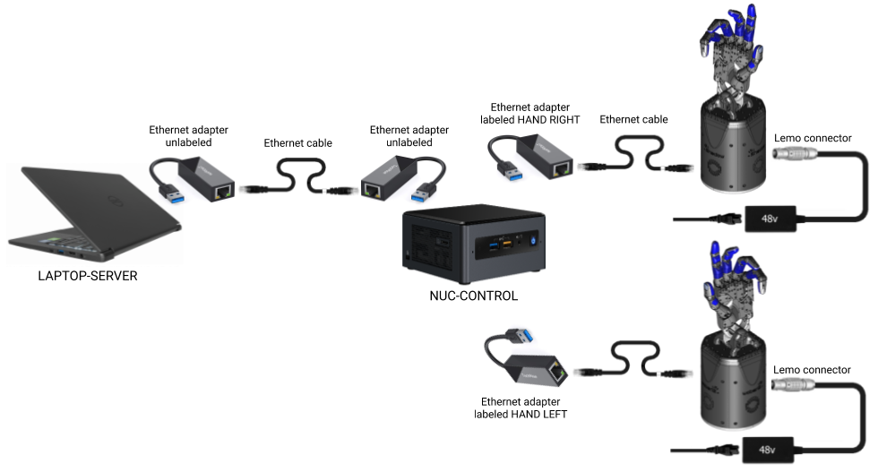

Connecting Cables
------------------

* Connect the hands to the NUC-CONTROL. It is very important that the exact USB-ethernet adapters are used.

  * The right hand should be connected to a USB->ethernet adapter labelled: ``HAND RIGHT``, which should be connected to one of the USB ports of the NUC-CONTROL (it does not matter which one).
  * The left hand should be connected to a USB->ethernet adapter labelled: ``HAND LEFT``, which should be connected to one of the USB ports of the NUC-CONTROL (it does not matter which one).

* Connect one USB->Ethernet adapter labelled ``NUC-CONTROL`` to another USB port on the NUC and the other USB->Ethernet labelled ``SERVER`` to any of the ports in your ``SERVER`` Laptop (provided by Shadow or a custom one).
* Connect the two adaptors together with an Ethernet cable.

You have been supplied with medium length Ethernet leads, but if you require a different length, you can simply use a standard commercial Ethernet Cat 5 cable, available from most computer parts suppliers. If you require internet connection in the laptop, connect an ethernet cable providing external internet connection to the back of the laptop, to an ethernet port labelled ``INTERNET``.

    Connections diagram

.. Source to edit the diagram: https://docs.google.com/drawings/d/1IOYFVruiCEKmIZpWwnUS8AJ-SWSNJJGQQxWrUoBa2Hk/edit?usp=sharing

* Finally, connect the external power supply to the hands using the metal Lemo connector, making sure to line up the red dots. When power is applied to the hand, the fans will be heard immediately. If you require a longer or shorter cable, please contact us at support@shadowrobot.com. 

Connection procedure
^^^^^^^^^^^^^^^^^^^^^
1. Connect the ethernet between the NUC and the laptop using the instructions above
2. Power on the laptop
3. Connect an ethernet cable providing external internet connection to the back of the laptop
4. Power on the NUC
5. Make sure the laptop has only 1 USB-Ethernet adapter connected to it.
6. In case of using another laptop than one provided, please follow the instructions below to install the software.
7. Power on the hand(s)
8. Connect the right hand to the USB-ethernet adapter labelled “HAND RIGHT” which should be plugged in to the NUC, as explained above
9. Connect the left hand to the USB-ethernet adapter labelled “HAND LEFT” which should be plugged in to the NUC, as explained above

Launch the hands
^^^^^^^^^^^^^^^^^
Depending on what you want to launch: click on ``Launch Shadow Right Hand`` or ``Launch Shadow Left Hand`` or ``Launch Shadow Bimanual Hands``. The hand(s) should vibrate and Rviz opens.

You can use the icons in “Shadow Demos” folder to close and open the hand(s) and run the standard demo(s), as well as save and upload ROS logs (send them to Shadow)

.. note::
    When you want to shut down the NUC, press and hold the power button of the NUC for at least 3 seconds and then let go.

Lights
^^^^^^
On power up, the lights will be in the following state:

=======================   =============       ================    =================================
Item                      Color               Activity            Meaning
=======================   =============       ================    =================================
Power LEDs                White               On                  Power good
EC Link Active            Green               On                  EtherCAT link established
EC Link Error             Red                 Off                 No EtherCAT link error
Run                       Green               Off                 Hand is in Init state
Application Layer Error   Red                 On (during boot)    Verifying ET1200 EEPROM
Application Layer Error   Red                 Then off            No EtherCAT packet error
ET1200 chip select        Yellow              On                  PIC32 communicating with ET1200
=======================   =============       ================    =================================

Lights will also appear inside the base, indicating 5v, 6v and 24v (or 28v) supplies. These can only be seen by removing the covers.

Jiggling
^^^^^^^^

On reset, all of the strain gauges (torque sensors) in the
motors need to be zeroed. This happens automatically. The motors are driven back and forth
to try to relieve any tension on the tendons. Then both gauges are zeroed. You will therefore
see all joints of the hand move slightly on power up or reset.
