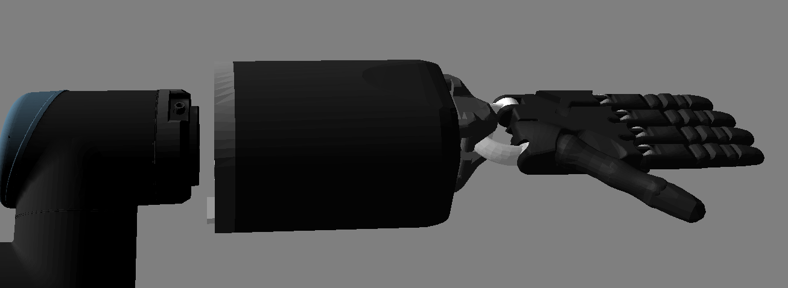

-----------------------
Setting up a real hand
-----------------------

Unimanual system
================

What's in the box?
------------------

=============================   ==================================================================
Item                            Description
=============================   ==================================================================
Shadow Hand E2M3 or E2PT        Hand Unit
NUC control machine             i7 NUC minicomputer for running hand's driver
NUC power supply                Power supply for the NUC computer
USB->Ethernet adapter x3        Adapters for connections between NUC, hand and client PC
PSU for Hand                    48v for motor hand
Kettle Leads                    To connect power supplies to mains
Power Cable                     4-pin Large Lemo connector, already fitted to the hand
EtherCAT Extension Cable        50cm EtherCAT extension lead, already fitted to the Hand
Ethernet Cable x2               1m ethernet cables to connect computers and the hand
Calibration Jigs                Bag containing calibration jigs for all joints
Toolbox                         Contains hex drivers to perform required maintenance
User Manual                     This document
Client PC (optional)            3XS laptop as control unit. Power supply and mouse included
64GB USB pendrive               Clonezilla backup copies of the NUC and (optionally) the client PC
Hand programmer                 Hand firmware programmer
Mounting plate with screws      Mounting plate allowing the hand to be assembled on a UR10 robot
=============================   ==================================================================

Connecting Cables
------------------
There are two ways to connect the EtherCAT and power cables to the hand.

External connections
^^^^^^^^^^^^^^^^^^^^
If your hand already has cables fitted, then you can simply connect the EtherCAT and power connectors immediately.

.. figure:: ../img/connecting_cables_external.png
    :width: 80%
    :align: center
    :alt: Connecting cables

    Connecting cables

**EtherCAT**: Connect the Ethernet cable to the hand's Ethernet socket, and connect the other end to the USB->Ethernet adapter with a label ``HAND``. Then, connect the USB end of the adapter to any of the USB ports in the NUC. Next, connect USB->Ethernet adapter with a label ``NUC-CONTROL`` to another USB port on the NUC and adapter with a label ``SERVER`` to any of the ports in your client PC (provided by Shadow or a custom one). Finally, connect the two adaptors together with an Ethernet cable.
You have been supplied with medium length Ethernet leads, but if you require a different length, you can simply use a standard commercial Ethernet Cat 5 cable, available from most computer parts suppliers. If you require internet connection in the laptop, connect an ethernet cable providing external internet connection to the back of the laptop, to an ethernet port labelled ``INTERNET``.

.. figure:: ../img/hand_connections_diagram.png
    :width: 100%
    :align: center
    :alt: Connections diagram

    Connections diagram

**Power**: Connect the external power supply to the hand using the metal Lemo connector, making sure to line up the red dots. If you require a longer or shorter cable, please contact the Shadow Robot Company.

Internal connections
^^^^^^^^^^^^^^^^^^^^
If you are connecting the hand to a robot with internal cabling, then you may wish to use the internal connectors.
Turn the hand over, and use the orange and green hex drivers to remove the connector cover. Connect the two cables to their relevant sockets. Now affix the hand to your robot arm. The rest of the connection steps remain the same as in the section above.

.. figure:: ../img/connecting_cables_internal.png
    :width: 80%
    :align: center
    :alt: Internal connections

    Internal connections

Mounting the hand
-----------------
Shadow Robot can supply an elbow adaptor plate to adapt the Hand to most other robot arms. However, if you wish to make your own fitting for the Hand:

.. figure:: ../img/mounting_hand.png
    :width: 80%
    :align: center
    :alt: Mounting the hand

The Hand's elbow plate contains eight screw holes which accept M6 bolts to a depth of 12mm. The holes are spaced equally from the centre on a circle with diameter 100mm. The overall diameter of the elbow plate is 135mm

To mount the hand properly and align with our xacros you need to rotate it as shown in the picture below:

    Correct way to align the hand to the UR arms

The hand's palm points in the direction of the TCP point of the arm. 

Powering up
-----------
You can power up the hand and PC in any order. You do not have to power up one before the other. When power is applied to the hand, the fans will be heard immediately.

Lights
^^^^^^

On power up, the lights will be in the following state:

=======================   =============       ================    =================================
Item                      Color               Activity            Meaning
=======================   =============       ================    =================================
Power LEDs                White               On                  Power good
EC Link Active            Green               On                  EtherCAT link established
EC Link Error             Red                 Off                 No EtherCAT link error
Run                       Green               Off                 Hand is in Init state
Application Layer Error   Red                 On (during boot)    Verifying ET1200 EEPROM
Application Layer Error   Red                 Then off            No EtherCAT packet error
ET1200 chip select        Yellow              On                  PIC32 communicating with ET1200
=======================   =============       ================    =================================

Lights will also appear inside the base, indicating 5v, 6v and 24v (or 28v) supplies. These can only be seen by removing the covers.

Jiggling
^^^^^^^^

This applies to the motor hand only. On reset, all of the strain gauges (torque sensors) in the
motors need to be zeroed. This happens automatically. The motors are driven back and forth
to try to relieve any tension on the tendons. Then both gauges are zeroed. You will therefore
see all joints of the hand move slightly on power up or reset.

Installing the software
-----------------------
By default, we will provide machines that already have all the software set up for you. However, even though each delivery will consist of a NUC machine for Hand's driver, the client PC is optional. In case you want to set up a custom machine as a client, please follow the instructions below.

On a new PC using the one-liner
^^^^^^^^^^^^^^^^^^^^^^^^^^^^^^^^
We have created a one-liner that is able to install Docker, download the docker image and create a new container for you. It will also create desktop icons, one to start the container, one to launch the hand driver on the control box and one to save the log files locally. To use it, you first need to have a PC with Ubuntu installed on it (preferably version 18.04), then follow these steps:

* **Get ROS Upload login credentials**

  If you want to upload technical logged data (ROS logs, backtraces, crash dumps etc.) to our server and notify the Shadow's software team to investigate your bug, then you need to enable logs uploading in the one-liner. In order to use this option you need to obtain a unique upload key by emailing sysadmin@shadowrobot.com. When you receive the key you can use it when running the one-liner installation tool. To enable the logs uploading you need to add the command line option ``use_aws=true`` to the one-liner.
  After executing the one-liner, it will prompt you to enter your upload key and press enter to continue. Please copy and paste your key from the email you received from Shadow Robot.

* **Run the one-liner**:

  The one-liner will install Docker, pull the image from Docker Hub, and create and run a container with the parameters specified. In order to use it, run the following command:

  ROS Kinetic (Recommended):

  .. prompt:: bash $

     bash <(curl -Ls bit.ly/run-aurora) server_and_nuc_deploy --read-secure sudo_password ethercat_interface=<ethercat_interface> config_branch=<config_branch> product=hand_e reinstall=true hand_serial=<hand_serial> internet_interface_name=<internet_interface_name> dhcp_interface_name=<dhcp_interface_name> dhcp_server_mac=<dhcp_server_mac> dhcp_client_mac=<dhcp_client_mac> upgrade_check=true launch_hand=true

  where ``<ethercat_interface>``, ``<config_branch>``, ``<hand_serial>``, ``<internet_interface_name>``, ``<dhcp_interface_name>``, ``<dhcp_server_mac>`` and ``<dhcp_client_mac>`` are values that will be provided by Shadow.

  An example of the script with ROS logs upload enabled:

  .. prompt:: bash $

     bash <(curl -Ls bit.ly/run-aurora) server_and_nuc_deploy --read-secure sudo_password,customer_key ethercat_interface=enx000ec6511588 config_branch=shadowrobot_200117 product=hand_e reinstall=true use_aws=true hand_serial=2378 internet_interface_name=enp8s0f1 dhcp_interface_name=enx000ec653b3bc dhcp_server_mac="00:0e:c6:53:b3:bc" dhcp_client_mac="00:0e:c6:53:b4:35" upgrade_check=true launch_hand=true

  In another example, if you do not have an Nvidia graphics card, you can add nvidia_docker=false to use nvidia-docker (``true`` is our default), i.e.:

  .. prompt:: bash $

     bash <(curl -Ls bit.ly/run-aurora) server_and_nuc_deploy --read-secure sudo_password,customer_key ethercat_interface=enx000ec6511588 config_branch=shadowrobot_200117 product=hand_e reinstall=true use_aws=true hand_serial=2378 internet_interface_name=enp8s0f1 dhcp_interface_name=enx000ec653b3bc dhcp_server_mac="00:0e:c6:53:b3:bc" dhcp_client_mac="00:0e:c6:53:b4:35" upgrade_check=true launch_hand=true nvidia_docker=false

  You can also add ``reinstall=true`` in case you want to reinstall the docker image and container. When it finishes it will show if it was successful or not
  and will create desktop icons on your desktop that you can double-click to launch the hand container, save the log files from the active containers to your desktop and perform various actions on the hand (open, close and demo).
  The icons look like this:

  .. figure:: ../img/icons.png
      :align: center
      :alt: Desktop icons

  - Launch Shadow Hand - launches the hand
  - Shadow ROS Logs Saver - used to save the hand logs and upload them to AWS
  - Shadow NUC RQT - opens RQT window running within the NUC machine, allows access to ROS plugins

  Within the ``Shadow Demos`` folder you will find following icons (use only when driver is running):

  .. figure:: ../img/shadow_demos.png
      :align: center
      :alt: Desktop icons

  - Close Right Hand - moves hand into pack position
  - Demo Right Hand - starts a program running several hand demos
  - Open Right Hand - moves hand into fully open position

  Within the ``Shadow Advanced Launchers`` folder you will find following icons:

  .. figure:: ../img/shadow_advanced_launchers.png
      :align: center
      :alt: Desktop icons

  - Launch Server Container - starts docker container on the server machine only
  - Launch Server ROSCORE - only starts roscore on the server side
  - Launch NUC Container and Hardware Control Loop - starts the hand driver only, on the NUC side
  - Launch Server GUI - Start GUI on the server side allowing user to control movements of the hand

  The above four icons run in succession are the equivalent of using the ``Launch Shadow Hand`` icon.

  - Launch Local Shadow Hand - icon to start the hand when it is plugged directly in to the server machine
  - Launch NUC container - start docker container on the NUC without starting the driver

Using a PC that Shadow provided
^^^^^^^^^^^^^^^^^^^^^^^^^^^^^^^
In this case, the previous steps would already have been performed by the Shadow team and the only thing to do is start the docker container by double-clicking the desktop icon.

Saving log files and uploading data to our server
--------------------------------------------------
When running the one-liner, along with the icon that starts the Dexterous Hand, you will also notice a second icon named 'Save Logs' that is used to retrieve and copy all the available logs files from the active containers locally on your Desktop. This icon will create a folder that matches the active container's name and the next level will include the date and timestamp it was executed. When it starts, it will prompt you if you want to continue, as by pressing yes it will close all active containers. After pressing "yes", you will have to enter a description of the logging event and it will start copying the bag files, logs and configuration files from the container and then exit. Otherwise, the window will close and no further action will happen. If you provided an upload key with the one-liner installation then the script will also upload your LOGS in compressed format to our server and notify Shadow's software team about the upload. This will allow the team to fully investigate your issue and provide support where needed.

Starting the driver
-------------------

* **Shadow Hand Driver**
  Launch the driver for the Shadow Hand using the desktop icon 'Launch Hand' or, if you want to launch the hand locally, plug in the hand ethernet adapter to the laptop and use the Advanced Launch Icon - ``Launch Local Shadow Hand``.

* **Lights in the hand**:
  When the ROS driver is running you should see the following lights on the Palm:

  ========================   =============       ================    =================================
  Light                      Colour              Activity            Meaning
  ========================   =============       ================    =================================
  Run                        Green               On                  Hand is in Operational state
  CAN1/2 Transmit            Blue                V.fast flicker      Demand values are being sent to the motors
  CAN1/2 Receive             Blue                V.fast flicker      Motors are sending sensor data
  Joint sensor chip select   Yellow              On                  Sensors being sampled
  ========================   =============       ================    =================================

  After killing the driver, the lights will be in a new state:

  ========================   =============       ================    =================================
  Light                      Colour              Activity            Meaning
  ========================   =============       ================    =================================
  Run                        Green               Blinking            Hand is in Pre-Operational state
  CAN1/2 Transmit            Blue                Off                 No messages transmitted on CAN 1/2
  CAN1/2 Receive             Blue                Off                 No messages received on CAN 1/2
  Joint sensor chip select   Yellow              Off                 Sensors not being sampled
  ========================   =============       ================    =================================

Bimanual system
================

What's in the box?
------------------

=============================   ==================================================================
Item                            Description
=============================   ==================================================================
2 Shadow Hand E2M3 or E2PT      2 Hand Units
2 NUC control machines          i7 NUC minicomputers for running hand's driver
2 NUC power supplies            2 power supplies for the NUC computer
USB->Ethernet adapter x3        Adapters for connections between NUC, hand and client PC
PSU for Hand                    48v for motor hand
Kettle Leads                    To connect power supplies to mains
Power Cable                     4-pin Large Lemo connector, already fitted to the hand
EtherCAT Extension Cable        50cm EtherCAT extension lead, already fitted to the Hand
Ethernet Cable x2               1m ethernet cables to connect computers and the hand
Calibration Jigs                Bag containing calibration jigs for all joints
Toolbox                         Contains hex drivers to perform required maintenance
User Manual                     This document
Client PC (optional)            3XS laptop as control unit. Power supply and mouse included
64GB USB pendrive               Clonezilla backup copies of the NUC and (optionally) the client PC
Hand programmer                 Hand firmware programmer
Mounting plate with screws      Mounting plate allowing the hand to be assembled on a UR10 robot
=============================   ==================================================================

Connecting Cables
------------------

Ethernet port for the hand(s)
^^^^^^^^^^^^^^^^^^^^^^^^^^^^^^

The right hand should be connected to a USB-ethernet adapter labelled: ``HAND RIGHT``, which should be connected to one of the USB ports of the NUC (it doesn’t matter which one). The left hand should be connected to a USB-ethernet adapter labelled: ``HAND LEFT``, which should be connected to one of the USB ports of the NUC (it doesn’t matter which one). It is very important that the exact USB-ethernet adapters are used.

Ethernet connection between the NUC and the laptop:
^^^^^^^^^^^^^^^^^^^^^^^^^^^^^^^^^^^^^^^^^^^^^^^^^^^^

An unlabelled USB-ethernet (doesn’t matter which one) should be plugged into a USB port on the laptop (doesn’t matter which one). Another unlabelled USB-ethernet adapter (doesn’t matter which one) should be plugged into a USB port on the NUC (doesn’t matter which one). Here it doesn’t matter which USB-ethernet adapters are being used. However, it’s very important that only 1 USB-ethernet adapter is connected to the laptop when aurora installation script is run. An ethernet cable should be connected between the laptop USB-ethernet adapter and the NUC USB-ethernet adapter.

Connection procedure
^^^^^^^^^^^^^^^^^^^^^

1. Connect the ethernet between the NUC and the laptop using the instructions above
2. Power on the laptop
3. Connect an ethernet cable providing external internet connection to the back of the laptop
4. Power on the NUC
5. Make sure the laptop has only 1 USB-Ethernet adapter connected to it.
6. In case of using another laptop than one provided, please follow the instructions below to install the software.
7. Power on the hand(s)
8. Connect the right hand to the USB-ethernet adapter labelled “HAND RIGHT” which should be plugged in to the NUC, as explained above
9. Connect the left hand to the USB-ethernet adapter labelled “HAND LEFT” which should be plugged in to the NUC, as explained above
10. Depending on what you want to launch: click on Launch Shadow Right Hand or Launch Shadow Left Hand or Launch Shadow Bimanual Hands. The hand(s) should vibrate and Rviz opens.
11. You can use the icons in “Shadow Demos” folder to close and open the hand(s) and run the standard demo(s), as well as save and upload ROS logs (send them to Shadow)

.. note::
    When you want to shut down the NUC, press and hold the power button of the NUC for at least 3 seconds and then let go.

Installing the software
-----------------------
By default, we will provide machines that already have all the software set up for you. However, even though each delivery will consist of a NUC machine for Hand's driver, the client PC is optional. In case you want to set up a custom machine as a client, please follow the instructions below.

On a new PC using the one-liner
^^^^^^^^^^^^^^^^^^^^^^^^^^^^^^^^
We have created a one-liner that is able to install Docker, download the docker image and create a new container for you. It will also create desktop icons, one to start the container, one to launch the hand driver on the control box and one to save the log files locally. To use it, you first need to have a PC with Ubuntu installed on it (preferably version 18.04), then follow these steps:

* **Get ROS Upload login credentials**

  If you want to upload technical logged data (ROS logs, backtraces, crash dumps etc.) to our server and notify the Shadow's software team to investigate your bug, then you need to enable logs uploading in the one-liner. In order to use this option you need to obtain a unique upload key by emailing sysadmin@shadowrobot.com. When you receive the key you can use it when running the one-liner installation tool. To enable the logs uploading you need to add the command line option ``use_aws=true`` to the one-liner.
  After executing the one-liner, it will prompt you to enter your upload key and press enter to continue. Please copy and paste your key from the email you received from Shadow Robot.

* **Run the one-liner**:

  The one-liner will install Docker, pull the image from Docker Hub, and create and run a container with the parameters specified. In order to use it, run the following command:

  * ROS Melodic (Recommended):

    For laptops using NVIDIA graphics:

    .. prompt:: bash $

       bash <(curl -Ls bit.ly/run-aurora) server_and_nuc_deploy --read-secure <customer_key> product=hand_e ethercat_interface=<ethercat_interface> ethercat_left_hand=<ethercat_left_hand> config_branch=<config_branch> reinstall=true use_aws=true bimanual=true upgrade_check=true launch_hand=true tag=melodic-release

    For laptops not using NVIDIA graphics:

    .. prompt:: bash $

       bash <(curl -Ls bit.ly/run-aurora) server_and_nuc_deploy --read-secure <customer_key> product=hand_e ethercat_interface=<ethercat_interface> ethercat_left_hand=<ethercat_left_hand> config_branch=<config_branch> reinstall=true use_aws=true bimanual=true upgrade_check=true launch_hand=true tag=melodic-release nvidia_docker=false

  * ROS Kinetic:

    For laptops using NVIDIA graphics:

    .. prompt:: bash $

       bash <(curl -Ls bit.ly/run-aurora) server_and_nuc_deploy --read-secure <customer_key> product=hand_e ethercat_interface=<ethercat_interface> ethercat_left_hand=<ethercat_left_hand> config_branch=<config_branch> reinstall=true use_aws=true bimanual=true upgrade_check=true launch_hand=true tag=kinetic-release

    For laptops not using NVIDIA graphics:

    .. prompt:: bash $

       bash <(curl -Ls bit.ly/run-aurora) server_and_nuc_deploy --read-secure <customer_key> product=hand_e ethercat_interface=<ethercat_interface> ethercat_left_hand=<ethercat_left_hand> config_branch=<config_branch> reinstall=true use_aws=true bimanual=true upgrade_check=true launch_hand=true tag=kinetic-release nvidia_docker=false

  where ``<customer_key>``, ``<ethercat_interface>``, ``<ethercat_left_hand>`` and ``<config_branch>`` are values that will be provided by Shadow.

  Notice that you can set ``reinstall=false`` in case you do not want to reinstall the docker image and container.

  When it finishes it will show if it was successful or not and will create desktop icons on your desktop that you can double-click to launch the hand container, save the log files from the active containers to your desktop and perform various actions on the hand (open, close and demo).

  .. warning::
    If for whatever reason the installation doesn’t proceed well or if there are errors or if it takes too long, contact Shadow with the error message. Also, try rerunning the installation script.

  The icons should look like this:

  .. figure:: ../img/bimanual_icons.png
      :align: center
      :alt: Bimanual desktop icons

  - Launch Shadow Right Hand - launches the right hand
  - Launch Shadow Left Hand - launches the left hand
  - Launch Shadow Bimanual Hands - launches the both hands as a bimanual system
  - Shadow ROS Logs Saver and Uploader - used to save the hands logs and upload them to AWS
  - Shadow NUC RQT - opens RQT window running within the NUC machine, allows access to ROS plugins

  Within the ``Shadow Demos`` folder you will find the following icons (use only when driver is running):

  - Close Right Hand - moves the right hand into pack position
  - Demo Right Hand - starts a program running several right hand demos
  - Open Right Hand - moves the right hand into fully open position
  - Close Left Hand - moves the left hand into pack position
  - Demo Left Hand - starts a program running several left hand demos
  - Open Left Hand - moves the left hand into fully open position

  Within the ``Shadow Advanced Launchers`` folder you will find following icons:

  - 1 - Launch Server Container - starts docker container on the server machine only
  - 2 - Launch Server ROSCORE - only starts roscore on the server side
  - 3 - Launch NUC Container and Bimanual Hands Hardware Control Loop - starts the bimanual hand driver only, on the NUC side
  - 3 - Launch NUC Container and Right Hand Hardware Control Loop - starts the right hand driver only, on the NUC side
  - 3 - Launch NUC Container and Left Hand Hardware Control Loop - starts the left hand driver only, on the NUC side
  - 4 - Launch Server Bimanual GUI - Start GUI on the server side allowing user to control movements of the bimanual system
  - 4 - Launch Server Left GUI - Start GUI on the server side allowing user to control movements of the left hand
  - 4 - Launch Server Right GUI - Start GUI on the server side allowing user to control movements of the right hand

  The above icons run in succession are the equivalent of using the ``Launch Shadow Hand`` icon (choosing only one for steps 3 and 4)

  - Launch Local Shadow Left Hand - icon to start the left hand when it is plugged directly into the server machine
  - Launch Local Shadow Right Hand - icon to start the right hand when it is plugged directly into the server machine
  - Launch NUC container - start docker container on the NUC without starting the driver