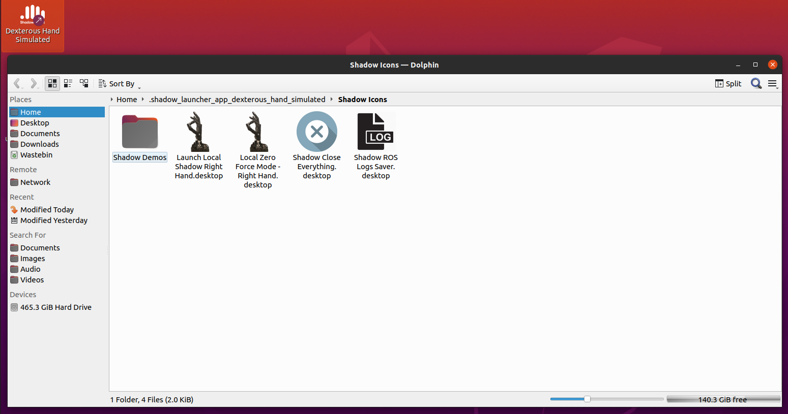
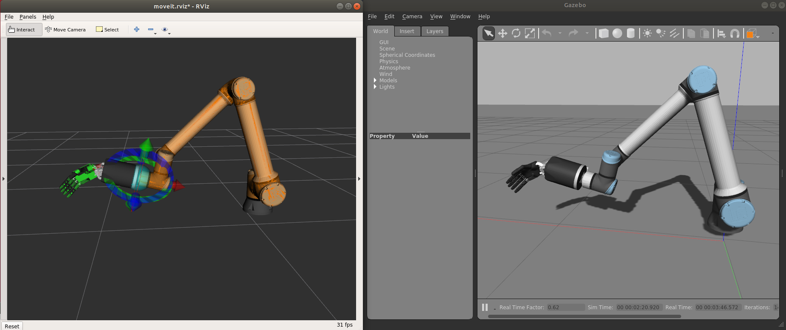
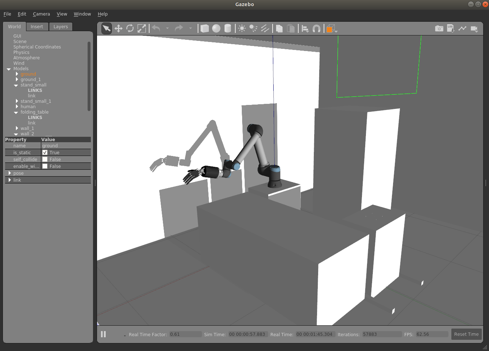
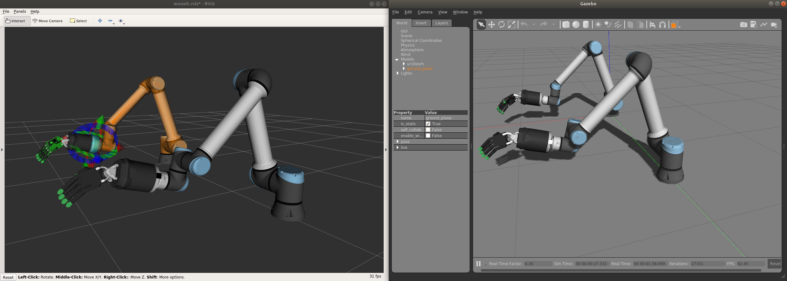
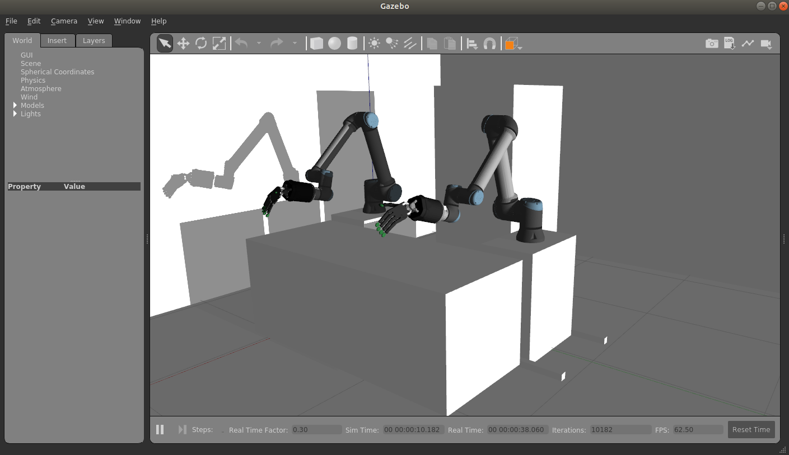

Gazebo
=======

`Gazebo <http://gazebosim.org/>`_ is our default simulator. Follow the instructions on the next section to install and run a simulation of our robot hands using Gazebo.

Installing the software (sim)
------------------------------

If you do not actually have a real hand but would like to use our hand in simulation, then please run the following command:

* ROS Noetic:

  .. prompt:: bash $

     bash <(curl -Ls https://raw.githubusercontent.com/shadow-robot/aurora/v2.1.6/bin/run-ansible.sh) docker_deploy --branch v2.1.6 tag=noetic-v1.0.21 product=hand_e sim_hand=true container_name=dexterous_hand_simulated

One-Liner parameters
---------------------

Values in bold are the default values.

  +------------------------+------------------------------------+----------------------------------------------------------------------+
  | Additional parameter   | Values                             | Description                                                          |
  +========================+====================================+======================================================================+
  | product=               | hand_e, hand_lite, hand_extra_lite | Describes the shadow hand product you want to install.               |
  +------------------------+------------------------------------+----------------------------------------------------------------------+
  | reinstall={value}      | true, **false**                    | Flag to know if the docker container should be fully reinstalled.    |
  +------------------------+------------------------------------+----------------------------------------------------------------------+
  | nvidia_docker={value}  | true, **false**                    | Define if nvidia-container-toolkit is used. Use with nvidia GPU.     |
  +------------------------+------------------------------------+----------------------------------------------------------------------+
  | launch_hand={value}    | true, **false**                    | Specify if hand driver should start when double clicking desktop icon|
  +------------------------+------------------------------------+----------------------------------------------------------------------+
  | sim_hand={value}       | true, **false**                    | If true the icon's will autolaunch hand in simulation mode.          |
  +------------------------+------------------------------------+----------------------------------------------------------------------+
  | hand_side={value}      | **right**, left                    | Specify if the hand is right or left (ignored if bimanual=true)      |
  +------------------------+------------------------------------+----------------------------------------------------------------------+
  | bimanual={value}       | true, **false**                    | Specify if both hands are used or not.                               |
  +------------------------+------------------------------------+----------------------------------------------------------------------+

More params and their explanation can be found `here. <https://github.com/shadow-robot/aurora/blob/v2.1.6/ansible/inventory/local/group_vars/docker_deploy.yml>`_

Starting a robot simulation
------------------------------

There are two ways you can launch a robot simulation.

The first is by using the desktop icons that are created when installing the software. The icon on your desktop will give you the option to launch the hand. You will want to select the option that does **not** include zero force mode.

The second option is to launch the docker container manually using the command below.

.. prompt:: bash $

   docker start dexterous_hand_simulated

If you have enabled the parameter ``launch_hand=true`` then when the container is started it will automatically launch the hand sim, if it is false however you will need to manually issue the command.

Shadow Dexterous hands
^^^^^^^^^^^^^^^^^^^^^^^
* The hand will start automatically if you have run the one-liner with the argument ``launch_hand=true``. To start it manually, simply run the following command in the container:

  .. prompt:: bash $

     roslaunch sr_robot_launch srhand.launch

  This will launch the five finger hand (shadowhand\_motor) by default .

* If you want to start the dexterous hand plus, you can add the hand\_type like this:

  .. prompt:: bash $

     roslaunch sr_robot_launch srhand.launch hand_type:=hand_lite

* If you want to launch another hand, these are the hands available:

  +---------+-------------------------+-----------------------+-----------------------+
  |         | Hand                    | hand_type Parameter   | Left Hand Parameter   |
  +=========+=========================+=======================+=======================+
  | |image0|| Hand E                  | hand_e                | hand_id:=lh           |
  +---------+-------------------------+-----------------------+-----------------------+
  | |image1|| Hand E Lite             | hand_lite             | Right hand only       |
  +---------+-------------------------+-----------------------+-----------------------+
  | |image2|| Hand E Extra Lite       | hand_extra_lite       | Right hand only       |
  +---------+-------------------------+-----------------------+-----------------------+

  .. |image0| image:: ../img/shadowhand_motor.png
  .. |image1| image:: ../img/shadowhand_lite.png
  .. |image2| image:: ../img/shadowhand_extra_lite.png

  To start the simulation, you can run:

  .. prompt:: bash $

     roslaunch sr_robot_launch srhand.launch hand_type=hand_e

  The ``hand_type`` param can be changed to start any of the available Shadow hands shown in the table.

* If it is a left hand, ``hand_id:=lh`` should be added. For example:

  .. prompt:: bash $

     roslaunch sr_robot_launch srhand.launch hand_type=hand_e_plus hand_id:=lh

* Moveit will enable advanced behaviour (inverse kinematics, planning, collision detectection, etc...), but if it is not needed, you can set ``use_moveit:=false``

.. note::
   If when you launch the hand you see some errors related to LibGL, this is a good indication that you have an NVidia card and should add the nvidia flag when running the installation one liner. Run the one liner again with the correct NVidia flags mentioned above and also ``-r true`` to reinstall the docker image and container.

Bimanual hand system
^^^^^^^^^^^^^^^^^^^^
.. figure:: ../img/bimanual.png
    :align: center
    :alt: Bimanual

To start the simulation of a bimanual system, you can run:

.. prompt:: bash $

   roslaunch sr_robot_launch sr_bimanual.launch
   
Unimanual arm and hand system
^^^^^^^^^^^^^^^^^^^^^^^^^^^^^^^

To start the simulation of a unimanual right system, you can run:

.. prompt:: bash $

   roslaunch sr_robot_launch sr_right_ur10arm_hand.launch
  
To add a scene, you can add ``scene:=true`` and you our default scene. You can also add your own scene adding a ``scene_file`` parameter.

Similarly, to start the simulation of a unimanual left system, you can run:

.. prompt:: bash $

   roslaunch sr_robot_launch sr_left_ur10arm_hand.launch

Bimanual arm and hand system
^^^^^^^^^^^^^^^^^^^^^^^^^^^^^

To start the simulation of a bimanual arm and hand system, you can run:

.. prompt:: bash $

   roslaunch sr_robot_launch sr_right_ur10arm_hand.launch
  
To add a scene, you can add ``scene:=true`` and you our default scene. You can also add your own scene adding a ``scene_file`` parameter.

    
