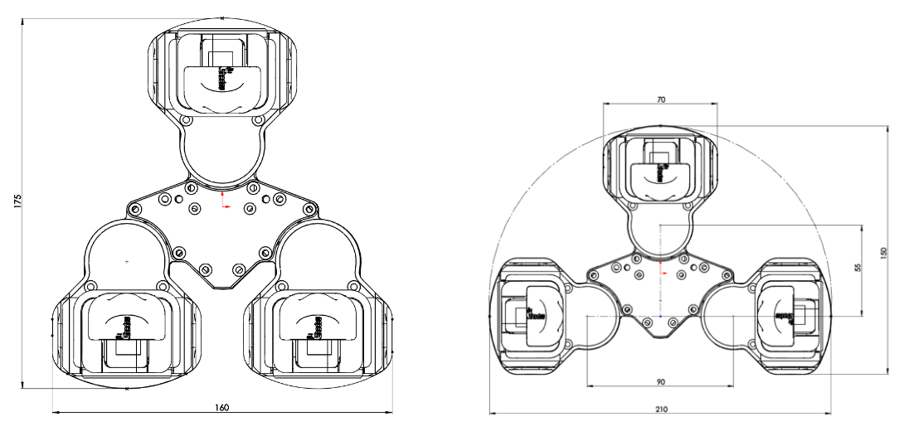

## Introduction

This manual describes the use and function of the Shadow Modular Grasper

### Abbreviations

Abbreviation | Meaning
--- | ---
API | Application Programming Interface
DoF | Degrees of Freedom
EC | EtherCAT
EEPROM | Electrically Erasable Programmable Read Only Memory. 
GUI | Graphical User Interface.
LED | Light Emitting Diode. (A small coloured light)
MCU | Micro Controller Unit. (A small, usually embedded, CPU)
PC | Personal Computer.
PWM | Pulse Width Modulation. (The digital method used to emulate an analogue signal.)
ROS | Robot Operating System.

### Modular Grasper Technical Spec

The Shadow Modular Grasper is an advanced solution for grasping and handling a wide range of objects.

<ul>
<li>9 Degrees of Freedom (DoF) </li>
<li>3 Fingers</li>
<li>3 Joints per Finger
<ul>
<li>Base rotation,	-45° to +45°</li>
<li>Proximal,	-80° to +60°</li>
<li>Distal,		-60° to +80°</li>
</ul>
</li>
<li>Maxon DC Motors</li>
<li>Backdrivable Gearbox</li>
<li>Non-slip surfaces for Grasp Stability</li>
<li>2.7 kg weight</li>
<li>2 kg Payload (using power grasp)</li>
<li>20 N intermittent force per fingertip, 10 N continuous</li>
<li>260 mm maximum span</li>
<li>1 kHz Position Control Loop , with 0.02° position sensing resolution</li>
<li>1.39 mNm resolution direct Torque sensing at each joint</li>
<li>10 kHz onboard Torque Control Loop </li>
<li>0.5 second full range open/close speed</li>
<li>ROS Compliant (Robot Operating System <a href="http://www.ros.org" rel="nofollow">www.ros.org</a>)</li>
<li>EtherCAT® interface</li>
<li>24V DC, 150W power envelope</li>
<li>Safety Systems:
<ul>
<li>Over temperature protection</li>
<li>Inherent compliance via Series Elastic Actuator</li>
<li>Patented chain configuration protects internal drive train</li>
</ul>
</li>
<li>Mounting plate to attach to standard robot arms</li>
<li>Grasping Library with open APIs (Python/ROS/REST)</li>
<li>Bespoke fingertips can easily be redesigned to accommodate different environments</li>
<li>OptoForce tactile sensing in fingertips (option)</li>
</ul>

