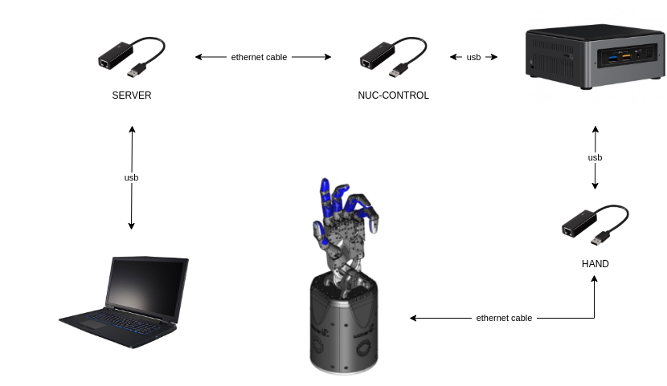
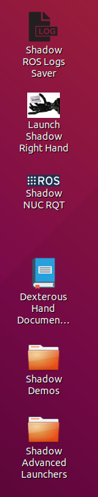
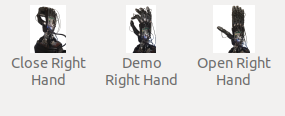
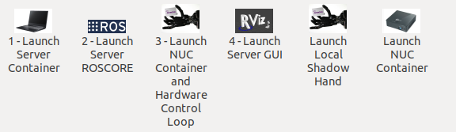

# Setting up the hand

## First time users
If you are unfamiliar with ROS and intend to use the ROS API, it is highly recommended that you read the [ROS Tutorials](http://www.ros.org/wiki/ROS/Tutorials).

If you are unfamiliar with the terminal on Linux, you should look [here](https://askubuntu.com/questions/183775/how-do-i-open-a-terminal).

Shadow software is deployed using Docker. Docker is a container framework where each container image is a lightweight, stand-alone, executable package that includes everything needed to run it. It is similar to a virtual machine but with much less overhead. Follow the instructions in the next section to get the latest Docker container of the hand driver and interface up and running.

## Hardware specifications

Currently, we are providing a control machine together with the hand. However, if needed to be run on a custom machine, in order to run our software and the ROS software stack you will need to meet some hardware requirements.

CPU: Intel i5 or above
RAM: 4GB or above
Hard Drive: Fast HDD or SSD (Laptop HDD are very slow)
Graphics Card: Nvidia GPU (optional)
LAN: A spare LAN port to connect the Hand (even with a USB to LAN adaptor)
OS: Ubuntu 18.04, 16.04 Kinetic (Active development) or 14.04 Indigo for older releases.

The most important one is to have a fast HDD or an SSD.

## Setting up a real hand

### What's in the box?

```eval_rst
=============================   ==================================================================
Item                            Description
=============================   ==================================================================
Shadow Hand E2M3 or E2PT        Hand Unit
NUC control machine             i7 NUC minicomputer for running hand's driver
NUC power supply                Power supply for the NUC computer
USB->Ethernet adapter x3        Adapters for connections between NUC, hand and client PC
PSU for Hand                    48v for motor hand
Kettle Leads                    To connect power supplies to mains
Power Cable                     4-pin Large Lemo connector, already fitted to the hand
EtherCAT Extension Cable        50cm EtherCAT extension lead, already fitted to the Hand
Ethernet Cable x2               1m ethernet cables to connect computers and the hand
Calibration Jigs                Bag containing calibration jigs for all joints
Toolbox                         Contains hex drivers to perform required maintenance
User Manual                     This document
Client PC (optional)            3XS loptop as control unit. Power supply and mouse included
64GB USB pendrive               Clonezilla backup copies of the NUC and (optionally) the client PC
Hand programmer                 Hand firmware programmer
Mounting plate with screws      Mounting plate allowing the hand to be assembled on a UR10 robot
=============================   ==================================================================
```

### Connecting Cables
There are two ways to connect the EtherCAT and power cables to the hand.

#### External connections
If your hand already has cables fitted, then you can simply connect the EtherCAT and power connectors immediately.


**EtherCAT**: Connect the Ethernet cable to the hand's Ethernet socket, and connect the other end to the USB->Ethernet adapter with a label `HAND`. Then, connect the USB end of the adapter to any of the USB ports in the NUC. Next, connect USB->Ethernet adapter with a label `NUC-CONTROL` to another USB port on the NUC and adapter with a label `SERVER` to any of the ports in your client PC (provided by Shadow or a custom one). Finally, connect the two adaptors together with an Ethernet cable.
You have been supplied with a medium length Ethernet leads, but if you require a longer or shorter one, you can simply use a standard commercial Ethernet Cat 5 cable, available from most computer parts suppliers.



**Power**: Connect the external power supply to the hand using the metal Lemo connector, making sure to line up the red dots. If you require a longer or shorter cable, please contact the Shadow Robot Company.

#### Internal connections
If you are connecting the hand to a robot with internal cabling, then you may wish to use the internal connectors.
Turn the hand over, and use the orange and green hex drivers to remove the connector cover. Connect the two cables to their relevant sockets. Now affix the hand to your robot arm. Rest of the connection steps remain the same as in the section above.


### Mounting the hand

Shadow Robot can supply an elbow adaptor plate to adapt the Hand to most other robot arms. However, if you wish to make your own fitting for the Hand:


The Hand's elbow plate contains eight screw holes which accept M6 bolts to a depth of 12mm. The holes are spaced equally from the centre on a circle wth diameter 100mm. The overall diameter of the elbow plate it 135mm

### Powering up

You can power up the hand and PC in any order. You do not have to power up one before the other. When power is applied to the hand, the fans will be heard immediately.

#### Lights

On power up, the lights will be in the following state

```eval_rst
=======================   =============       ================    =================================
Item                      Color               Activity            Meaning
=======================   =============       ================    =================================
Power LEDs                White               On                  Power good
EC Link Active            Green               On                  EtherCAT link established
EC Link Error             Red                 Off                 No EtherCAT link error
Run                       Green               Off                 Hand is in Init state
Application Layer Error   Red                 On (during boot)    Verifying ET1200 EEPROM
Application Layer Error   Red                 Then off            No EtherCAT packet error
ET1200 chip select        Yellow              On                  PIC32 communicating with ET1200
=======================   =============       ================    =================================
```

Lights will also appear inside the base, indicating 5v, 6v and 24v (or 28v) supplies. These can only be seen by removing the covers.

#### Jiggling

This applies to the motor hand only. On reset, all of the strain gauges (torque sensors) in the
motors need to be zeroed. This happens automatically. The motors are driven back and forth
to try to relieve any tension on the tendons. Then both gauges are zeroed. You will therefore
see all joints of the hand move slightly on power up or reset or power up.


### Installing the software

By default, we will provide machines that already have all the software set up for you. However, even though each delivery will consist of a NUC machine for Hand's driver, the client PC is optional. In case you want to set up a custom machine as a client, please follow the instructions below.

#### On a new PC using the one-liner
We have created a one-liner that is able to install Docker, download the docker image and create a new container for you. It will also create desktop icons, one to start the container, one launch the hand driver on the control box and one to save the log files locally. To use it, you first need to have a PC with Ubuntu installed on it (preferable version 16.04), then follow these steps:

* **Get ROS Upload login credentials**

  If you want to upload technical logged data (ROS logs, backtraces, crash dumps etc.) to our server and notify the Shadow's software team to investigate your bug then you need to enable logs uploading in the one-liner. In order to use this option you need to obtain a unique upload key by emailing sysadmin@shadowrobot.com. When you receive the key you can use it when running the one-liner installation tool. To enable the logs uploading you need to add the command line option ```use_aws=true``` to the one-liner.
  After executing the one-liner, it will prompt you to enter your upload key and press enter to continue. Please copy and paste your key from the email you received by Shadow Robot.

* **Run the one-liner**:

  The one-liner will install Docker, pull the image from Docker Hub, and create and run a container with the parameters specified. In order to use it, run the following command:

  ROS Kinetic (Recommended):
  ```bash
  $ bash <(curl -Ls bit.ly/run-aurora) server_and_nuc_deploy --read-secure sudo_password ethercat_interface=<ethercat_interface> config_branch=<config_branch> product=hand_e reinstall=true hand_serial=<hand_serial> internet_interface_name=<internet_interface_name> dhcp_interface_name=<dhcp_interface_name> dhcp_server_mac=<dhcp_server_mac> dhcp_client_mac=<dhcp_client_mac> upgrade_check=true launch_hand=true
  ```
  where `<ethercat_interface>`, `<config_branch>`, `<hand_serial>`, `<internet_interface_name>`, `<dhcp_interface_name>`, `<dhcp_server_mac>` and `<dhcp_client_mac>` are values that will be provided by Shadow.

  An example of the script with ROS logs upload enabled:
  ```bash
  $ bash <(curl -Ls bit.ly/run-aurora) server_and_nuc_deploy --read-secure sudo_password,customer_key ethercat_interface=enx000ec6511588 config_branch=shadowrobot_200117 product=hand_e reinstall=true use_aws=true hand_serial=2378 internet_interface_name=enp8s0f1 dhcp_interface_name=enx000ec653b3bc dhcp_server_mac="00:0e:c6:53:b3:bc" dhcp_client_mac="00:0e:c6:53:b4:35" upgrade_check=true launch_hand=true
  ```  
  In another example, if you do not have an Nvidia graphics card, you can add nvidia_docker=false to use nvidia-docker (`true` is our default), i.e.:
  ```bash
  $ bash <(curl -Ls bit.ly/run-aurora) server_and_nuc_deploy --read-secure sudo_password,customer_key ethercat_interface=enx000ec6511588 config_branch=shadowrobot_200117 product=hand_e reinstall=true use_aws=true hand_serial=2378 internet_interface_name=enp8s0f1 dhcp_interface_name=enx000ec653b3bc dhcp_server_mac="00:0e:c6:53:b3:bc" dhcp_client_mac="00:0e:c6:53:b4:35" upgrade_check=true launch_hand=true nvidia_docker=false
  ```

  You can also add `reinstall=true` in case you want to reinstall the docker image and container. When it finishes it will show if it was successful or not
  and will create desktop icons on your desktop that you can double-click to launch the hand container, save the log files from the active containers to your desktop and perform various actions on the hand (open, close and demo).
  The icons look like this:

  

  - Launch Shadow Hand - launches the hand
  - Shadow ROS Logs Saver - used to save the hand logs and upload them to AWS
  - Shadow NUC RQT - opens RQT window running within the NUC machine, allows to access ROS plugins

  Within the `Shadow Demos` folder you will find following icons (use only when driver is running):

  

  - Close Right Hand - moves hand into pack position
  - Demo Right Hand - starts a program running several hand demos
  - Open Right Hand - moves hand into fully open position

  Within the `Shadow Advanced Launchers` folder you will find following icons:

  

  - Launch Server Container - starts docker container on the server machine only
  - Launch Server ROSCORE - only start roscore on the server side
  - Launch NUC Container and Hardware Control Loop - starts the hand driver only, on the NUC side
  - Launch Server GUI - Start GUI on the server side allowing to control movements of the hand

  The above four icons run in succession are equivalent of using the `Launch Shadow Hand` icon.

  - Launch Local Shadow Hand - icon to start the hand when it is plugged directly to the server machine
  - Launch NUC container - start docker container on the NUC without starting the driver

#### Using a PC that Shadow provided
In this case, the previous steps would already have been performed by the Shadow team and the only thing to do is start the docker container by double-clicking the desktop icon.

### Saving log files and uploading data to our server
When running the one-liner, along with the icon that starts the Dexterous Hand, you will also notice a second icon named Save logs that is used to retrieve and copy all the available logs files from the active containers locally on your Desktop. This icon will create a folder that matches the active container's name and the next level will include the date and timestamp it was executed. When it starts, it will prompt you if you want to continue, as by pressing yes it will close all active containers. After pressing "yes", you will have to enter a description of the logging event and will start coping the bag files, logs and configuration files from the container and then exit. Otherwise, the window will close and no further action will happen. If you provided an upload key with the one-liner installation then the script will also upload your LOGS in compressed format to our server and notify the Shadow's software team about the upload. This will allow the team to fully investigate your issue and provide support where needed.

### Starting the driver

* **Shadow Hand Driver**
  Launch the driver for the Shadow Hand using the desktop icon 'Launch Hand' or, if you want to launch the hand locally, plug in the hand ethernet adapter to the laptop and use the Advanced Launch Icon - `Launch Local Shadow Hand`.

* **Lights in the hand**:
  When the ROS driver is running you should see the following lights on the Palm:

  ```eval_rst
  ========================   =============       ================    =================================
  Light                      Colour              Activity            Meaning
  ========================   =============       ================    =================================
  Run                        Green               On                  Hand is in Operational state
  CAN1/2 Transmit            Blue                V.fast flicker      Demand values are being sent to the motors
  CAN1/2 Receive             Blue                V.fast flicker      Motors are sending sensor data
  Joint sensor chip select   Yellow              On                  Sensors being sampled
  ========================   =============       ================    =================================
  ```

  After killing the driver, the lights will be in a new state:
  ```eval_rst
  ========================   =============       ================    =================================
  Light                      Colour              Activity            Meaning
  ========================   =============       ================    =================================
  Run                        Green               Blinking            Hand is in Pre-Operational state
  CAN1/2 Transmit            Blue                Off                 No messages transmitted on CAN 1/2
  CAN1/2 Receive             Blue                Off                 No messages received on CAN 1/2
  Joint sensor chip select   Yellow              Off                 Sensors not being sampled
  ========================   =============       ================    =================================
  ```

## Setting up a simulated hand

### Gazebo

[Gazebo](http://gazebosim.org/) is our default simultator. So follow the intructions on the next section to install and run a simulation of our robot hands using Gazebo.

#### Installing the software (sim)

If you do not actually have a real hand but would like to use our hand in simulation, then please run the following command:

ROS Kinetic (Recommended):
```bash
$ bash <(curl -Ls bit.ly/run-aurora) docker_deploy product=hand_e sim_hand=true launch_hand=true
```

ROS Indigo:
```bash
$ bash <(curl -Ls bit.ly/run-aurora) docker_deploy product=hand_e tag=indigo-release sim_hand=true launch_hand=true
```

You can also add reinstall=true true in case you want to reinstall the docker image and container. When it finishes it will show:

```bash
Operation completed
```
and it will create two desktop icons on your desktop that you can double-click to launch the hand or save the log files from the active containers to your desktop.

If you have an Nvidia graphics card, you can add nvidia_docker=true to use nvidia-docker

#### Starting a robot simulation

First you need to start the hand container by either doble clicking the icon "Hand_Container" or running the following command:
```bash
$ docker start dexterous_hand_real_hw
```

##### Shadow Dexterous hands
* The hand will start automatically if you have ran the one-liner with the argument ```launch_hand=true``` or to start it manually, simply do (in the container):
  ```bash
  $ roslaunch sr_robot_launch srhand.launch
  ```
  This will launch the five finger hand (shadowhand\_motor) by default .

* If you want to start the dexterous hand plus, you can add the hand\_type like this:
  ```bash
  $ roslaunch sr_robot_launch srhand.launch hand_type:=hand_e_plus
  ```
* If you want to launch another hand, these are the hands available:

```eval_rst
+------------+------------+------------+------------+------------+------------+------------+------------+------------+------------+-------------+
| |image0|   | |image1|   | |image2|   | |image3|   | |image4|   | |image5|   | |image6|   | |image7|   | |image8|   | |image9|   | |image10|   |
+============+============+============+============+============+============+============+============+============+============+=============+
| 1          | 2          | 3          | 4          | 5          | 6          | 7          | 8          | 9          | 10         | 11          |
+------------+------------+------------+------------+------------+------------+------------+------------+------------+------------+-------------+

+------+-------------------------------------------------------+----------------------------------------------+
|      | Right                                                 | Left                                         |
+======+=======================================================+==============================================+
| 1    | shadowhand\_motor.urdf.xacro                          | shadowhand\_left\_motor.urdf.xacro           |
+------+-------------------------------------------------------+----------------------------------------------+
| 2    | shadowhand\_motor\_biotac.urdf.xacro                  | shadowhand\_left\_motor\_biotac.urdf.xacro   |
+------+-------------------------------------------------------+----------------------------------------------+
| 3    | shadowhand\_motor\_ff\_biotac.urdf.xacro              |                                              |
+------+-------------------------------------------------------+----------------------------------------------+
| 4    | shadowhand\_motor\_btsp.urdf.xacro                    |                                              |
+------+-------------------------------------------------------+----------------------------------------------+
| 5    | shadowhand\_motor\_ellipsoid.urdf.xacro               |                                              |
+------+-------------------------------------------------------+----------------------------------------------+
| 6    | shadowhand\_motor\_th\_ff\_rf\_ellipsoid.urdf.xacro   |                                              |
+------+-------------------------------------------------------+----------------------------------------------+
| 7    | shadowhand\_muscle.urdf.xacro                         | shadowhand\_left\_muscle.urdf.xacro          |
+------+-------------------------------------------------------+----------------------------------------------+
| 8    | shadowhand\_muscle\_biotac.urdf.xacro                 |                                              |
+------+-------------------------------------------------------+----------------------------------------------+
| 9    | shadowhand\_lite.urdf.xacro                           |                                              |
+------+-------------------------------------------------------+----------------------------------------------+
| 10   | shadowhand\_extra\_lite.urdf.xacro                    |                                              |
+------+-------------------------------------------------------+----------------------------------------------+
| 11   | shadowhand\_motor\_plus.urdf.xacro                    | shadowhand\_left\_motor\_plus.urdf.xacro     |
+------+-------------------------------------------------------+----------------------------------------------+

.. |image0| image:: ../img/shadowhand_motor.png
.. |image1| image:: ../img/shadowhand_motor_biotac.png
.. |image2| image:: ../img/shadowhand_motor_ff_biotac.png
.. |image3| image:: ../img/shadowhand_motor_btsp.png
.. |image4| image:: ../img/shadowhand_motor_ellipsoid.png
.. |image5| image:: ../img/shadowhand_motor_th_ff_rf_ellipsoid.png
.. |image6| image:: ../img/shadowhand_muscle.png
.. |image7| image:: ../img/shadowhand_muscle_biotac.png
.. |image8| image:: ../img/shadowhand_lite.png
.. |image9| image:: ../img/shadowhand_extra_lite.png
.. |image10| image:: ../img/shadowhand_motor_plus.png

```

To start the simulation, you can run:

```bash
$ roslaunch sr_robot_launch srhand.launch robot_description:=`rospack find sr_description`/robots/shadowhand_motor.urdf.xacro
```

The ``robot description`` param can be changed to start any of the available Shadow hands shown in the table.
* If it is a left hand, ``hand_id:=lh`` should be added. For example:

```bash
$ roslaunch sr_robot_launch srhand.launch robot_description:=`rospack find sr_description`/robots/shadowhand_left_motor.urdf.xacro hand_id:=lh
```

* Moveit will enable advanced behaviour (inverse kinematics, planning, collision detectection, etc...), but if it is not needed, you can set ``use_moveit:=false``

If when you launch the hand you see some errors related to LibGL, this is a good indication that you have an NVidia card and should add an 'nv' flag when running the installation one liner. Run the one liner again with the correct NVidia flags mentioned above and also ``-r true`` to reinstall the docker image and container.

##### Bimanual system


To start the simulation of a bimanual system, you can run:

```bash
$ roslaunch sr_robot_launch sr_bimanual.launch use_moveit:=true
```

### Mujoco

[Mujoco](http://www.mujoco.org/) is a robot simulator that has now been adopted by a wide community of researchers and developers, specially for 
machine learning applications. We have developed the tools and the model of our dexterous hand to use Mujoco as an alternative to Gazebo. 
Mujoco is not free so follow the next instructions if you have already a [Mujoco License](https://www.roboti.us/license.html).


#### Obtaining the mujoco simulation

The software is most easily obtained by downloading and running our docker images. Which image you should use depends on whether your host machine has an Nvidia GPU.

##### Non-Nvidia GPU systems

Run the following command to pull the docker image:

```bash
$ docker pull shadowrobot/dexterous-hand:kinetic-mujoco-release
```

Then use this to run the docker container for the first time:

```bash
$ docker run --name mujoco_container -it -e DISPLAY -e LOCAL_USER_ID=$(id -u) -e QT_X11_NO_MITSHM=1 -v /tmp/.X11-unix:/tmp/.X11-unix:rw --net=host --privileged shadowrobot/dexterous-hand:kinetic-mujoco-release bash
```

##### Nvidia GPU systems

If you have Nvidia GPU, for steps 1 and 2, use following commands instead:

```bash
$ docker pull shadowrobot/dexterous-hand:kinetic-mujoco-release-nvidia
```

```bash
$ nvidia-docker run --name mujoco_container -it -e DISPLAY -e LOCAL_USER_ID=$(id -u) -e QT_X11_NO_MITSHM=1 -v /tmp/.X11-unix:/tmp/.X11-unix:rw --net=host --privileged shadowrobot/dexterous-hand:kinetic-mujoco-release-nvidia bash
```

Note that you will need `nvidia-docker` (version 1) installed. Version 2 support is coming soon.

#### Running the Mujoco Simulation

Inside the container, put your Mujoco key in `/home/user/mjpro150/bin/mjkey.txt`

The easiest way is to just open the file inside of the container using "vim" and paste the contents of the key there.

You could also use `docker cp`, on your host machine terminal:

```bash
$ docker cp <path to your mujoco key file> mujoco_container:/home/user/mjpro150/bin/mjkey.txt
```

You can then start the simulation by running the following in the docker container terminal:

```bash
roslaunch sr_robot_launch srhand_mujoco.launch
```

By default, this will launch a right Dexterous Hand Plus. You can also launch a left hand by appending `hand_id:=lh`:

```bash
roslaunch sr_robot_launch srhand_mujoco.launch hand_id:=lh
```

You can also launch a non-Plus Dexterous Hand by appending `hand_type:=hand_e`:

```bash
roslaunch sr_robot_launch srhand_mujoco.launch hand_type:=hand_e
```

These arguments can be combined to launch a non-Plus left Dexterous Hand.

#### Re-Using your Mujoco Container

After stopping your container (in order to shut down your machine, for example), you can re-use the same container by running:

```bash
docker start mujoco_container && docker attach mujoco_container
```

This will start the container and connect you to the container terminal again. You can run the same roslaunch command as above to start the simulation again.
