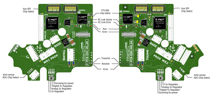

Lights on the hand
====================

Here is an annotation of the back of the hand's lights:

On power up, the lights will be in the following state:

=======================   =============       ================    =================================
Item                      Color               Activity            Meaning
=======================   =============       ================    =================================
Power LEDs                White               On                  Power good
EC Link Active            Green               On                  EtherCAT link established
EC Link Error             Red                 Off                 No EtherCAT link error
Run                       Green               Off                 Hand is in Init state
Application Layer Error   Red                 On (during boot)    Verifying ET1200 EEPROM
Application Layer Error   Red                 Then off            No EtherCAT packet error
ET1200 chip select        Yellow              On                  PIC32 communicating with ET1200
=======================   =============       ================    =================================

Lights will also appear inside the base, indicating 5v, 6v and 24v (or 28v) supplies. These can only be seen by removing the covers.

When the ROS driver is running you should see the following lights on the Palm:

========================   =============       ================    =================================
Light                      Colour              Activity            Meaning
========================   =============       ================    =================================
Run                        Green               On                  Hand is in Operational state
CAN1/2 Transmit            Blue                V.fast flicker      Demand values are being sent to the motors
CAN1/2 Receive             Blue                V.fast flicker      Motors are sending sensor data
Joint sensor chip select   Yellow              On                  Sensors being sampled
========================   =============       ================    =================================

After killing the driver, the lights will be in a new state:

========================   =============       ================    =================================
Light                      Colour              Activity            Meaning
========================   =============       ================    =================================
Run                        Green               Blinking            Hand is in Pre-Operational state
CAN1/2 Transmit            Blue                Off                 No messages transmitted on CAN 1/2
CAN1/2 Receive             Blue                Off                 No messages received on CAN 1/2
Joint sensor chip select   Yellow              Off                 Sensors not being sampled
========================   =============       ================    =================================
