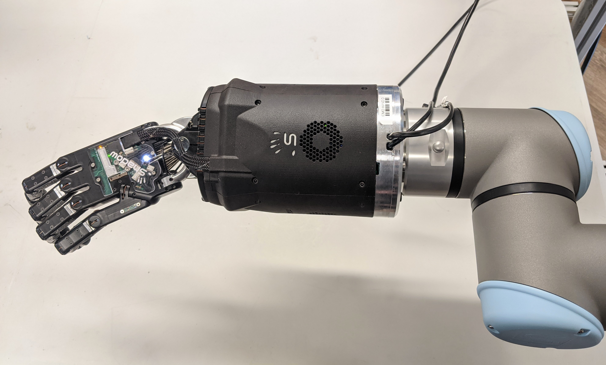

Mounting the hand to an arm
-----------------------------
Shadow Robot supplies an elbow adaptor plate to adapt the Hand to most robot arms. The Hand's elbow plate contains eight screw holes which accept M6 bolts to a depth of 12mm. The holes are spaced equally from the centre on a circle with diameter 100mm. The overall diameter of the elbow plate is 135mm

.. figure:: ../img/mounting_hand.png
    :width: 80%
    :align: center
    :alt: Mounting the hand

To mount the hand properly to an UR arm so that it is aligned with our xacros, you need to rotate it as shown in the picture below:

    Correct way to align the hand to the UR arms

The hand's palm points in the direction of the TCP point of the arm. 
