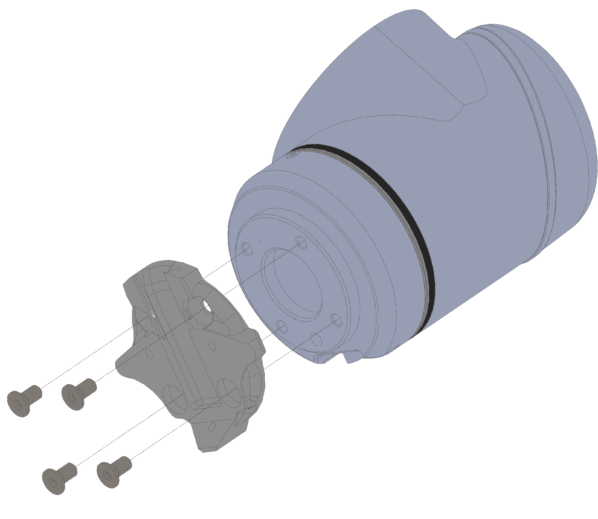
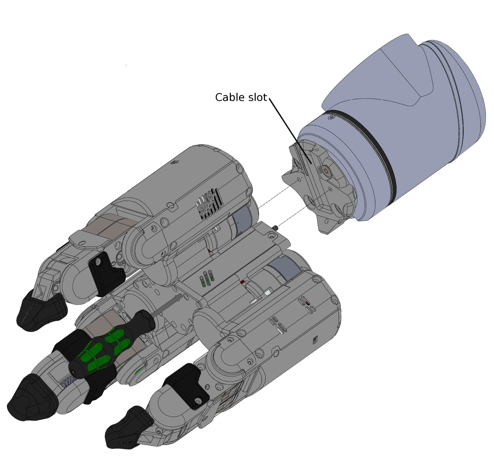
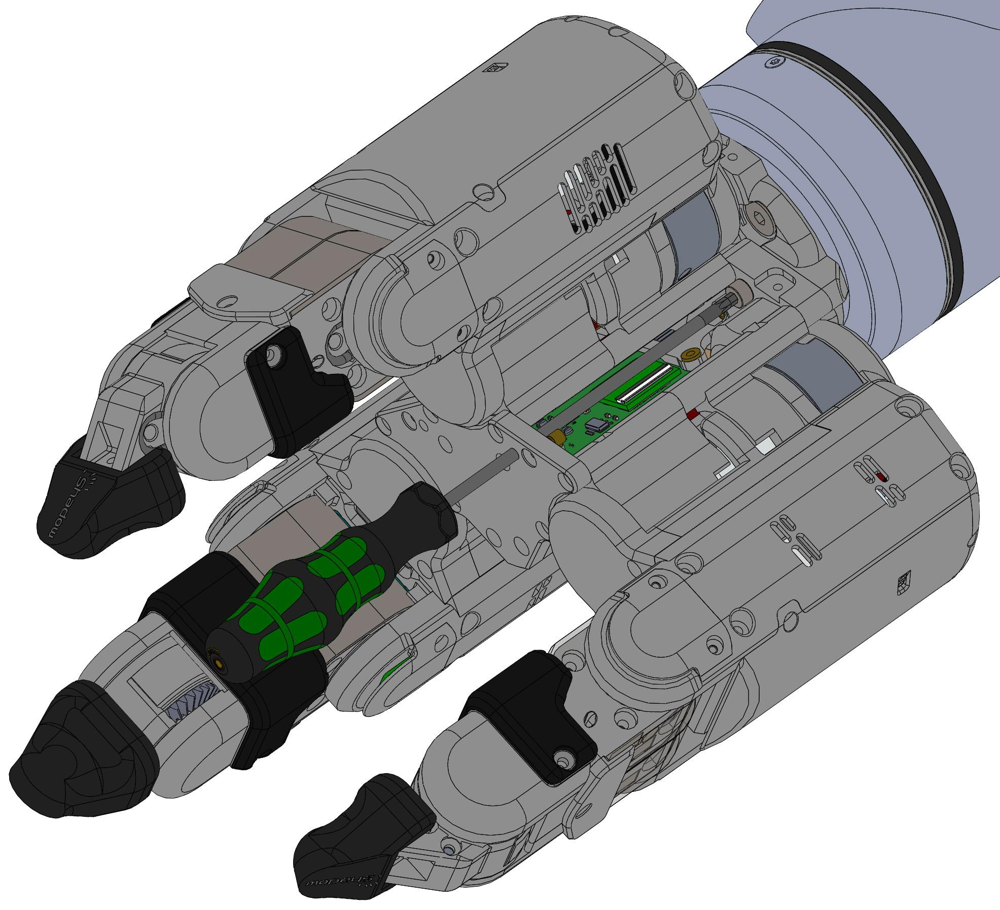
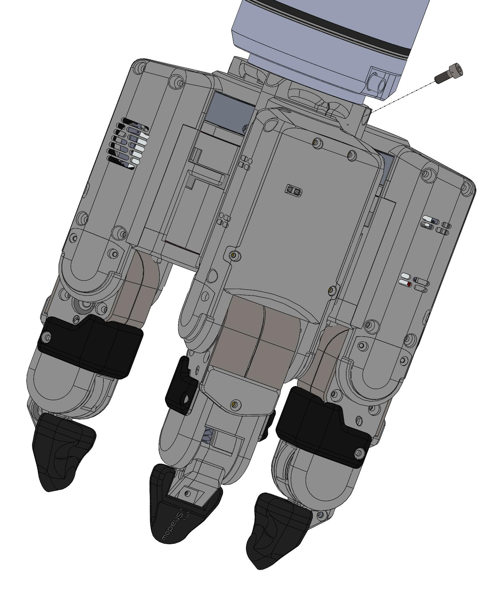

## What's in the box?

Item | Description
--- | --- 
Shadow Grasper-9° | Grasper with 3 Fingers, 9 DoF
PSU for Grasper | 24v Power Supply
Kettle Lead | To connect the power supply to mains
Power Cable | 3-pin Large Lemo connector
EtherCAT Cable | Ethernet Cable to connect Grasper to PC
Hex driver set | Hex drivers used for simple maintenance tasks
3mm Hex driver 110mm long | Hex driver used to attach Grasper to its mount plate
User Manual | This document
Mounting Plate | Mechanical interface between Grasper and robot arm
10mm M4 Cap Head Screw | Required to use Mounting Plate

## Connecting Cables
If your Grasper already has cables fitted, then you can simply connect the EtherCAT and power connectors immediately:

**EtherCAT**: Connect the Ethernet cable to the Grasper's Ethernet socket, and connect the other end to the PC's second
Ethernet port. You have been supplied with a medium length Ethernet lead, but if you require a longer or shorter one, you can simply use a standard commercial Ethernet Cat 5 cable, available from most computer parts suppliers.

**Power**: Connect the external power supply to the Grasper using the metal Lemo connector, making sure to line up the red dots. If you require a longer or shorter cable, please contact the Shadow Robot Company at grasper@shadowrobot.com

## Mounting the grasper

The Grasper will be supplied with a mounting plate to attach it to a robot arm. The default will be for any arm with a flange conforming to ISO 9409-1-50-4-M6, such as a UR10, but other arms can be accommodated upon request. To mount the Grasper onto a robot arm, begin by attaching the Grasper mounting plate to the arm using the appropriate screws (Arm shown below is a UR10 that requires 4 x M6 screws. )

With the mounting plate mounted securely onto the arm, the Grasper can now be attached to it. To mount the Grasper, there are 2 internal captive screws that can be accessed by the provided 3mm 110mm long hex driver (see image below). It is advisable to insert the driver and locate it into the screw head, then screw into the mounting plate. Repeat for the second captive screw. Lastly, an additional M4 10mm cap head screw should be inserted into the mounting plate and screwed into the base of the grasper (The screw is inserted at an angle of 45º, see image below). 

**Note**: When attaching the grasper to the mounting plate be sure that the Ethernet and power cables are located in the correct slot and not being pinched between the mount plate and grasper. 

## Powering up

You can power up the Grasper and PC in any order. You do not have to power up one before the other. When power is applied to the Grasper, the fans will be heard immediately.

### Lights

On power up, the lights on each finger (shown in green above) will be solid green. When the ROS driver is run successfully the lights will settle to flashing green. Any Red lights indicate some kind of error. 
