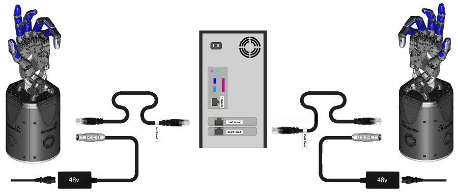
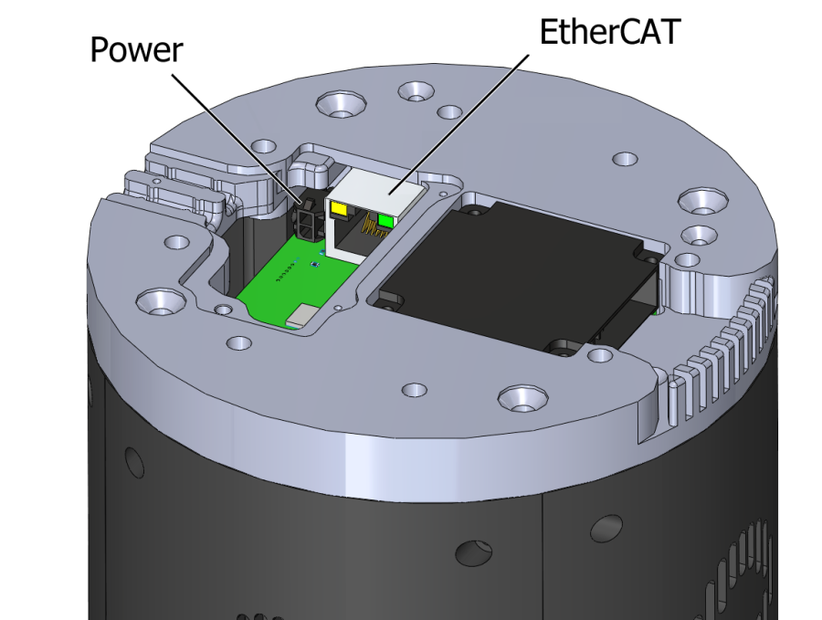
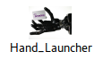
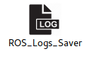

# Setting up the hand

## First time users
If you are unfamiliar with ROS and intend to use the ROS API, it is highly recommended that you read the [ROS Tutorials](http://www.ros.org/wiki/ROS/Tutorials).

If you are unfamiliar with the terminal on Linux, you should look [here](https://askubuntu.com/questions/183775/how-do-i-open-a-terminal).

Shadow software is deployed using Docker. Docker is a container framework where each container image is a lightweight, stand-alone, executable package that includes everything needed to run it. It is similar to a virtual machine but with much less overhead. Follow the instructions in the next section to get the latest Docker container of the hand driver and interface up and running.

## Hardware specifications

In order to run our software and the ROS software stack you will need to meet some hardware requirements. 

CPU: Intel i5 or above
RAM: 4GB or above
Hard Drive: Fast HDD or SSD (Laptop HDD are very slow)
Graphics Card: Nvidia GPU (optional)
LAN: A spare LAN port to connect the Hand (even with a USB to LAN adaptor)
OS: Ubuntu 18.04, 16.04 Kinetic (Active development) or 14.04 Indigo for older releases.

The most important one is to have a fast HDD or an SSD.

## Setting up a real hand

### What's in the box?

```eval_rst
=========================   ===========================================================
Item                        Description
=========================   ===========================================================
Shadow Hand E2M3 or E2PT    Hand Unit
PC                          Host PC control unit for the hand
PSU for Hand                48v for motor hand
Kettle Leads                To connect power supplies to mains
Power Cable                 4-pin Large Lemo connector, already fitted to the hand
EtherCAT Extension Cable    50cm EtherCAT extension lead, already fitted to the Hand
Calibration Jigs            Bag containing calibration jigs for all joints
Toolbox                     Contains hex drivers to perform required maintenance
User Manual                 This document
=========================   ===========================================================
```

### Connecting Cables
There are two ways to connect the EtherCAT and power cables to the hand.

#### External connections
If your hand already has cables fitted, then you can simply connect the EtherCAT and power connectors immediately.


**EtherCAT**: Connect the Ethernet cable to the hand's Ethernet socket, and connect the other end to the PC's second
Ethernet port. **If you have a Bi-manual system, connect the Left and Right hands correctly to the labelled ports.** 
You have been supplied with a medium length Ethernet lead, but if you require a longer or shorter one, you can simply use a standard commercial Ethernet Cat 5 cable, available from most computer parts suppliers.

**Power**: Connect the external power supply to the hand using the metal Lemo connector, making sure to line up the red dots. If you require a longer or shorter cable, please contact the Shadow Robot Company.

#### Internal connections
If you are connecting the hand to a robot with internal cabling, then you may wish to use the internal connectors.
Turn the hand over, and use the orange and green hex drivers to remove the connector cover. Connect the two cables to their relevant sockets. Now affix the hand to your robot arm. 


### Mounting the hand

Shadow Robot can supply an elbow adaptor plate to adapt the Hand to most other robot arms. However, if you wish to make your own fitting for the Hand: 


The Hand's elbow plate contains eight screw holes which accept M6 bolts to a depth of 12mm. The holes are spaced equally from the centre on a circle wth diameter 100mm. The overall diameter of the elbow plate it 135mm

### Powering up

You can power up the hand and PC in any order. You do not have to power up one before the other. When power is applied to the hand, the fans will be heard immediately.

#### Lights

On power up, the lights will be in the following state

```eval_rst
=======================   =============       ================    =================================
Item                      Color               Activity            Meaning
=======================   =============       ================    =================================
Power LEDs                White               On                  Power good
EC Link Active            Green               On                  EtherCAT link established
EC Link Error             Red                 Off                 No EtherCAT link error
Run                       Green               Off                 Hand is in Init state
Application Layer Error   Red                 On (during boot)    Verifying ET1200 EEPROM
Application Layer Error   Red                 Then off            No EtherCAT packet error
ET1200 chip select        Yellow              On                  PIC32 communicating with ET1200
=======================   =============       ================    =================================
```

Lights will also appear inside the motor or muscle base, indicating 5v, 6v and 24v (or
28v)supplies. In the motor hand, these can only be seen by removing the covers.

#### Jiggling

This applies to the motor hand only. On reset, all of the strain gauges (torque sensors) in the
motors need to be zeroed. This happens automatically. The motors are driven back and forth
to try to relieve any tension on the tendons. Then both gauges are zeroed. You will therefore
see all joints of the hand move slightly on power up or reset or power up.


### Installing the software 

#### On a new PC using the one-liner
We have created a one-liner that is able to install Docker, download the image and create a new container for you. It will also create two desktop icons, one to start the container and launch the hand and another one to save the log files locally. To use it, you first need to have a PC with Ubuntu installed on it (preferable version 16.04) then follow these steps:

* **Check your hand interface ID**: 

  Before setting up the docker container, the EtherCAT interface ID for the hand needs to be discovered. In order to do so, after plugging the hand’s ethernet cable into your machine and powering it up, please run

  ```bash
  $ sudo dmesg
  ```
  command in the console. At the bottom, there will be information similar to the one below:
   
  ```bash
  [490.757853] IPv6: ADDRCONF(NETDEV_CHANGE): enp0s25: link becomes ready
  ```
  In the above example, ‘enp0s25’ is the interface ID that is needed.

* **Get ROS Upload login credentials**

  If you want to upload technical logged data (ROS logs, backtraces, crash dumps etc.) to our server and notify the Shadow's software team to investigate your bug then you need to enable logs uploading in the one-liner. In order to use this option you need to obtain a unique upload key by emailing sysadmin@shadowrobot.com. When you receive the key you can use it when running the one-liner installation tool. To enable the logs uploading you need to add the command line option ```-ck true``` to the one-liner.
  After executing the one-liner, it will prompt you to enter your upload key and press enter to continue. Please copy and paste your key from the email you received by Shadow Robot.

* **Check your hand configuration branch**:

  You should have the name of your [sr_config](https://github.com/shadow-robot/sr-config) hand branch which contains the specific configuration of your hand (calibration, controller tuning etc…).
  Usually it is something like this: ``shadowrobot_XXXXX``. 

  If you are unsure please contact us. 

* **Run the one-liner**:

  The one-liner will install Docker, pull the image from Docker Hub, and create and run a container with the parameters specified. In order to use it, use the following command:

  **Please remember to replace [EtherCAT interface ID] with your Interface ID and [sr_config_branch] with your unique sr_config branch**

  ROS Kinetic (Recommended):
  ```bash
  $ bash <(curl -Ls http://bit.do/launch-sh) -i shadowrobot/dexterous-hand:kinetic-release -n dexterous-hand -sn Hand_Launcher -e [EtherCAT interface ID] -b [sr_config_branch]
  ```
  Examples:
  For Interface ID ```ens0s25``` and sr_config_branch ```shadow_12345```
  ```bash
  $ bash <(curl -Ls http://bit.do/launch-sh) -i shadowrobot/dexterous-hand:kinetic-release -n dexterous-hand -sn Hand_Launcher -e ens0s25 -b shadow_12345
  ```  
  Same as above but with ROS logs upload enabled
  ```bash
  $ bash <(curl -Ls http://bit.do/launch-sh) -i shadowrobot/dexterous-hand:kinetic-release -n dexterous-hand -sn Hand_Launcher -e ens0s25 -b shadow_12345 -ck true
  ```  

  ROS Indigo:
  ```bash
  $ bash <(curl -Ls http://bit.do/launch-sh) -i shadowrobot/dexterous-hand:indigo-release -n dexterous-hand -sn Hand_Launcher -e [EtherCAT interface ID] -b [sr_config_branch]
  ```
  Examples:
  For Interface ID ```ens0s25``` and sr_config_branch ```shadow_12345```
  ```bash
  $ bash <(curl -Ls http://bit.do/launch-sh) -i shadowrobot/dexterous-hand:indigo-release -n dexterous-hand -sn Hand_Launcher -e ens0s25 -b shadow_12345
  ```  
  Same as above but with ROS logs upload enabled
  ```bash
  $ bash <(curl -Ls http://bit.do/launch-sh) -i shadowrobot/dexterous-hand:indigo-release -n dexterous-hand -sn Hand_Launcher -e ens0s25 -b shadow_12345 -ck true
  ```  

  You can also add -r true in case you want to reinstall the docker image and container. When it finishes it will show:
  ```bash
  Operation completed
  ```
  and it will create two desktop icons on your desktop that you can double-click to launch the hand or save the log files from the active containers to your desktop.
  The icon that launches the hand looks like this:

  
   
  And for saving the logs:

  
  

#### Using a PC that Shadow provided
In this case, the previous steps would have been performed by the Shadow team before, then the only thing to do to start the Hand is to either double-click the desktop icon or to run the container using:

```bash
$ docker start dexterous-hand
```

You can check the currently available containers using:
```bash
$ docker ps -a
```

The container will be ready when fingers move to the zero position. 

### Saving log files and uploading data to our server
When running the one-liner, along with the icon that starts the Grasper, you will also notice a second icon named Save logs that is used to retrieve and copy all the available logs files from the active containers locally on your Desktop. This icon will create a folder that matches the active container's name and the next level will include the date and timestamp it was executed. When it starts, it will prompt you if you want to continue, as by pressing yes it will close all active containers. If typed 'y' to continue, you will have to enter a description of the logging event and will start coping the bag files, logs and configuration files from the container and then exit. Otherwise, the window will close and no further action will happen. If you provided an upload key with the one-liner installation then the script will also upload your LOGS in compressed format to our server and notify the Shadow's software team about the upload. This will allow the team to fully investigate your issue and provide support where needed. 

### Starting the driver

* **Shadow Hand Driver**
  Launch the driver for the Shadow Hand using the desktop icon 'Hand_Launcher' or at a
  terminal (in the container), type:

  ```bash
  $ roslaunch sr_ethercat_hand_config sr_rhand.launch
  ```

* **Lights in the hand**:
  When the ROS driver is running you should see the following lights on the Palm:

  ```eval_rst
  ========================   =============       ================    =================================
  Light                      Colour              Activity            Meaning
  ========================   =============       ================    =================================
  Run                        Green               On                  Hand is in Operational state
  CAN1/2 Transmit            Blue                V.fast flicker      Demand values are being sent to the motors
  CAN1/2 Receive             Blue                V.fast flicker      Motors are sending sensor data
  Joint sensor chip select   Yellow              On                  Sensors being sampled
  ========================   =============       ================    =================================
  ```

  After killing the driver, the lights will be in a new state:
  ```eval_rst
  ========================   =============       ================    =================================
  Light                      Colour              Activity            Meaning
  ========================   =============       ================    =================================
  Run                        Green               Blinking            Hand is in Pre-Operational state
  CAN1/2 Transmit            Blue                Off                 No messages transmitted on CAN 1/2
  CAN1/2 Receive             Blue                Off                 No messages received on CAN 1/2
  Joint sensor chip select   Yellow              Off                 Sensors not being sampled
  ========================   =============       ================    =================================
  ```

## Setting up a simulated hand

### Installing the software 

If you do not actually have a real hand but would like to use our hand in simulation, then please run the following command:

ROS Kinetic (Recommended):
```bash
$ bash <(curl -Ls http://bit.do/launch-sh) -i shadowrobot/dexterous-hand:kinetic-release -n dexterous-hand -sn Hand_Container -b kinetic_devel -l false
```

ROS Indigo:
```bash
$ bash <(curl -Ls http://bit.do/launch-sh) -i shadowrobot/dexterous-hand:indigo-release -n dexterous-hand -sn Hand_Container -b kinetic_devel -l false
```

You can also add -r true in case you want to reinstall the docker image and container. When it finishes it will show:

```bash
Operation completed
```
and it will create two desktop icons on your desktop that you can double-click to launch the hand or save the log files from the active containers to your desktop.

### Starting a robot simulation

First you need to start the hand container by either doble clicking the icon "Hand_Container" or running the following command:
```bash
$ docker start dexterous-hand
```

#### Shadow Dexterous hands
* To start a simulation of our dexterous hand, simply do (in the container):
  ```bash
  $ roslaunch sr_robot_launch srhand.launch
  ```
  This will launch the five finger hand (shadowhand\_motor) by default .

* If you want to start the dexterous hand plus, you can add the hand\_type like this:
  ```bash
  $ roslaunch sr_robot_launch srhand.launch hand_type:=hand_e_plus
  ```
* If you want to launch another hand, these are the hands available:
    
```eval_rst
+------------+------------+------------+------------+------------+------------+------------+------------+------------+------------+-------------+
| |image0|   | |image1|   | |image2|   | |image3|   | |image4|   | |image5|   | |image6|   | |image7|   | |image8|   | |image9|   | |image10|   |
+============+============+============+============+============+============+============+============+============+============+=============+
| 1          | 2          | 3          | 4          | 5          | 6          | 7          | 8          | 9          | 10         | 11          |
+------------+------------+------------+------------+------------+------------+------------+------------+------------+------------+-------------+

+------+-------------------------------------------------------+----------------------------------------------+
|      | Right                                                 | Left                                         |
+======+=======================================================+==============================================+
| 1    | shadowhand\_motor.urdf.xacro                          | shadowhand\_left\_motor.urdf.xacro           |
+------+-------------------------------------------------------+----------------------------------------------+
| 2    | shadowhand\_motor\_biotac.urdf.xacro                  | shadowhand\_left\_motor\_biotac.urdf.xacro   |
+------+-------------------------------------------------------+----------------------------------------------+
| 3    | shadowhand\_motor\_ff\_biotac.urdf.xacro              |                                              |
+------+-------------------------------------------------------+----------------------------------------------+
| 4    | shadowhand\_motor\_btsp.urdf.xacro                    |                                              |
+------+-------------------------------------------------------+----------------------------------------------+
| 5    | shadowhand\_motor\_ellipsoid.urdf.xacro               |                                              |
+------+-------------------------------------------------------+----------------------------------------------+
| 6    | shadowhand\_motor\_th\_ff\_rf\_ellipsoid.urdf.xacro   |                                              |
+------+-------------------------------------------------------+----------------------------------------------+
| 7    | shadowhand\_muscle.urdf.xacro                         | shadowhand\_left\_muscle.urdf.xacro          |
+------+-------------------------------------------------------+----------------------------------------------+
| 8    | shadowhand\_muscle\_biotac.urdf.xacro                 |                                              |
+------+-------------------------------------------------------+----------------------------------------------+
| 9    | shadowhand\_lite.urdf.xacro                           |                                              |
+------+-------------------------------------------------------+----------------------------------------------+
| 10   | shadowhand\_extra\_lite.urdf.xacro                    |                                              |
+------+-------------------------------------------------------+----------------------------------------------+
| 11   | shadowhand\_motor\_plus.urdf.xacro                    | shadowhand\_left\_motor\_plus.urdf.xacro     |
+------+-------------------------------------------------------+----------------------------------------------+

.. |image0| image:: ../img/shadowhand_motor.png
.. |image1| image:: ../img/shadowhand_motor_biotac.png
.. |image2| image:: ../img/shadowhand_motor_ff_biotac.png
.. |image3| image:: ../img/shadowhand_motor_btsp.png
.. |image4| image:: ../img/shadowhand_motor_ellipsoid.png
.. |image5| image:: ../img/shadowhand_motor_th_ff_rf_ellipsoid.png
.. |image6| image:: ../img/shadowhand_muscle.png
.. |image7| image:: ../img/shadowhand_muscle_biotac.png
.. |image8| image:: ../img/shadowhand_lite.png
.. |image9| image:: ../img/shadowhand_extra_lite.png
.. |image10| image:: ../img/shadowhand_motor_plus.png

```

To start the simulation, you can run:

```bash
$ roslaunch sr_robot_launch srhand.launch robot_description:=`rospack find sr_description`/robots/shadowhand_motor.urdf.xacro
```

The ``robot description`` param can be changed to start any of the available Shadow hands shown in the table.
* If it is a left hand, ``hand_id:=lh`` should be added. For example:

```bash
$ roslaunch sr_robot_launch srhand.launch robot_description:=`rospack find sr_description`/robots/shadowhand_left_motor.urdf.xacro hand_id:=lh
```

* Moveit will enable advanced behaviour (inverse kinematics, planning, collision detectection, etc...), but if it is not needed, you can set ``use_moveit:=false``

#### Bimanual system


To start the simulation of a bimanual system, you can run:

```bash
$ roslaunch sr_robot_launch sr_bimanual.launch use_moveit:=true
```