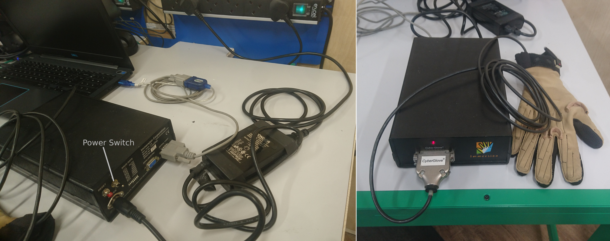
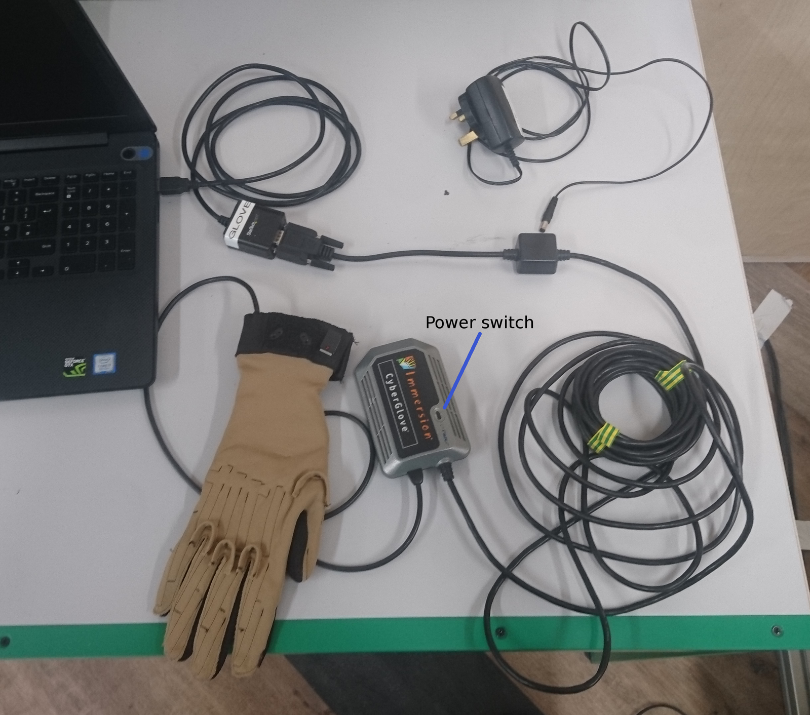
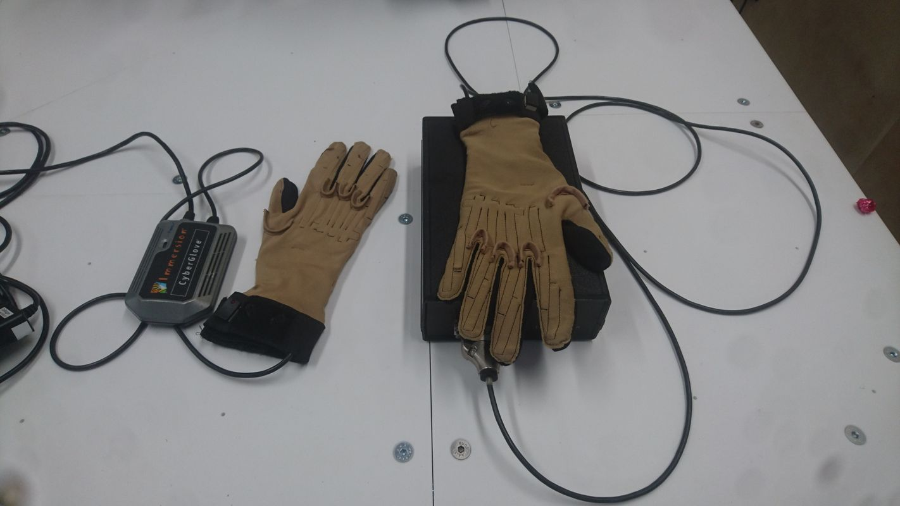
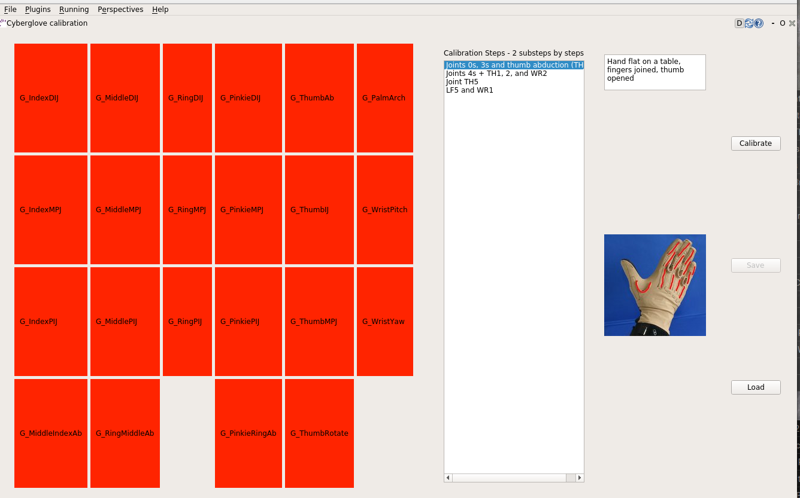
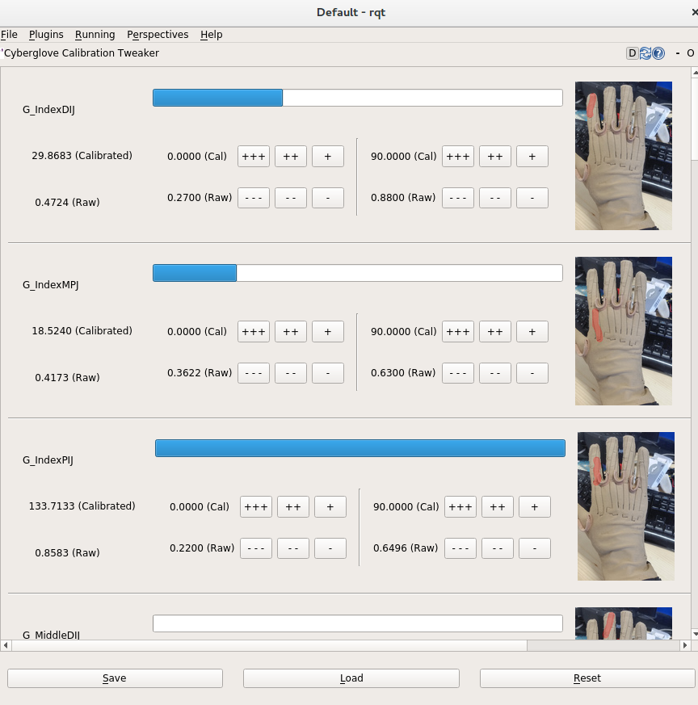

Using Peripherals
==================

Cyberglove
----------

.. warning:: The Cyberglove is not supported in our latest releases neither in Melodic nor Noetic ROS versions of our docker images. Documentation here is only for reference but we don't provide support for this anymore.

Introduction
^^^^^^^^^^^^^
The Cyberglove is a data glove designed for use with Virtual Reality that Shadow has integrated with our Dexterous Hand to provide a method for control directly by a human operator. The gloves have 22 sensors which correspond approximately to the degrees of freedom of the robot. With practice, good control of the Shadow Hand is possible. The following is a guide for getting up and running with the glove.

Getting Started
^^^^^^^^^^^^^^^^

Connecting
~~~~~~~~~~~~
There are two variants of the cyberglove. Both use an RS-232 serial interface with a D-sub type connector and connect to a PC via a USB Serial adaptor. To start, connect the serial adaptor to the PC and the control box to the adaptor.

The two gloves are powered in slightly different ways. The glove with the large black control box has a large DC power supply which plugs into the control box. The power supply takes mains power via a kettle lead.

The other glove has a small PSU that plugs directly into the mains and connects to the small injector in the middle of the serial lead.

The smaller control box has a button disguised as the power LED. Push and hold it for a second or two. It will glow green once it's powered on.

Running in Docker
~~~~~~~~~~~~~~~~~~
To run the glove from a docker container, you must connect and power up the glove before starting the container. This ensures that the USB serial device is available from inside the container.

The usual docker image to use is shadowrobot/dexterous-hand:kinetic. Please see [here](https://dexterous-hand.readthedocs.io/en/master/user_guide/1_setting_up_the_hand.html#on-a-new-pc-using-the-one-liner) for instructions on launching a docker image.

Launching
~~~~~~~~~~
The usual method to launch the glove is with the following command:

.. prompt:: bash $

   roslaunch sr_cyberglove_config cyberglove.launch

This will only be present on systems which have been delivered with a glove. This in turn simply calls `cyberglove_trajectory/launch/cyberglove.launch` with setup specific options. The latter launch file can be used directly if desired.

Launch Options
+++++++++++++++
The launch file in cyberglove_trajectory has the following arguments.

+---------------------+-----------------------------------------------------------+-------------------------------------------------------------------------------------------------------------------------------------------------------------+
| Argument            | Default                                                   | Description                                                                                                                                                 |
+=====================+===========================================================+=============================================================================================================================================================+
| serial_port         | /dev/ttyUSB0                                              | The device name of the USB serial adaptor on the host PC                                                                                                    |
+---------------------+-----------------------------------------------------------+-------------------------------------------------------------------------------------------------------------------------------------------------------------+
| joint_prefix        | rh\_                                                      | Prepended to the glove namespace, (e.g. rh_cyberglove). Necessary for bimanual systems                                                                      |
+---------------------+-----------------------------------------------------------+-------------------------------------------------------------------------------------------------------------------------------------------------------------+
| calibration         | sr_cyberglove_config/calibrations/right_cyberglove.yaml   | Path to yaml file containing per user glove calibration.                                                                                                    |
+---------------------+-----------------------------------------------------------+-------------------------------------------------------------------------------------------------------------------------------------------------------------+
| mapping             | sr_cyberglove_config/mappings/GloveToHandMappings_generic | Path to glove → robot joint mapping matrix. Usually no need to modify this file.                                                                            |
+---------------------+-----------------------------------------------------------+-------------------------------------------------------------------------------------------------------------------------------------------------------------+
| version             | 2                                                         | Glove protocol version. 2 for the older glove at Shadow, 3 for the newer one (See below)                                                                    |
+---------------------+-----------------------------------------------------------+-------------------------------------------------------------------------------------------------------------------------------------------------------------+
| protocol            | 8bit                                                      | Sets 8 or 16 bit mode for protocol version 3. 8 bit is correct for both of Shadow's gloves.                                                                 |
+---------------------+-----------------------------------------------------------+-------------------------------------------------------------------------------------------------------------------------------------------------------------+
| filter              | true                                                      | Filter data internally before publishing.                                                                                                                   |
+---------------------+-----------------------------------------------------------+-------------------------------------------------------------------------------------------------------------------------------------------------------------+
| trajectory_tx_delay | 0.1                                                       | Offset in second to set the trajectory time stamp. It must be grater than the time it takes for the trajectory goal msg to reach the trajectory controller. |
+---------------------+-----------------------------------------------------------+-------------------------------------------------------------------------------------------------------------------------------------------------------------+
| trajectory_delay    | 0.02                                                      | Delay from the beginning of the trajectory. I.e. the time_from_start of the single trajectory point.                                                        |
+---------------------+-----------------------------------------------------------+-------------------------------------------------------------------------------------------------------------------------------------------------------------+

Normally the default options are fine for either of Shadow's gloves. The main exception is the glove version, as the two gloves require slightly different serial protocols. See below for further explanation.

Protocol choice for cybergloves
+++++++++++++++++++++++++++++++

Shadow has two gloves of slightly different versions:

The older glove with the big black control box on the right is a Cyberglove 2. The newer one with the neater control box on the left is (probably) an early Cyberglove 3, although there is still some controversy over this fact. In any case, the old glove works with `version:=2` and the newer one works with `version:=3`.

Calibrating
^^^^^^^^^^^^
To modify the glove calibration, there are two RQT plugins:

1. Glove Calibrator: User executes a sequence of gestures which are used to generate a new calibration file.
2. Glove Calibration Tweaker: Individual calibration points can be modified manually to adjust/improve an existing calibration.

Calibration GUI
~~~~~~~~~~~~~~~~

* With a glove connected and started, run the calibration GUI.
* Using the pictures on the right as a guide, execute the sequence of hand positions.
  * Place your hand in the position shown in the picture.
  * Press 'Calibrate'
  * Repeat for all positions.
* Save the new calibration. **(N.B. The calibration will not be loaded until it is saved)**

Tweaking GUI
~~~~~~~~~~~~

* The sensors of the glove are enumerated. Each sensor has a picture to its right to show its location on the glove.
* The raw sensor value and its calibrated output in degrees are displayed on the left of each sensor's display.
* Each sensor's display is divided into its calibration points.
* The calibrated value and its position with respect to the calibration points is visualised for each sensor via the blue bar at the top of each sensor's display.
* Each calibration point can be manually adjusted using the 6 buttons, with the buttons having the following effects:

+---------------------+--------+-------+--------+----------+-------+--------+
| Button              | \+\+\+ | \+\+  | \+     | \- \- \- | \- \- | \-     |
+=====================+========+=======+========+==========+=======+========+
| Adjustment To Value | +0.1   | +0.01 | +0.001 | -0.1     | -0.01 | -0.001 |
+---------------------+--------+-------+--------+----------+-------+--------+

* Using a virtual hand for reference, the user should adjust the calibrations, one sensor at a time, to improve correlation between user and robot hands.
* Once satisfied with changes, the calibration can be saved using the save button.
* An existing calibration can be loaded using the load button.
* The most recently loaded calibration (or the one present when the GUI was started) can be reloaded using the reload button.

Topics/Service
^^^^^^^^^^^^^^^

Topics
~~~~~~

* Contains raw values, in raw ADC values, scaled 0.0->1.0:
  .. prompt:: bash $

     /rh_cyberglove/raw/joint_state

* Contains sensor values, calibrated in radians:
  .. prompt:: bash $

     /rh_cyberglove/calibrated/joint_state

* Goal trajectory, published directly to trajectory controller.
  .. prompt:: bash $

     /rh_trajectory_controller/follow_joint_trajectory/goal

Service
~~~~~~~~

* Empty service called to instruct driver to reload glove calibration from parameter server **(N.B Doesn't reload calibration from disk)**
  .. prompt:: bash $

     /rh_cyberglove/reload_calibration

Synchronising Between Multiple Machines
^^^^^^^^^^^^^^^^^^^^^^^^^^^^^^^^^^^^^^^

If the glove node runs on a different machine from the trajectory controller, both machines will need to be synchronised.
Chrony (sudo apt-get install chrony) has been used successfully to achieve that.

The argument trajectory_tx_delay should be increased slightly to account for the extra transmission time from the glove driver to the trajectory controller.

Optoforce
----------

If the hand has optoforce sensors installed, it is recommended to use the one liner to install the docker container using the “-o true” option. Doing this, everything will be set up automatically.
Example of the oneliner is illustrated below:

.. prompt:: bash $

   bash <(curl -Ls http://bit.ly/launch-sh) -i shadowrobot/dexterous-hand:kinetic-release -n dexterous-hand -sn Hand_Launcher -e [EtherCAT interface ID] -b [sr_config_branch] -o true

.. Note::Please remember to replace [EtherCAT interface ID] with your Interface ID and [sr_config_branch] with your unique sr_config branch

For more information on setup and getting started with the optoforce sensors, [look here](https://github.com/shadow-robot/optoforce/tree/indigo-devel/optoforce).

Topics
^^^^^^^

Optoforce sensor data will be published on the following topics:

.. prompt:: bash $

   /rh/optoforce_**

BioTac
-------
These topics are read-only and update at 100 Hz with data from the biotac sensors, which comprises their pressure,
temperature and electrode resistance. For further information about the biotacts, refer to their `documentation <https://www.syntouchinc.com/wp-content/uploads/2016/12/BioTac_SP_Product_Manual.pdf>`_.

Topics
^^^^^^

* This topic is published by the driver at 100 Hz with data from tactile sensors:
  .. prompt:: bash $

     /rh/tactile

  Example topic message when using BioTac fingertip sensors:

  .. prompt:: bash $

          tactiles:
          -
          pac0: 2048
          pac1: 2054
          pdc: 2533
          tac: 2029
          tdc: 2556
          electrodes: [2622, 3155, 2525, 3062, 2992, 2511, 3083, 137, 2623, 2552, 2928, 3249, 2705, 3037, 3020, 2405, 3049, 948, 2458, 2592, 3276, 3237, 3244, 3119]
          -
          pac0: 0
          pac1: 0
          pdc: -9784
          tac: 32518
          tdc: 0
          electrodes: [0, 0, 0, 0, 0, 0, 0, 0, 0, 0, 0, 0, 0, 0, 0, 0, 0, 0, 0, 0, 0, 0, 0, 0]
          -
          pac0: 0
          pac1: 0
          pdc: -9784
          tac: 32518
          tdc: 0
          electrodes: [0, 0, 0, 0, 0, 0, 0, 0, 0, 0, 0, 0, 0, 0, 0, 0, 0, 0, 0, 0, 0, 0, 0, 0]
          -
          pac0: 0
          pac1: 0
          pdc: -9784
          tac: 32518
          tdc: 0
          electrodes: [0, 0, 0, 0, 0, 0, 0, 0, 0, 0, 0, 0, 0, 0, 0, 0, 0, 0, 0, 0, 0, 0, 0, 0]
          -
          pac0: 0
          pac1: 0
          pdc: -9784
          tac: 32518
          tdc: 0
          electrodes: [0, 0, 0, 0, 0, 0, 0, 0, 0, 0, 0, 0, 0, 0, 0, 0, 0, 0, 0, 0, 0, 0, 0, 0]

* These topics are read-only and update at 100 Hz with data from the biotac sensors, which comprises their pressure, temperature and electrode resistance. This topic is published from the */biotac_republisher* node which receives this data from the driver via the */rh/tactile* topic. For further information about the biotacs, refer to their documentation: <https://www.syntouchinc.com/wp-content/uploads/2016/12/BioTac_SP_Product_Manual.pdf>
  .. prompt:: bash $

     /rh/biotac_

  Example */rh/biotac_*** topic message:

  .. prompt:: bash $

     pac0: 2056
     pac1: 2043
     pdc: 2543
     tac: 2020
     tdc: 2454
     electrodes: [2512, 3062, 2404, 2960, 2902, 2382, 2984, 138, 2532, 2422, 2809, 3167, 2579, 2950, 2928, 2269, 2966, 981, 2374, 2532, 3199, 3152, 3155, 3033]
