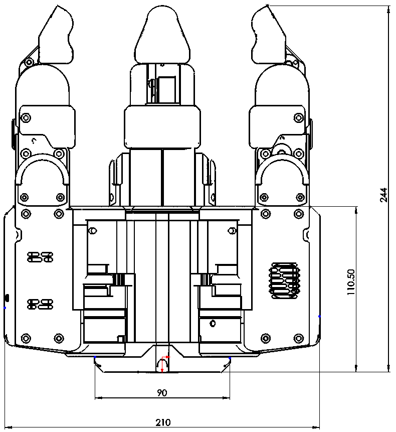
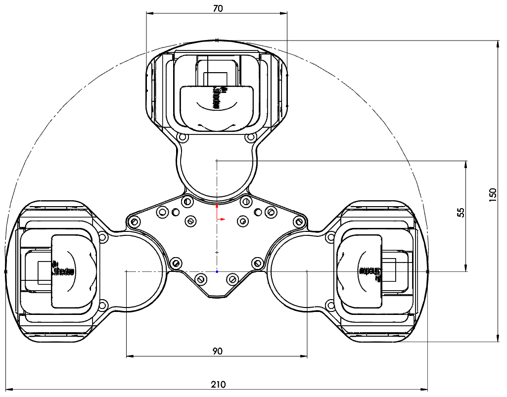
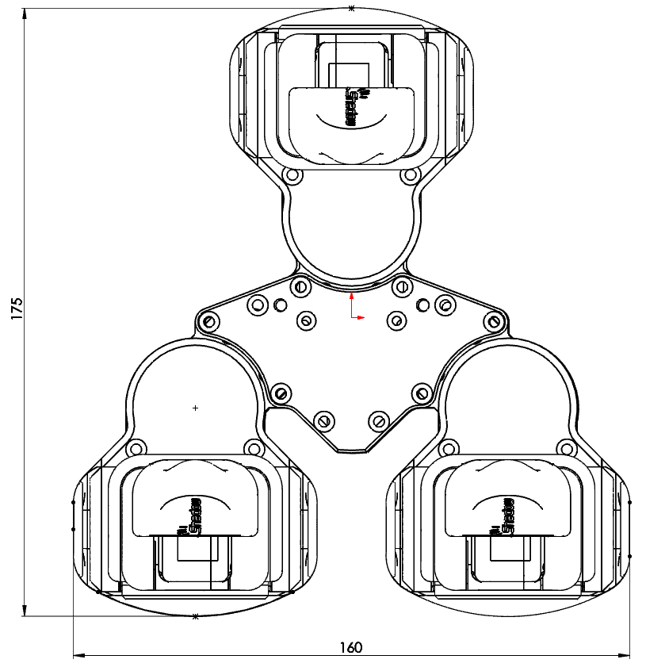
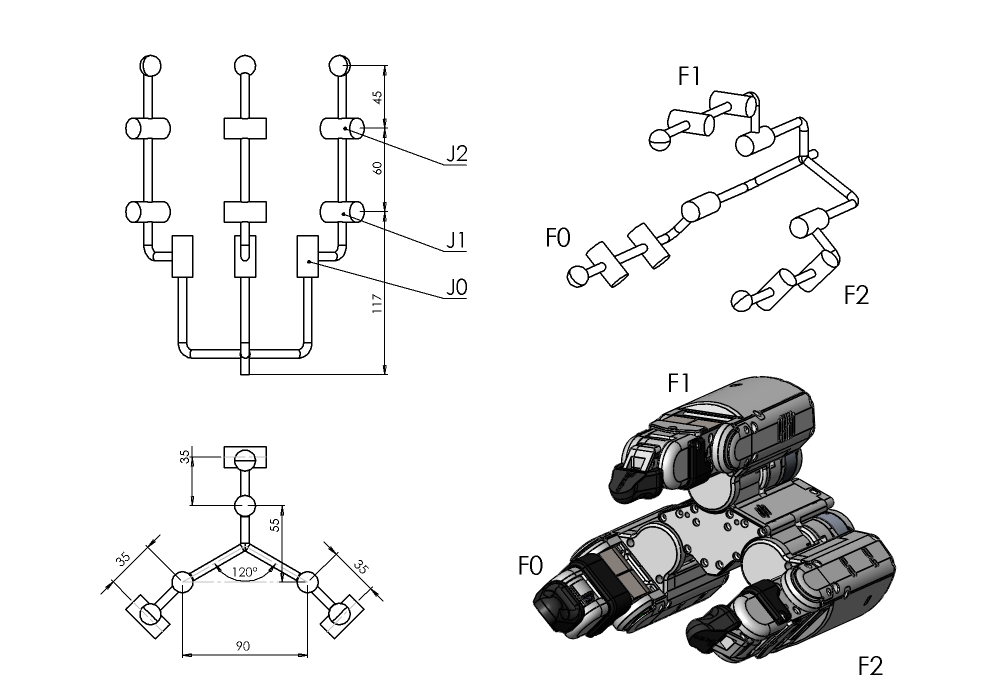
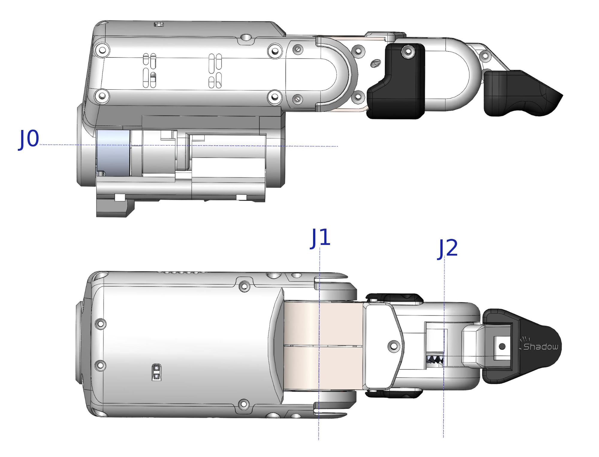

## Dimensions

## Kinematics

## Finger

 

### Naming and angle conventions

The three fingers are named F0, F1, and F2 (see 4.2 Kinematics) and the three finger joints are: base rotation (sideways movement), proximal (middle section), and distal (fingertip). Joints are numbered from 0, starting at the base (See diagram above).

## Joint Ranges

| Joint(s) | Min deg | Max deg | Min rad | Max rad |
| :---: | ---: | ---: | ---: | ---: | 
| J0 | -45 | 45 | -0.785 | 0.785 | 
| J1 | -80 | 60 | -1.396 | 1.047 |
| J2 | -60 | 80 | -1.047 | 1.396 |
