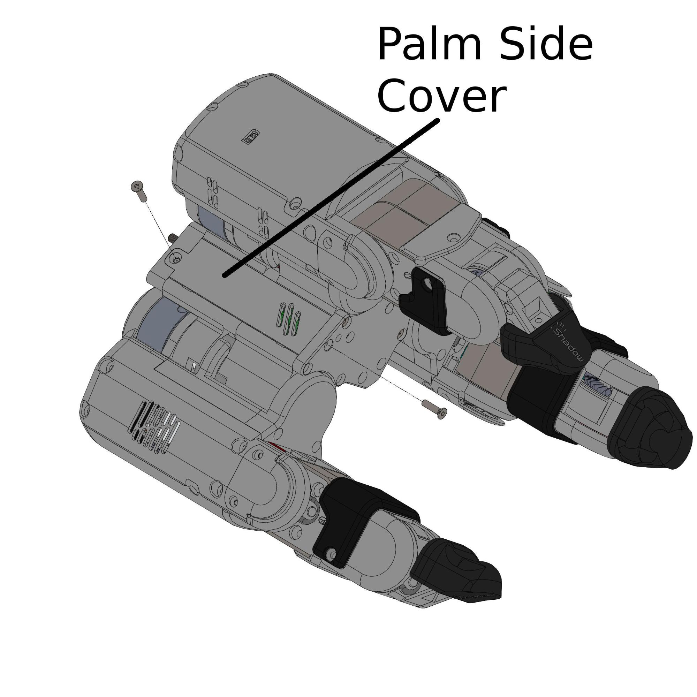
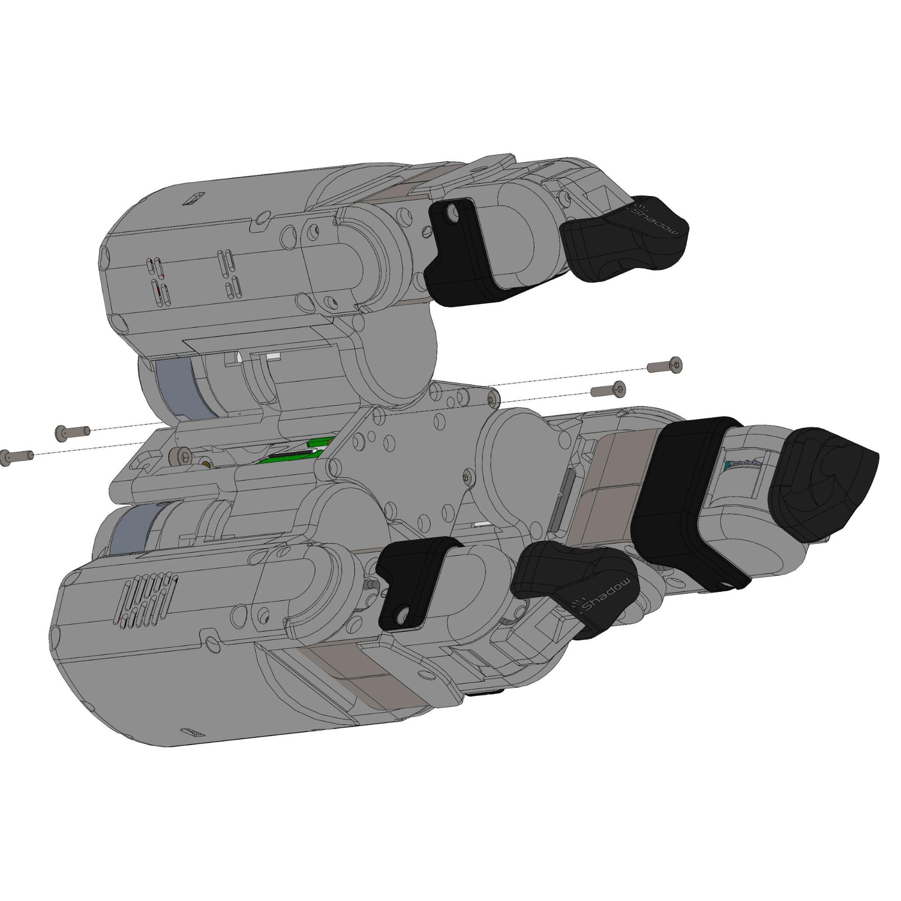
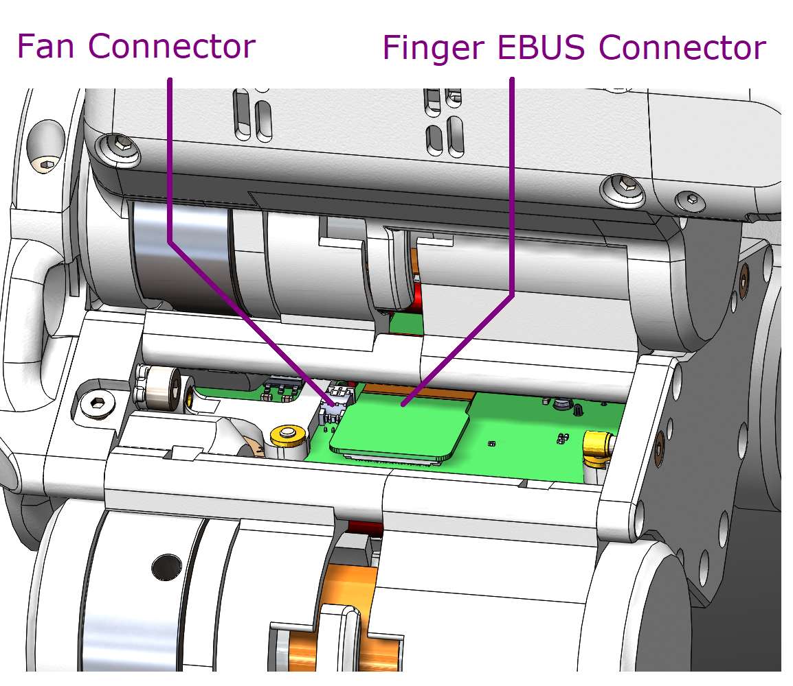
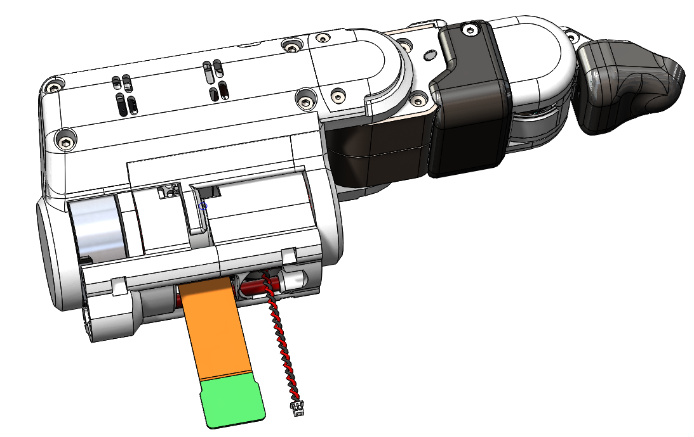

## Mechanical maintenance

### Inspecting for wear and tear
The Grasper should be periodically inspected for wear and tear. Anything unusual should be reported to your supplier contact or sent to grasper@shadowrobot.com.

### Replacing a finger
In the event that one or more fingers have some damage or another issue that requires replacement or repair it may be necessary to swap a finger of the Grasper for a new or repaired one. 

To remove or replace a finger, first, unplug the Grasper's power and Ethernet cables. Then detach the Grasper from the arm by unscrewing it from the mounting plate (See above). Then follow these steps. 

(Optional) Remove one or more of the palm side covers (This is to allow better access to unplug the finger's cables)

Disconnect the Finger Ebus connector and Fan connector. (Note: Finger Ebus connector is a PCB stacking connector; to remove, pull the whole connector vertically away from the main PCB)

The finger can now be safely removed. If you are replacing the finger then reverse these steps with the replacement finger.
