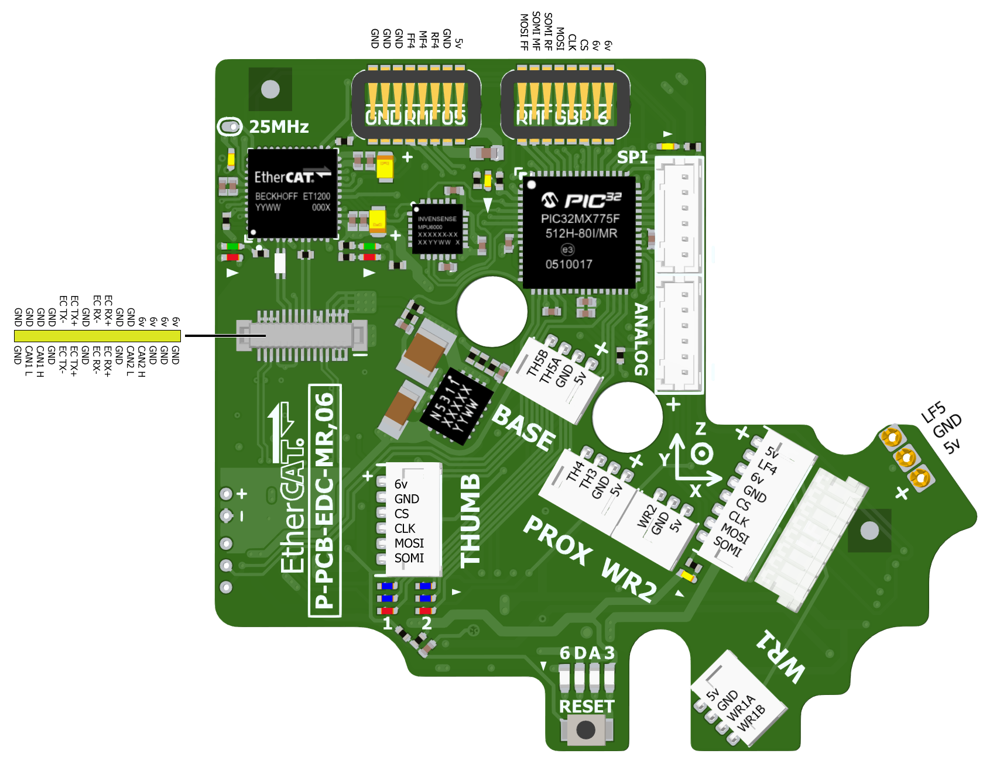

Internal Connectors
====================

The following connectors are detailed here for your information, but are not available without
dismantling the hand.

Fingers
-------

The connectors in the fingers are can be exposed by removing the four screws on the back of
the proximal phalange, using an orange hex driver. The board is available in two versions

.. figure:: ../img/cp_internal_connectors_proximal.png
    :width: 25%
    :align: center
 

**SPI to Palm:** This consists of two 3-way connectors, and connects the Palm MCU to the finger.

**MID Analog:** This connects the two Hall effect sensors in the middle phalange to this PCB.

**SPI to Tactile Sensor:** This connects the tactile sensor to this PCB.

**Tactile Sensor Connector:** This is an analogue input, accepting three resistive sensors.

Palm
----

**EtherCAT Dual CAN connector:** This connector supplies power to the palm, as well as
connecting the EtherCAT LVDS and both CAN buses.
