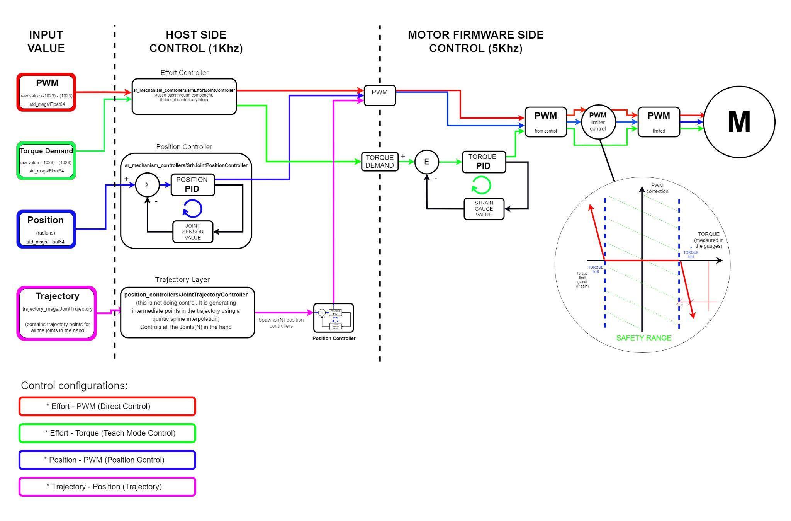

Control Description
===================

Control Implementation
----------------------
+--------------------------+------------------------------------------+-----------------------------------+
| Host side loop (1KHz)    | Motor side loop (5Khz)                   | Secondary Motor loop  (5KHz)      |
+==========================+==========================================+===================================+
| “P”, “I” & “D”:          | “F”:                                     | Torque_limit:                     |
| Control gain parameters  | Torque demand fed forward to the output  | Control torque demand limitation  |
+--------------------------+------------------------------------------+-----------------------------------+                                      
| “Max_force”:             | “P”, “I” & “D”:                          | Torque_limiter_gain:              |
| Output limitation        | Control gain parameters                  | Proportional term parameter       |
+--------------------------+------------------------------------------+                                   |  
| “Position_Deadband”:     | “Max_PWM”:  Motor PWM limitation         |                                   | 
| Band where error is      +------------------------------------------+                                   |
| considered zero          | “Deadband”:                              |                                   |
|                          | Band where error is considered zero      |                                   | 
|                          +------------------------------------------+                                   |
|                          |  “Sign”:                                 |                                   |
|                          |  Define the flex and the extend tendon   |                                   |
+--------------------------+------------------------------------------+-----------------------------------+

Control Options
---------------
+----------------------------+----------------------------------------+------------------------------------------+----------------------------------------+
| PWM                        | Teach Mode                             | Position                                 | Trayectory(*)                          |
+============================+========================================+==========================================+========================================+
| Control input: PWM demand  | Control input: Torque (Effort) demand  | Control input: Position demand           | Control input: Position demand + time  |
+----------------------------+----------------------------------------+------------------------------------------+                                        |
| Input refreshment: 1kHz    | Input refreshment: 1kHz                | Input refreshment: 1kHz                  | (*) Position Control with the addition |
+----------------------------+----------------------------------------+------------------------------------------+ of one algorithm on the top which      |
| Implemented in: Motor side | Implemented in: Motor side             | Implemented in: Host side                | splits the position target into a      |
+----------------------------+----------------------------------------+------------------------------------------+ collection of points, creating a spline|
| Control output: PWM demand | Control output: PWM demand             | Control output: PWM demand               | which controls the speed of the joint  |
|                            +----------------------------------------+------------------------------------------+                                        |
|                            | Control loop: 5KHz                     | Control loop: 1KHz                       |                                        |
|                            +----------------------------------------+------------------------------------------+                                        | 
|                            | Sensor feedback: Motor strain gauges   | Sensor feedback: Joint position sensors  |                                        |
+----------------------------+----------------------------------------+------------------------------------------+----------------------------------------+
