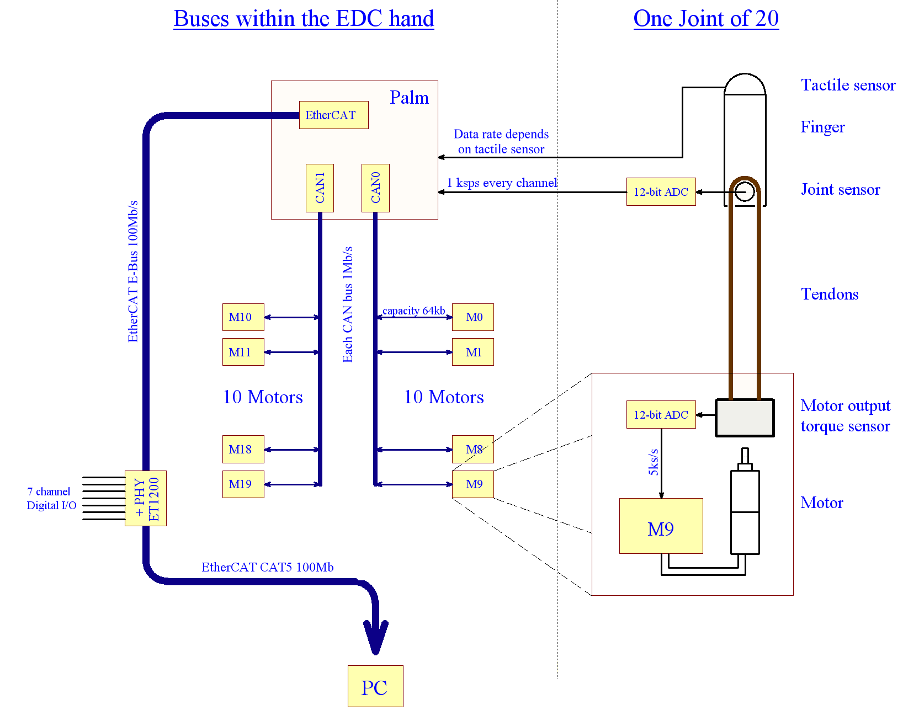
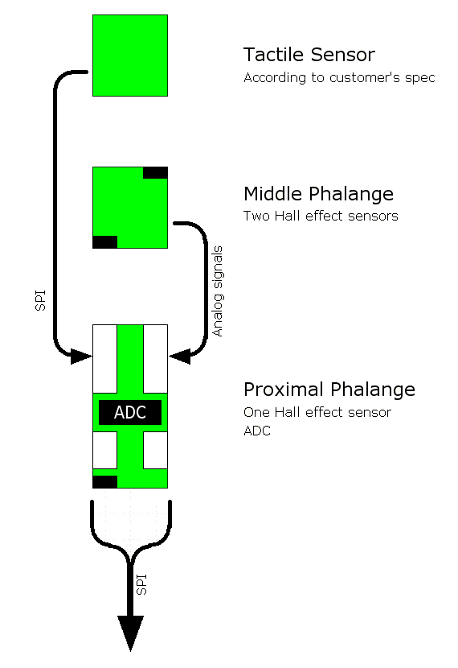
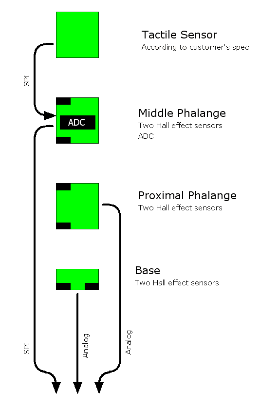
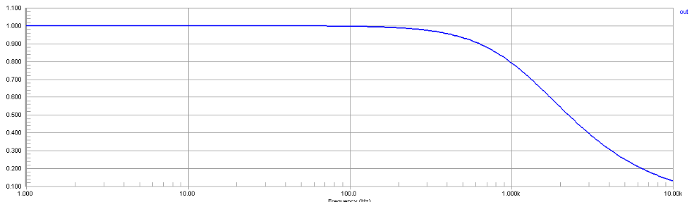

Data Flow
===========

Overview
--------

The only data connection between the PC and the hand is a 100Mbps EtherCAT cable. EtherCAT
is an open high performance Ethernet-based fieldbus system. The EtherCAT cable enters the
hand at the elbow, and connects to an EtherCAT bridge which converts the signal to E-Bus
(LVDS) which is suitable for connection to the palm as it needs no magnetics.

Motor hand:

Two CAN buses are connected to the palm, and each serves 10 motors, giving a total of 8kB/s
bandwidth to/from each motor.
An SPI bus serves each finger, allowing the palm to sample all joint sensors at 1000Hz.

Palm
----

The palm acts as the main data hub, dealing with all EtherCAT, CAN, and SPI communication.

Fingers
-------

Each finger is identical. It contains four analogue Hall effect sensors which measure the
position of each of its four joints. Three of these sensors are sampled by an ADC in the finger,
while the fourth (J4) is sampled by an ADC in the palm.

    

The proximal phalange contains the ADC, which is connected to the palm by SPI. It also houses
the connectors for the middle phalange and the tactile sensor.

Thumb
-----

The thumb contains six Hall effect sensors to measure the position of its five joints. The base
joint with its large angle range needs two sensors to fully cover the range.

   

Only the middle phalange of the thumb contains an ADC. The other two phalanges return
analog signals which are sampled by an ADC on the palm.

Motors
------

When in torque control mode, each motor MCU samples its own torque sensor at 5000Hz, and
updates the motor PWM signal at the same rate, according to its internal PID control loop. New
force demands are sent to the motor MCU every millisecond.
When in position control mode, the force control loop is switched off, and the host simply sends
PWM demand values to the MCU every millisecond. These are implemented immediately.
Requests for sensor data are sent to the motor MCU every 2 milliseconds, and corresponding
values are returned immediately.

Analogue sensor filtering
-------------------------

Hall effect sensors naturally produce noise, and so need a simple RC filter. The filter produces a
flat response to 100Hz, allowing for an undisturbed joint angle signal up to rotation speeds of
90º per 0.025sec.

