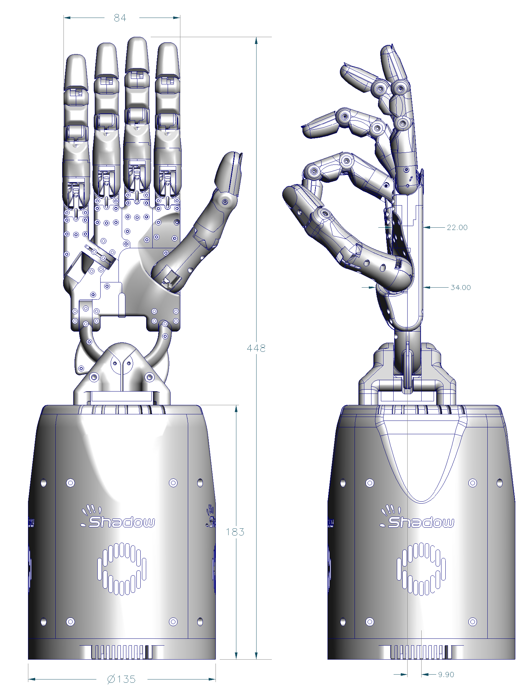

Dimensions
===========

The Hand has been designed to be similar to a typical male hand, however the fingers are all
the same length, although the knuckles are staggered to give comparable fingertip locations to
the human hand.

..
  TODO: Figure

