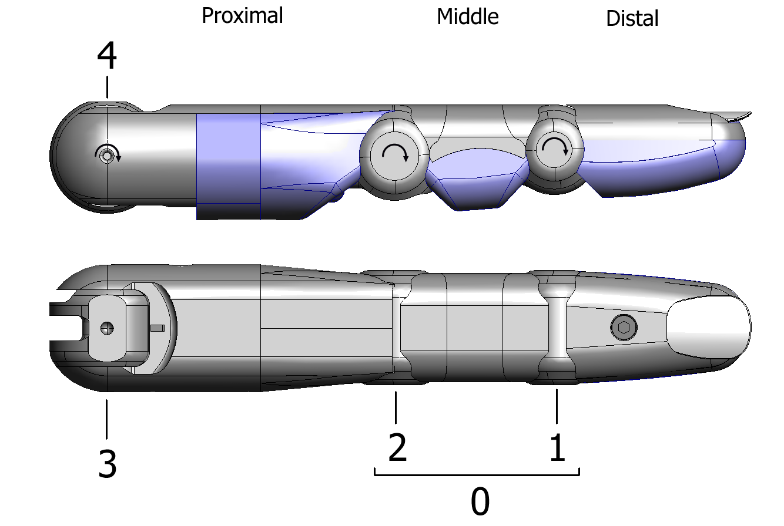
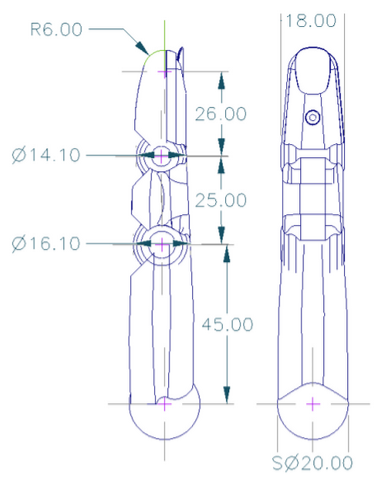

Finger
========

The four fingers are named according to the UK convention: First, Middle, Ring, Little.

Naming and angle conventions
----------------------------

The four finger joints are the distal (finger tip), middle, proximal (nearest the palm), and the
adduction/abduction joint (sideways movement) which is coplanar with the proximal joint. Joints
are numbered from 1, starting at the distal end. Arrows on the diagram show the direction of
positive rotation. Lines show the axis of rotation. For joint 4s, spreading the fingers is negative
rotation. i.e. for FF and MF, anti-clockwise is positive, and for RF and LF, clockwise is positive.

Loopback tendons and J0 coupling
--------------------------------

In order to reduce the number of actuators in the forearm, joints 1 and 2 of the fingers are
coupled together such that:

.. prompt:: text

   joint1 angle <= joint2 angle

This coupling is achieved through a loopback tendon connected between the two joints as
shown in the diagram below.

Any flexion of joint 1, beyond the angle of joint 2, forces joint 2 to flex to maintain the
constraint. Joints 1 and 2 are together connected to one motor. For the purposes of control,
they are considered to be a single joint, 0 (zero).
