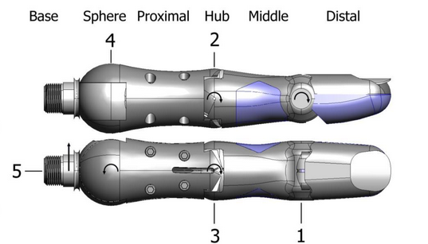
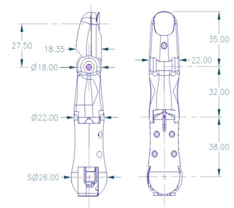

Thumb
========

There is one thumb which is mechanically different to the fingers.

    

Naming and angle conventions
-----------------------------
The thumb has five degrees of freedom, and is stronger than the fingers, partly due to its larger
diameter pulleys, and partly due to the larger motors actuating joints 4 and 5. All five joints of
the thumb are independently actuated, and there is no intentional coupling between joints.
