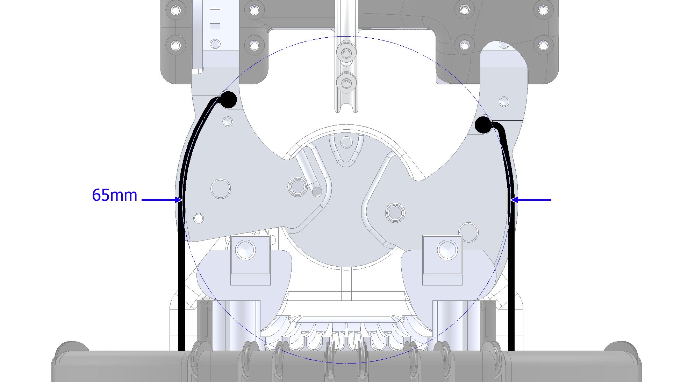
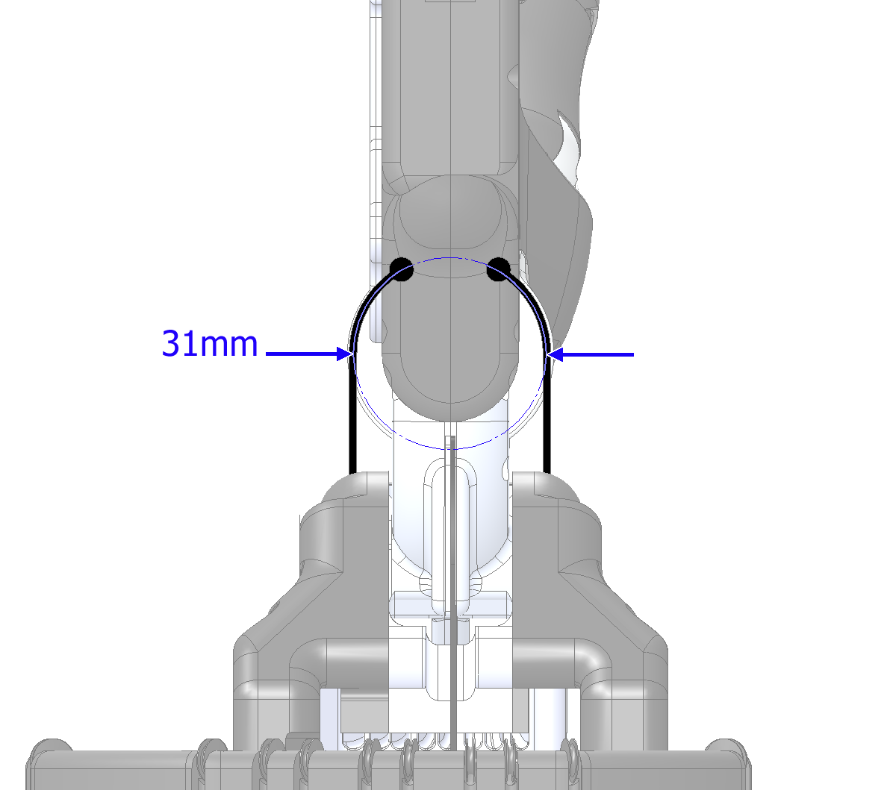

Wrist
=======

The wrist has two degrees of freedom, Yaw and Pitch.

Yaw
----
The Yaw rotation is more proximal, and has a range of -28º (towards little finger) to 10º (towards
thumb), and a pulley diameter of 65mm.

Pitch
------

The Pitch rotation is more distal, and has a range of -40º (extension) to 28º (flexion), and a
pulley diameter of 31mm.

