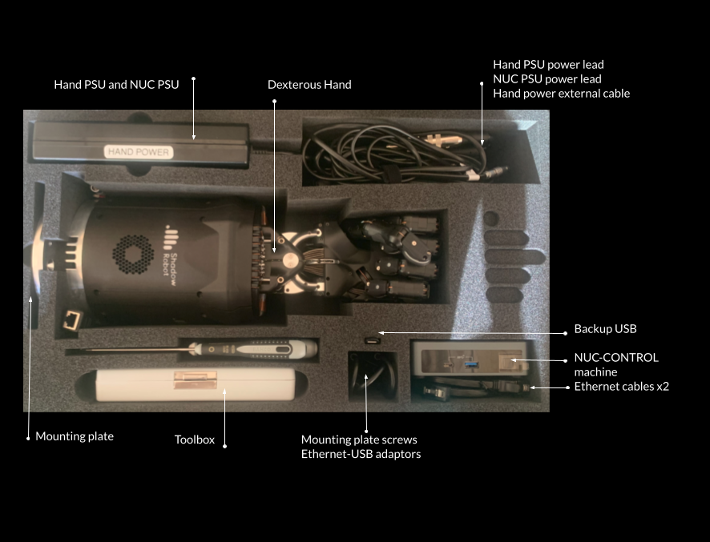

Hand peli case contents
========================

When you receive your Dexterous Hand, this is what you will find in the peli case:

+------------------------------------------------------------------------+-----------+-----------+
| Equipment                                                              | Quantity              |
+                                                                        +-----------+-----------+
|                                                                        | Unimanual | Bimanual  |
+========================================================================+===========+===========+
| Dexterous Hand                                                         | 1         | 2         |
+------------------------------------------------------------------------+-----------+-----------+
| Hand Power External Cable                                              | 1         | 2         |
+------------------------------------------------------------------------+-----------+-----------+
| Hand Power Supply                                                      | 1         | 2         |
+------------------------------------------------------------------------+-----------+-----------+
| Hand Power Supply lead according to destination country                | 1         | 2         |
+------------------------------------------------------------------------+-----------+-----------+
| Mounting plate (to connect the hand to UR arm)                         | 1         | 2         |
+------------------------------------------------------------------------+-----------+-----------+
| Mounting Plate screws for mounting plate                               | 4         | 8         |
+------------------------------------------------------------------------+-----------+-----------+
| Mounting Plate screws for the hand                                     | 8         | 16        |
+------------------------------------------------------------------------+-----------+-----------+
| 3m Ethernet cable                                                      | 2         | 4         |
+------------------------------------------------------------------------+-----------+-----------+
| “NUC-CONTROL” USB-ethernet adapter                                     | 1         | 1         |
+------------------------------------------------------------------------+-----------+-----------+
| “SERVER” USB-ethernet adapter                                          | 1         | 1         |
+------------------------------------------------------------------------+-----------+-----------+
| “RIGHT/LEFT HAND” Labelled USB-ethernet adapter                        | 1         | 2         |
+------------------------------------------------------------------------+-----------+-----------+
| NUC labelled SHADOW NUC-CONTROL for running hand’s driver and the arm  | 1         | 1         |
+------------------------------------------------------------------------+-----------+-----------+
| NUC PSU                                                                | 1         | 1         |
+------------------------------------------------------------------------+-----------+-----------+
| NUC PSU power lead according to destination country                    | 1         | 1         |
+------------------------------------------------------------------------+-----------+-----------+
| Toolbox (contains hex drivers to robot maintenance)                    | 1         | 2         |
+------------------------------------------------------------------------+-----------+-----------+
| Cut allen key (inside the Toolbox)                                     | 1         | 2         |
+------------------------------------------------------------------------+-----------+-----------+
| Allen key (inside the Toolbox)                                         | 1         | 2         |
+------------------------------------------------------------------------+-----------+-----------+
| Spooltool (inside the Toolbox)                                         | 1         | 2         |
+------------------------------------------------------------------------+-----------+-----------+
| Luggage locks for peli case                                            | 2         | 4         |
+------------------------------------------------------------------------+-----------+-----------+
| “Shadow Backup” USB w. Clonezilla images of NUC and server             | 1         | 1         |
+------------------------------------------------------------------------+-----------+-----------+
| Hand Delivery Instructions                                             | 1         | 1         |
+------------------------------------------------------------------------+-----------+-----------+

+-----------------------------------------------------------------------+--------------------------------------+
| Equipment                                                             | Quantity                             |
+-----------------------------------------------------------------------+--------------------------------------+
| Dexterous Hand                                                        |     1                                |
+-----------------------------------------------------------------------+--------------------------------------+
| Hand Power External Cable                                             |     1                                |
+-----------------------------------------------------------------------+--------------------------------------+
| Hand Power Supply                                                     |     1                                |
+-----------------------------------------------------------------------+--------------------------------------+
| Hand Power Supply lead according to destination country               |     1                                |
+-----------------------------------------------------------------------+--------------------------------------+
| Mounting plate (to connect the hand to UR arm)                        |     1                                |
+-----------------------------------------------------------------------+--------------------------------------+
| Mounting Plate screws for mounting plate                              |     4                                |
+-----------------------------------------------------------------------+--------------------------------------+
| Mounting Plate screws for the hand                                    |     8                                |
+-----------------------------------------------------------------------+--------------------------------------+
| 3m Ethernet cable                                                     |     2                                |
+-----------------------------------------------------------------------+--------------------------------------+
| "NUC-CONTROL" USB-ethernet adapter                                    |     1   (only 1 per bimanual system) |
+-----------------------------------------------------------------------+--------------------------------------+
| "SERVER" USB-ethernet adapter                                         |     1   (only 1 per bimanual system) |
+-----------------------------------------------------------------------+--------------------------------------+
| "RIGHT/LEFT HAND" Labelled USB-ethernet adapter                       |     1                                |
+-----------------------------------------------------------------------+--------------------------------------+
| NUC labelled SHADOW NUC-CONTROL for running hand’s driver and the arm |     1   (only 1 per bimanual system) |
+-----------------------------------------------------------------------+--------------------------------------+
| NUC PSU                                                               |     1   (only 1 per bimanual system) |
+-----------------------------------------------------------------------+--------------------------------------+
| NUC PSU power lead according to destination country                   |     1   (only 1 per bimanual system) |
+-----------------------------------------------------------------------+--------------------------------------+
| Toolbox (contains hex drivers to robot maintenance)                   |     1                                |
+-----------------------------------------------------------------------+--------------------------------------+
| Cut allen key (inside the Toolbox)                                    |     1                                |
+-----------------------------------------------------------------------+--------------------------------------+
| Allen key (inside the Toolbox)                                        |     1                                |
+-----------------------------------------------------------------------+--------------------------------------+
| Spooltool (inside the Toolbox)                                        |     1                                |
+-----------------------------------------------------------------------+--------------------------------------+
| Luggage locks for peli case                                           |     2                                |
+-----------------------------------------------------------------------+--------------------------------------+
| “Shadow Backup” USB w. Clonezilla images of NUC and server            |     1   (only 1 per bimanual system) |
+-----------------------------------------------------------------------+--------------------------------------+
| Hand Delivery Instructions                                            |     1   (only 1 per bimanual system) |
+-----------------------------------------------------------------------+--------------------------------------+
