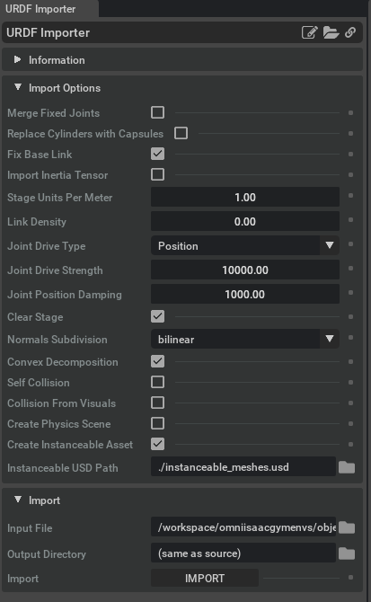

Making an Isaac USD asset for the HTC vive tracker
==================================================

This is a simple example of how to make an Isaac USD asset for the HTC vive tracker. All the steps here have been applied to a `.usda 
vive tracker model that can be found 
here <https://github.com/shadow-robot/OmniIsaacGymEnvs/blob/F_slightly_fewer_segfaults_debugging/sr_assets/objects/test_vive_2_flat.usda>`_, 
so you might want to reverse-engineer that if you want to apply this process to a different object.

Object file import
------------------

The `official HTC Vive tracker .step file can be found here <http://link.vive.com/tracker/3d_model?_ga=2.171658405.480380930.1554754406-1241175711.1543953131>`_.
This needs to be converted to a .obj mesh. This has already been done `here <https://sketchfab.com/3d-models/htc-vive-tracker-4bcb460ac22248f7abf4beeacae954e3>`_.

Copy this .obj file to a directory on your host (outside the container) that the isaac sim container can access. If you 
followed the `isaac_repo_installation` instructions, you can copy this to the ``~/OmniIsaacGymEnvs`` directory.

Starting the Isaac GUI
^^^^^^^^^^^^^^^^^^^^^^

Then, from inside your Isaac container (created in the `_isaac_container_installation`) run the following command: to start the isaac GUI:
 
 .. code-block:: bash
 
    runapp

Vive Tracker URDF
^^^^^^^^^^^^^^^^^

The easiest way to get the vive tracker as a .usd(a) file is to first create a URDF file for the object. An example URDF file is as follows:

.. code-block:: xml

    <?xml version="1.0"?>
        <robot name="object">
        <link name="object">
            <visual>
            <origin xyz="0 0 0"/>
            <geometry>
                <mesh filename="meshes/HTC_Vive_Tracker_2017.obj" scale=".001 .001 .001"/>
            </geometry>
            </visual>
            <collision>
            <origin xyz="0 0 0"/>
            <geometry>
                <mesh filename="meshes/HTC_Vive_Tracker_2017.obj" scale=".001 .001 .001"/>
            </geometry>
            </collision>
            <inertial>
            <mass value="0.086"/>
            </inertial>
        </link>
        </robot>

.. note::

    The above URDF assumes the following folder structure, with the ``objects`` folder located in ``~/OmniIsaacGymEnvs``:

    .. code-block:: bash

        objects
        ├── meshes
        │   └── HTC_Vive_Tracker_2017.obj
        └── vive_tracker.urdf

.. note::
    
    The vive tracker frame has been aligned  according to page 22 of the 
    `Vive Tracker Developer Guidelines document <https://developer.vive.com/documents/722/HTC-Vive-Tracker-2017-Developer-Guidelines_v1.5.pdf>`_. 

Importing the URDF
^^^^^^^^^^^^^^^^^^

From the Isaac GUI, click ``Isaac Utils -> Workflows -> URDF Importer``. This will open a new pane. Select options in the URDF importer 
pane as follows:

Then click the ``IMPORT`` button at the bottom of the URDF Importer pane. This will process the URDF and .obj file(s) and create a new 
folder named after the URDF file in the ``objects`` directory. This folder will contain a .usd file for the object, as well as a .usd file for the object's meshes.
The ``objects`` folder structure should now be:

.. code-block:: bash
    
    objects
    ├── meshes
    │   └── HTC_Vive_Tracker_2017.obj
    ├── vive_tracker
    │   ├── instanceable_meshes.usd
    │   └── vive_tracker.usd
    └── vive_tracker.urdf

XForm Structure
^^^^^^^^^^^^^^^

Xforms must be structured according to the structure in the following image. If you have used the URDF above, this should already be correct.

.. image:: ../img/rl_vive_tracker_object_usd_structure.png

