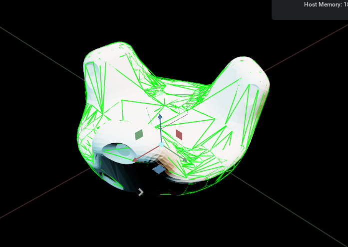

Making an Isaac USD asset for the HTC vive tracker
==================================================

This is a simple example of how to make an Isaac USD asset for the HTC vive tracker. All the steps here have been applied to a `.usda 
vive tracker model that can be found 
here <https://github.com/shadow-robot/OmniIsaacGymEnvs/blob/F_slightly_fewer_segfaults_debugging/sr_assets/objects/test_vive_2_flat.usda>`_, 
so you might want to reverse-engineer that if you want to apply this process to a different object.

Starting the Isaac GUI
----------------------

Then, from inside your Isaac container (created in the `_isaac_container_installation`) run the following command: to start the isaac GUI:
 
 .. code-block:: bash
 
    runapp

Object file import
------------------

The `official HTC Vive tracker .step file can be found here <http://link.vive.com/tracker/3d_model?_ga=2.171658405.480380930.1554754406-1241175711.1543953131>`_.
This needs to be converted to a .obj mesh. This has already been done `here <https://sketchfab.com/3d-models/htc-vive-tracker-4bcb460ac22248f7abf4beeacae954e3>`_ 
(you will have to make an account to download it).

Copy this .obj file to a directory on your host (outside the container) that the isaac sim container can access. If you 
followed the `isaac_repo_installation` instructions, you can make new directories called ``objects/meshes`` in the ``~/OmniIsaacGymEnvs`` directory 
and copy it there.

Vive Tracker URDF
^^^^^^^^^^^^^^^^^

The easiest way to get the vive tracker as a .usd(a) file is to first create a URDF file for the object. An example URDF file is as follows:

.. code-block:: xml

    <?xml version="1.0"?>
        <robot name="object">
        <link name="object">
            <visual>
            <origin xyz="0 0 0"/>
            <geometry>
                <mesh filename="meshes/HTC_Vive_Tracker_2017.obj" scale=".001 .001 .001"/>
            </geometry>
            </visual>
            <collision>
            <origin xyz="0 0 0"/>
            <geometry>
                <mesh filename="meshes/HTC_Vive_Tracker_2017.obj" scale=".001 .001 .001"/>
            </geometry>
            </collision>
            <inertial>
            <mass value="0.086"/>
            </inertial>
        </link>
        </robot>

Copy and paste the above URDF info a file called ``vive_tracker.urdf`` in the ``objects`` directory you created earlier. The structure of this 
directory should now be:

.. code-block:: bash

    objects
    ├── meshes
    │   └── HTC_Vive_Tracker_2017.obj
    └── vive_tracker.urdf

.. note::
    
    The vive tracker frame has been aligned  according to page 22 of the 
    `Vive Tracker Developer Guidelines document <https://developer.vive.com/documents/722/HTC-Vive-Tracker-2017-Developer-Guidelines_v1.5.pdf>`_. 

Importing the URDF
^^^^^^^^^^^^^^^^^^

From the Isaac GUI, click ``Isaac Utils -> Workflows -> URDF Importer``. This will open a new pane. Select options in the URDF importer 
pane as follows:

.. image:: ../img/rl_isaac_URDF_importer.png

Click the folder icon on the ``Import File`` row in the ``Import`` section and go to ``/workspace/omniisaacgymenvs/objects/``. Double click the 
``vive_tracker.urdf`` file you made earlier.
Then click the ``IMPORT`` button at the bottom of the URDF Importer pane. This will process the URDF and .obj file(s) and create a new 
folder named after the URDF file in the ``objects`` directory. This folder will contain a .usd file for the object, 
as well as a .usd file for the object's meshes. The ``objects`` folder structure should now be:

.. code-block:: bash
    
    objects
    ├── meshes
    │   └── HTC_Vive_Tracker_2017.obj
    ├── vive_tracker
    │   ├── instanceable_meshes.usd
    │   └── vive_tracker.usd
    └── vive_tracker.urdf

Enable Coloured Lights
^^^^^^^^^^^^^^^^^^^^^^^

In the top right corner of the viewport, click the button with a picture of a light that says ``Stage Lights``. Select ``Coloured Lights`` 
under ``Light Rigs``.

XForm Structure
^^^^^^^^^^^^^^^

The XForm structure of the imported URDF object should currently look like this:

Delete the root_joint
^^^^^^^^^^^^^^^^^^^^^

In the ``Stage`` view on the right hand side, right-click ``root_joint`` and click ``Delete``.

Set default prim
^^^^^^^^^^^^^^^^

In the ``Stage`` view on the right hand side, right-click the top ``object`` XForm and click ``Set as Default Prim``.

Delete Physics Articulation Root
^^^^^^^^^^^^^^^^^^^^^^^^^^^^^^^^

In the ``Stage`` view on the right hand side, select the top ``object`` XForm. In the ``Property`` pane below the ``Stage`` pane, scroll down to the ``Physics`` 
section. To the right of ``Articulation Root``, click the red ``X`` button. When asked if you are sure you want to remove the ``Articulation root`` 
component, select yes.

Save the tracker as a flattened .usda file
^^^^^^^^^^^^^^^^^^^^^^^^^^^^^^^^^^^^^^^^^^

Click ``File`` > ``Save Flattened As...``

Change the extention to ``.usda``, the filename as ``vive_tracker_flat``, and save the file in the ``objects/vive_tracker`` 
directory:

``/workspace/omniisaacgymenvs/objects/vive_tracker``

Now, clear the stage: ``File`` > ``New``. When prompted, click ``Don't Save``.

Now, load the file we just saved.

``File`` > ``Open``

And select/open the file we just saved called ``vive_tracker_flat.usda``:

.. image:: ../img/rl_open_vive_tracker_flat.png

Tuning the collision mesh
-------------------------

By default, if ``Convex Decomposition`` is checked in the URDF importer, the resulting convex decomposition will not track the surface of 
the imported mesh very well. If ``Convex Decomposition`` is not checked, the collision mesh will be a convex hull of the imported mesh (which is even 
worse). To fix this, we need to manually tune the convex decomposition settings.

Enable viewing collision meshes
^^^^^^^^^^^^^^^^^^^^^^^^^^^^^^^

First, we need a way of viewing the collision meshes. To do this, click button that looks like an eye (between the ``RTX-Real-Time`` and 
``Perspective`` buttons in the top left of the Isaac GUI). Then click ``Show By Type`` > ``Physics`` > ``Colliders`` > ``All``:

You should now be able to see the collision mesh and the following asset structure:

You will notice that the collision mesh is larger than the imported object. Lets fix this.

Find which prototype is the collision mesh
^^^^^^^^^^^^^^^^^^^^^^^^^^^^^^^^^^^^^^^^^^
In the ``Stage`` pane on the right, go to ``object`` > ``object`` > ``collisions``. In the ``Property`` pane below, in the ``References`` section, 
have a look at the Prim Path for the collision mesh:

In this case, you can see that it says ``/Flattened_Prototype_1``. Now, in the ``Stage`` pane, go to ``Flattened_Prototype_1`` > ``mesh_0`` (or whichever 
prototype was specified in the ``References`` section of the collision mesh). Make sure ``mesh_0`` of the approperiate ``Flattened_Prototype_x`` XForm 
is selected. 

Tuning the convex decomposition of the collision mesh
^^^^^^^^^^^^^^^^^^^^^^^^^^^^^^^^^^^^^^^^^^^^^^^^^^^^^

To bring up the convex decomposition settings we need, under ``Approximation``, change the option from ``Convex Decomposition`` 
to something else (e.g. ``Triangle Mesh``) and then change it back to ``Convex Decomposition``. Now expand the ``Advanced`` section. The ``Physics`` > 
``Collider`` section should now look like this:

Make the following changes:

* You probably want to increase the ``Voxel Resolution`` to max (5000000). This will increase the time taken to compute the convex decomposition but shouldn't have an impact on runtime performance. 

* Play around with increasing the ``Max Convex Hulls``, in theory this should give a more accurate convex decomposition, but this could potentially slow the RL simulation down. We have gone for around 200 Max Convex Hulls for this example. 

* Finally, tick the ``Shrink Wrap`` box to have the convex decomposition process attempt to adjust the convex hulls so that their points lie on the surface of the original mesh.

The imported URDF object should now look like this:

Click ``File`` > ``Save``. When prompted, click ``Save``.