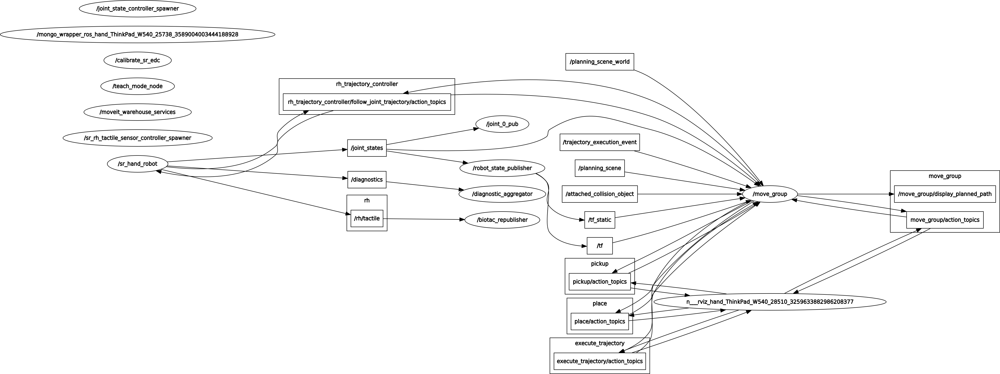

Command Line Interface
-----------------------

All functions of the hand are available from the command line.

In the following sections, `Hand` refers to the shadow dexterous hand and `Host` refers to the host computer which is controlling the hand. Assume that all the topics are read-only unless specified otherwise.

Using rostopic
^^^^^^^^^^^^^^^
To check how to interact with ROS topics, see `this link <http://wiki.ros.org/rostopic>`_.

The following rqt_graph shows the flow of topics between nodes whilst the hand is running.

Here is a list of the available topics:

Calibration (Real hand only)
+++++++++++++++++++++++++++++

These topics are used during the Hand startup routine to make sure that the Hand is calibrated:

.. code-block:: shell

   /cal_sh_rh_*/calibrated
   /calibrated

An empty message is published to the */cal_sh_rh_***/calibrated* topics for each joint when they are calibrated. The */calibrate_sr_edc* node subscribes to these topics and when all of them have had an empty message published to them, it publishes True to the */calibrated* topic. Before empty messages have been received by all the joints it publishes False to the */calibrated* topic.

Diagnostics (Real hand only)
+++++++++++++++++++++++++++++

.. code-block:: shell

   /diagnostics
   /diagnostics_agg
   /diagnostics_toplevel_state

These topics update at 2 Hz with information on each joint's Temperature, Current, Measured effort and Command effort, as well as information about the EtherCat devices and firmware version.

Joint states
+++++++++++++

.. code-block:: shell

   /joint_states

This topic is read-only and updates at 125 Hz with the name, position, velocity and effort values of all joints in a Hand.

Example topic message:

.. code-block:: shell

   name: [rh_FFJ1, rh_FFJ2, rh_FFJ3, rh_FFJ4, rh_LFJ1, rh_LFJ2, rh_LFJ3, rh_LFJ4, rh_LFJ5,
   rh_MFJ1, rh_MFJ2, rh_MFJ3, rh_MFJ4, rh_RFJ1, rh_RFJ2, rh_RFJ3, rh_RFJ4, rh_THJ1,
   rh_THJ2, rh_THJ3, rh_THJ4, rh_THJ5, rh_WRJ1, rh_WRJ2]
   position: [1.279751244673038, 1.7231505348398373, 1.2957917583498741, -0.00406710173435502, 0.054689233814909366, 1.253488840949725, 1.5395435039130654, 0.02170017906073821, 0.1489674305718295, 1.08814400717011, 1.638917596069165, 1.4315445985097324, 0.00989364236002074, 1.2257618075487349, 1.8331224739256338, 1.2888368284819698, -0.13269012433948385, 0.14435534682895756, 0.6980816915624072, 0.18782898954368935, 1.124295322901818, 0.21905854304869088, -0.048455186771971595, -0.0032803323337213066]
   velocity: [-7.484333985952662e-06, -7.484333985952662e-06, 0.0023735860019749185, 0.00062181267775619, -0.0005871136552505063, -0.0005871136552505063, 0.0020967687295392933, 0.0001739028157522596, 0.0004985252400775274, -9.485516545601461e-06, -9.485516545601461e-06, -0.0007068752456452666, -0.0012475428276090576, 0.0008426052935621657, 0.0008426052935621657, 0.001237001167977189, -0.0026444893567459573, 0.0025260047430310925, -0.0003217106977882921, 6.159570145597239e-05, -0.0023454723015513593, 0.0009436399232442155, 0.00017469681801687975, -4.900148416020751e-05]
   effort: [-1.3660655058510802, -1.3660655058510802, -2.030169817308198, -1.9577332816789155, 0.0, 0.0, -17.29928766980003, -1.5006516553524243, -1.8579749510438912, -1.504877130092884, -1.504877130092884, -0.3374653182042338, -1.6492254479379729, -8.476660697182016, -8.476660697182016, -3.3867013328219056, -2.3404145772688683, -0.7688013735971971, 11.02319645071454, 0.8482082620071664, 0.08818910881575533, 1.127772119947565, -2.2344970991165316, -3.5544023107705667]

etherCAT (Real hand only)
++++++++++++++++++++++++++

.. code-block:: shell

    /rh/debug_etherCAT_data

This topic is published by the driver and updates at 1000 Hz with data from the Hand as it is received over EtherCAT, which is useful for debugging.

- *sensors* are the position sensors in the joints, which are included in every packet.

- *tactile* is the data from the tactile sensors, which are included in every packet.

- Data is received in two alternative packets for the motor torques, each holds data for half of the 20 motors. If *which_motors* is 0 then the data is for the first 10 motors. If 1, the data is for the second 10 motors.

- *motor_data_packet_torque* is the raw difference between the strain gauge in tension and the strain gauge in compression for each motor.

- *motor_data_type* is used to specify the data in motor_data_packet_misc. This data has been requested from the host. Which value corresponds to which data is defined `here. <https://github.com/shadow-robot/hand-firmware/blob/ff95fa8fc50a372c37f5fedcc5b916f4d5c4afe2/PIC32/nodes/0220_palm_edc/0220_palm_edc_ethercat_protocol.h#L88>`_

- *which_motor_data_arrived* is a bitmap, 20x1 demensional array for the 20 motors, which shows which motors data has been received from. For example 349525 = 01010101010101010101.

- *which_motor_data_had_errors* is a bitmap for the motors which have errors.

- The tactile sensors attached to the Hand are selected during startup, `their corresponding values are here. <https://github.com/shadow-robot/hand-firmware/blob/ff95fa8fc50a372c37f5fedcc5b916f4d5c4afe2/PIC32/nodes/common/tactile_edc_ethercat_protocol.h#L74>`_

- *tactile_data_type* is used to specify the data in tactile, similar to motor_data_type and motor_data_packet_misc. In the Example topic message below the PST fingertip sensors are used, its value is refered `here. <https://github.com/shadow-robot/hand-firmware/blob/ff95fa8fc50a372c37f5fedcc5b916f4d5c4afe2/PIC32/nodes/common/tactile_edc_ethercat_protocol.h#L93>`_

- *tactile_data_valid* is a bitmap for the 5 sensors that is 1 when there are no errors.

- *idle_time_us* is the time margin once the Hand has completed its processing and is ready to communicate on the EtherCAT bus.

.. Note:: More data is transmitted from the tactile sensors than is published to the etherCAT topic by default.

Example */rh/debug_etherCAT_data* topic message:

.. code-block:: shell
   
  header:
      seq: 176798
      stamp:
        secs: 1528812878
        nsecs: 323410491
      frame_id: ''
    sensors: [1303, 1574, 3205, 1780, 1382, 1523, 3164, 1938, 904, 1332, 2977, 1706, 1730, 1434, 3060, 1853, 1955, 1814, 2132, 2294, 2496, 4029, 1668, 2931, 1768, 1377, 26, 27, 28, 29, 30, 31, 0, 19, 8, 9, 0]
    motor_data_type:
      data: 3
    which_motors: 0
    which_motor_data_arrived: 349525
    which_motor_data_had_errors: 0
    motor_data_packet_torque: [15, -31, -4, 3, 0, 0, -207, -3, -55, -3]
    motor_data_packet_misc: [-105, -47, 0, -39, 0, 0, 120, 0, 79, 0]
    tactile_data_type: 0
    tactile_data_valid: 31
    tactile: [407, 429, 416, 398, 389]
    idle_time_us: 430
    ---
    header:
      seq: 176799
      stamp:
        secs: 1528812878
        nsecs: 324399217
      frame_id: ''
    sensors: [1303, 1574, 3205, 1780, 1382, 1523, 3164, 1938, 904, 1332, 2977, 1706, 1731, 1434, 3060, 1853, 1955, 1814, 2131, 2294, 2496, 4030, 1669, 2931, 1768, 1376, 26, 27, 28, 29, 30, 31, 19, 10, 0, 0, 0]
    motor_data_type:
      data: 4
    which_motors: 1
    which_motor_data_arrived: 699050
    which_motor_data_had_errors: 0
    motor_data_packet_torque: [-29, -3, 1, -35, -1, -22, -18, 35, 4, 5]
    motor_data_packet_misc: [0, 0, 0, 0, 0, 0, 0, 0, 0, 0]
    tactile_data_type: 0
    tactile_data_valid: 0
    tactile: [407, 429, 416, 398, 389]
    idle_time_us: 394

Palm Extras
++++++++++++

.. code-block:: shell
      
   /rh/palm_extras

This topic updates at 84 Hz with data from additional devices plugged into the palm.

Example topic message:

.. code-block:: shell

   layout:
     dim:
       -
         label: "accelerometer"
         size: 3
         stride: 0
       -
         label: "gyrometer"
         size: 3
         stride: 0
       -
         label: "analog_inputs"
         size: 4
         stride: 0
     data_offset: 0
   data: [26.0, 27.0, 28.0, 29.0, 30.0, 31.0, 4.0, 5.0, 0.0, 8.0]
      
The first six values are readings from an IMU set in the hand. The IMU is an add-on feature so some hands might not have this data available.  

Tactile (Only for a real hand with tactile sensors)
+++++++++++++++++++++++++++++++++++++++++++++++++++++

.. code-block:: shell
      
   /rh/tactile

This topic is published by the driver at 100 Hz with data from tactile sensors.

Example topic message when using PST fingertip sensors:

.. code-block:: shell

   header:
     seq: 126618
     stamp:
       secs: 1528813967
       nsecs: 440903704
     frame_id: "rh_distal"
   pressure: [405, 428, 422, 401, 384]
   temperature: [1224, 1198, 1225, 1242, 1266]
 
Example topic message when using BioTac fingertip sensors:

.. code-block:: shell
  
   tactiles:
   -
   pac0: 2048
   pac1: 2054
   pdc: 2533
   tac: 2029
   tdc: 2556
   electrodes: [2622, 3155, 2525, 3062, 2992, 2511, 3083, 137, 2623, 2552, 2928, 3249, 2705, 3037, 3020, 2405, 3049, 948, 2458, 2592, 3276, 3237, 3244, 3119]
   -
   pac0: 0
   pac1: 0
   pdc: -9784
   tac: 32518
   tdc: 0
   electrodes: [0, 0, 0, 0, 0, 0, 0, 0, 0, 0, 0, 0, 0, 0, 0, 0, 0, 0, 0, 0, 0, 0, 0, 0]
   -
   pac0: 0
   pac1: 0
   pdc: -9784
   tac: 32518
   tdc: 0
   electrodes: [0, 0, 0, 0, 0, 0, 0, 0, 0, 0, 0, 0, 0, 0, 0, 0, 0, 0, 0, 0, 0, 0, 0, 0]
   -
   pac0: 0
   pac1: 0
   pdc: -9784
   tac: 32518
   tdc: 0
   electrodes: [0, 0, 0, 0, 0, 0, 0, 0, 0, 0, 0, 0, 0, 0, 0, 0, 0, 0, 0, 0, 0, 0, 0, 0]
   -
   pac0: 0
   pac1: 0
   pdc: -9784
   tac: 32518
   tdc: 0
   electrodes: [0, 0, 0, 0, 0, 0, 0, 0, 0, 0, 0, 0, 0, 0, 0, 0, 0, 0, 0, 0, 0, 0, 0, 0]

BioTac (Only for a real hand with Biotac tactile sensors)
+++++++++++++++++++++++++++++++++++++++++++++++++++++++++

These topics are read-only and updated at 100 Hz with data from the biotac sensors, which comprises their pressure, temperature and electrode resistance. This topic is published from the */biotac_republisher* node which receives this data from the driver via the */rh/tactile* topic. For further information about the biotacs, refer to their `documentation <https://www.syntouchinc.com/wp-content/uploads/2016/12/BioTac_SP_Product_Manual.pdf>`_

Example */rh/biotac_*** topic message:

.. code-block:: shell

   pac0: 2056
   pac1: 2043
   pdc: 2543
   tac: 2020
   tdc: 2454
   electrodes: [2512, 3062, 2404, 2960, 2902, 2382, 2984, 138, 2532, 2422, 2809, 3167, 2579, 2950, 2928, 2269, 2966, 981, 2374, 2532, 3199, 3152, 3155, 3033]

Trajectory Controller
++++++++++++++++++++++

Finger Trajectory Controller
~~~~~~~~~~~~~~~~~~~~~~~~~~~~

- Command
  
  .. code-block:: shell

     /rh_trajectory_controller/command

  This topic can be published to and is the set position for the fingertrajectory controller. It comprises an array of all the joints set positions and is used for commanding the robot. For example the rqt joint sliders publish to it.

  Example topic message:

  .. code-block:: shell
   
     joint_names: [rh_FFJ1, rh_FFJ2, rh_FFJ3, rh_FFJ4, rh_MFJ1, rh_MFJ2, rh_MFJ3, rh_MFJ4, rh_RFJ1,
     rh_RFJ2, rh_RFJ3, rh_RFJ4, rh_LFJ1, rh_LFJ2, rh_LFJ3, rh_LFJ4, rh_LFJ5, rh_THJ1,
     rh_THJ2, rh_THJ3, rh_THJ4, rh_THJ5]
     points:
     -
     positions: [0.24434609527920614, 0.8203047484373349, 0.8552113334772214, -0.17453292519943295, 1.0297442586766545, 1.4311699866353502, 1.413716694115407, 0.007182575752410699, 0.9773843811168246, 1.5707963267948966, 1.2566370614359172, -0.12217304763960307, 0.4014257279586958, 1.2566370614359172, 1.5184364492350666, 0.017453292519943295, 0.13962634015954636, 0.12217304763960307, 0.6632251157578453, 0.17453292519943295, 1.117010721276371, -0.7504915783575618]
     velocities: [0.0, 0.0, 0.0, 0.0, 0.0, 0.0, 0.0, 0.0, 0.0, 0.0, 0.0, 0.0, 0.0, 0.0, 0.0, 0.0, 0.0, 0.0, 0.0, 0.0, 0.0, 0.0]
     accelerations: []
     effort: []
     time_from_start:
     secs: 0
     nsecs: 5000000

- State

  .. code-block:: shell

     /rh_trajectory_controller/state

  This topic is read-only and updates at 50 Hz from the trajectory controller with the positions and velocities of the 20 finger joints.

  Example topic message:
    
  .. code-block:: shell

      header: 
      seq: 29135
      stamp: 
         secs: 583
         nsecs: 274000000
      frame_id: ''
      joint_names: 
        - rh_FFJ1
        - rh_FFJ2
        - rh_FFJ3
        - rh_FFJ4
        - rh_LFJ1
        - rh_LFJ2
        - rh_LFJ3
        - rh_LFJ4
        - rh_LFJ5
        - rh_MFJ1
        - rh_MFJ2
        - rh_MFJ3
        - rh_MFJ4
        - rh_RFJ1
        - rh_RFJ2
        - rh_RFJ3
        - rh_RFJ4
        - rh_THJ1
        - rh_THJ2
        - rh_THJ3
        - rh_THJ4
        - rh_THJ5
      desired: 
         positions: [0.00011967184218224583, 0.0005548183242297389, 0.00041894754950187046, -0.10062701434085283, 8.783502460599571e-05, 0.0004641775977824551, 0.0006856740495884452, 0.1096183605452164, 0.004913053249636874, 0.00010239955504565482, 0.00047931794332974065, 0.00013111648840283263, -0.10127973823850217, 8.996037101196772e-05, 0.0004488761418596776, 0.0001876294034980873, 0.1001350676276958, -0.035240921470978015, -0.31784852833458305, 0.0007460299926848393, 0.04911052560971607, -0.0002772503508325329]
         velocities: [0.0, 0.0, 0.0, 0.0, 0.0, 0.0, 0.0, 0.0, 0.0, 0.0, 0.0, 0.0, 0.0, 0.0, 0.0, 0.0, 0.0, 0.0, 0.0, 0.0, 0.0, 0.0]
         accelerations: [0.0, 0.0, 0.0, 0.0, 0.0, 0.0, 0.0, 0.0, 0.0, 0.0, 0.0, 0.0, 0.0, 0.0, 0.0, 0.0, 0.0, 0.0, 0.0, 0.0, 0.0, 0.0]
         effort: []
         time_from_start: 
            secs: 0
            nsecs:         0
      actual: 
         positions: [7.10895251927468e-05, 0.0006767078325600195, 0.0004175216727215769, -0.10062678076768616, -0.00027645955245603204, 0.0005525155619778843, 0.0006916863497421488, 0.10961843159979079, 0.004913188891993769, 4.852612279648838e-05, 0.0005853580394772351, 0.00013062204099512087, -0.10127949778047185, -3.317031927352332e-06, 0.0005469772724389088, 0.00018736835619481695, 0.10013483724669392, -0.03524090059726159, -0.31784850071453175, 0.000746036136888506, 0.04911112453716715, -0.0002772527343921638]
         velocities: [0.08902813995150381, -0.001099212107393761, 0.006855683840805191, 0.030914854686922167, -0.2850721338474761, 0.009299471978875831, 0.0092727557285639, -0.034998219897310806, 0.006294029941129844, -0.004965571363457199, 0.0018022999079858118, 0.009204137459833733, 0.03093467522055917, -0.007240949470287823, -0.00034343975205673206, 0.008327083950443404, -0.02997268098080695, 0.07474706451076522, 0.6818870795543708, -0.003969150639010634, -0.013970489880483824, 0.02504911604093861]
         accelerations: []
         effort: []
         time_from_start: 
            secs: 582
            nsecs: 721000000
      error: 
         positions: [4.85823169893429e-05, -0.0001218895083301419, 1.425876780203339e-06, -2.3357316658589866e-07, 0.00036429457706210755, -8.833796419560613e-05, -6.012300153734884e-06, -7.105457422440509e-08, -1.3564235690211035e-07, 5.3873432249051945e-05, -0.0001060400961474528, 4.944474079060512e-07, -2.404580303760895e-07, 9.327740293940678e-05, -9.810113057939773e-05, 2.6104730332932036e-07, 2.3038100183114807e-07, -2.087371653303194e-08, -2.762005113510213e-08, -6.144203812397109e-09, -5.989274511897236e-07, 2.3835595719390312e-09]
         velocities: [-0.08902813995150381, 0.001099212107393761, -0.006855683840805191, -0.030914854686922167, 0.2850721338474761, -0.009299471978875831, -0.0092727557285639, 0.034998219897310806, -0.006294029941129844, 0.004965571363457199, -0.0018022999079858118, -0.009204137459833733, -0.03093467522055917, 0.007240949470287823, 0.00034343975205673206, -0.008327083950443404, 0.02997268098080695, -0.07474706451076522, -0.6818870795543708, 0.003969150639010634, 0.013970489880483824, -0.02504911604093861]
         accelerations: []
         effort: []
         time_from_start: 
            secs: -583
            nsecs: 279000000

- follow_joint_trajectory

  These topics provide information about positions, velocities and accelerations of joints whilst executing a trajectory from the current pose to the goal pose:

  .. code-block:: shell
  
     /rh_trajectory_controller/follow_joint_trajectory/feedback
     /rh_trajectory_controller/follow_joint_trajectory/goal
     /rh_trajectory_controller/follow_joint_trajectory/result
     /rh_trajectory_controller/follow_joint_trajectory/status

  The following topic is used to stop a currently executing trajectory:

  .. code-block:: shell

     /rh_trajectory_controller/follow_joint_trajectory/cancel

Wrist Trajectory Controller
~~~~~~~~~~~~~~~~~~~~~~~~~~~

- Command

  .. code-block:: shell
  
     /rh_wr_trajectory_controller/command

  This topic can be published to and is the set position for the wrist trajectory controller. It comprises an array of all the joints set positions and is used for commanding the robot. For example the rqt joint sliders publish to it.

  Example topic message:

  .. code-block:: shell
   
      joint_names: [rh_WRJ1, rh_WRJ2]
      points:
      -
      positions: [-0.03490658503988659, 0.0]
      velocities: [0.0, 0.0]
      accelerations: []
      effort: []
      time_from_start:
      secs: 0
      nsecs: 5000000

- State

  .. code-block:: shell

     /rh_wr_trajectory_controller/state

  This topic is read-only and updates at 50 Hz from the trajectory controller with the positions and velocities of the wrist joints.

  Example topic message:

  .. code-block:: shell

      header: 
      seq: 23029
      stamp: 
         secs: 461
         nsecs: 154000000
      frame_id: ''
      joint_names: 
        - rh_WRJ1
        - rh_WRJ2
      desired: 
         positions: [0.12041453184118814, 0.17462944274957784]
         velocities: [0.0, 0.0]
         accelerations: [0.0, 0.0]
         effort: []
         time_from_start: 
            secs: 0
            nsecs:         0
      actual: 
         positions: [0.12041412527154005, 0.17453432025078097]
         velocities: [-0.006723029810312021, 8.480557225661457e-05]
         accelerations: []
         effort: []
         time_from_start: 
            secs: 460
            nsecs: 601000000
      error: 
         positions: [4.065696481703185e-07, 9.51224987968402e-05]
         velocities: [0.006723029810312021, -8.480557225661457e-05]
         accelerations: []
         effort: []
         time_from_start: 
            secs: -461
            nsecs: 399000000

- follow_joint_trajectory

   These topics provide information about positions, velocities and accelerations of joints whilst executing a trajectory from the current pose to the goal pose:
   
   .. code-block:: shell
   
       /rh_wr_trajectory_controller/follow_joint_trajectory/feedback
       /rh_wr_trajectory_controller/follow_joint_trajectory/goal
       /rh_wr_trajectory_controller/follow_joint_trajectory/result
       /rh_wr_trajectory_controller/follow_joint_trajectory/status
   
   The following topic is used to stop a currently executing trajectory:
   
   .. code-block:: shell
   
       /rh_wr_trajectory_controller/follow_joint_trajectory/cancel

Position Controller
+++++++++++++++++++

- Command

  .. code-block:: shell
  
     /sh_rh_*_position_controller/command

  These topics can be published to and are the set position of each joint in radians. The topics are subscribed to by the driver (/sr_hand_robot node). This topic is used to communicate the set position with the rqt Joint Sliders plugin, when using position control. The Hand can be set to position control using the Change Robot Control Mode rqt plugin.

  Example of running
    
  .. prompt:: bash $

     rostopic info /sh_rh_ffj0_position_controller/command

  .. code-block:: shell

     Type: std_msgs/Float64
     Publishers:
     /rqt_gui_py_node_23644 (http://shadow-bravo:38385/)
       
     Subscribers:
     /sr_hand_robot (http://shadow-bravo:45091/)
     /rostopic_15687_1526406188893 (http://shadow-bravo:36637/)
     /record (http://shadow-bravo:35575/)

  Example topic message:

  .. code-block:: shell
    
     data: 0.628318530718

- State
        
  .. code-block:: shell
      
     /sh_rh_*_position_controller/state

  These topics are published at 87 Hz by the driver (/sr_hand_robot node). They contain messages of type *control_msgs/JointControllerState*, which contain the parameters used for each joints position controller.

  Example topic message:

  .. code-block:: shell
        
     set_point: 1.1113358647
     process_value: 1.11095072243
     process_value_dot: 0.000426142920695
     error: 0.0
     time_step: 0.001
     command: 0.0
     p: -3800.0
     i: 0.0d: 0.0
     i_clamp: 0.0
     antiwindup: False

- Force

  .. code-block:: shell

     /sh_rh_*_position_controller/max_force_factor

  The /sh_rh_*_position_controller/max_force_factor topic can be published to and scales down the maximum output command of the joints position controller. The output command is interpreted by the driver (/sr_hand_robot node) as PWM if the driver is in PWM mode, or as tendon force if it is in Torque mode.
  The maximum force is controlled by the parameter "max_force" that is specified in `this yaml file <https://github.com/shadow-robot/sr-config/blob/kinetic-devel/sr_ethercat_hand_config/controls/host/rh/sr_edc_joint_position_controllers_PWM.yaml#L9>`_.
  *max_force_factor* has a value between [0.0, 1.0] and controls the percentage of the max_force that will be effectively considered.

  This parameter doesn't exist in the grasp controller.

- PID parameters

  .. code-block:: shell

     /sh_rh_*_position_controller/pid/parameter_descriptions
     /sh_rh_*_position_controller/pid/parameter_updates

These topics are read-only and contain parameters used for tuning the position controllers. They should not be published directly, but can be accessed through rqt_reconfigure.

TF
+++

.. code-block:: shell

   /tf
   /tf_static

These topics store information on the active transforms in the ROS environment and holds their position and orientation in relation to their parents. Static tfs are fixed and the dynamic tfs update at 100 Hz.
They can be published to, as well as read from. For further information on ROS tfs see the `ROS wiki <http://wiki.ros.org/tf>`_.

Mechanism Statistics
+++++++++++++++++++++
  
.. code-block:: shell

   /mechanism_statistics

This topic is read-only and updates at 1 Hz with the attributes of each joint, for example:

.. code-block:: shell
       
   position: 0.715602037549
   velocity: 0.0
   measured_effort: -11.088
   commanded_effort: -10.799974692
   is_calibrated: False
   violated_limits: False
   odometer: 0.0
   min_position: 0.715218542352
   max_position: 0.715985532746
   max_abs_velocity: 0.0363159179688
   max_abs_effort: 15.84

Moveit! Topics
+++++++++++++++

In Position control the Moveit topics are used for trajectory planning. They are described in their documentation `here <https://moveit.ros.org/documentation/>`_

Collisions
+++++++++++

These are used for object collision avoidance if it is active.

.. code-block:: shell
     
   /attached_collision_object
   /collision_object

Trajectory Execution
+++++++++++++++++++++

Live information regarding the current trajectory execution.

.. code-block:: shell
     
   /execute_trajectory/cancel
   /execute_trajectory/feedback
   /execute_trajectory/goal
   /execute_trajectory/result
   /execute_trajectory/status

RViz Topics
++++++++++++

These topics are used to interface with RViz. Documentation for this can be found `here <http://wiki.ros.org/rviz#User_Documentation>`_.

.. code-block:: shell
     
   /rviz_*/motionplanning_planning_scene_monitor/parameter_descriptions
   /rviz_*/motionplanning_planning_scene_monitor/parameter_updates
   /rviz_moveit_motion_planning_display/robot_interaction_interactive_marker_topic/feedback
   /rviz_moveit_motion_planning_display/robot_interaction_interactive_marker_topic/update
   /rviz_moveit_motion_planning_display/robot_interaction_interactive_marker_topic/update_full

Using rosservice
^^^^^^^^^^^^^^^^

To reset individual motors, E.G. RFJ4:

.. prompt:: bash $
   
   rosservice call /sr_hand_robot/lh/reset_motor_RFJ4

To change control modes, E.G. teach mode:

.. prompt:: bash $
          
	rosservice call /realtime_loop/xxxxxx
