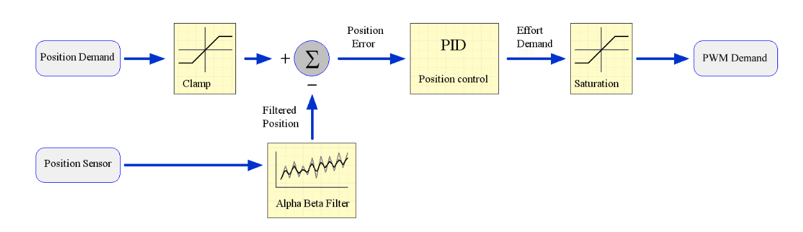

Controling the Hand
====================

Control Modes
---------------

Effort and Torque
^^^^^^^^^^^^^^^^^^

ROS uses the concept of effort as something that actuators provide. The word effort is used,
rather than torque, because it can be applied to any type of actuator (rotary, linear, pressure,
etc.), whereas torque only applies to rotary actuators. Since all motors on the Shadow hand are
rotary, we use the words effort and torque interchangeably.

Controller options
^^^^^^^^^^^^^^^^^^

The host supports two types of control for the Shadow Hand: torque (effort) control or position
control.

**Teach mode**: No control is implemented on the host. The Effort demand is sent to the motor
which implements it using a 5kHz control loop. See `Control <https://shadow-robot-company-dexterous-hand.readthedocs-hosted.com/en/full_manual/user_guide/sd_firmware.html#control>`_  for details of the Effort control algorithm.

**Position**: This uses a PID position controller. The output of the host side PID controller is sent
to the motor as a PWM demand. No effort controller is used for position control.

**Trajectory**: This controller allows the user to define a joint space trajectory, that is a series of
waypoints consisting of joint positions. Each waypoint has an associated time. The trajectory
controller uses quintic spline interpolation to produce a position target every 1ms, so that the
position control loop for each joint runs at 1KHz. This allows the user to define a smooth
trajectory and control the speed of the joint.

Writing controllers
--------------------

Rather than use the ROS topics to access sensor data, you will need to write a plugin for the Controller Manager. 
This will give you access to the sensor data at the full 1kHz rate, and allow you to create your own control algorithms 
for the hand. Please see this page for more information about the `Controller Manager <http://wiki.ros.org/ros_control>`_.

The Controller Manager is the node that talks to the hardware via EtherCAT and provides a facility for hosting plugins. The position controllers you have already used are examples of this. Note that the Controller Manager can host any number of running controllers but one should be loaded at a time for a given joint so they don't fight for control.

Deeper settings
---------------

Editing PID settings
^^^^^^^^^^^^^^^^^^^^^

The motor controller PID settings are stored in YAML files. You can find the files in the next folder:

.. prompt:: bash $
          
	roscd sr_ethercat_hand_config/controls/

Changing motor data update rates
^^^^^^^^^^^^^^^^^^^^^^^^^^^^^^^^

Each motor can return two sensor readings every 2ms. The first is always the measured torque. The second is requested by the host. This allows the host to decide on the sensor update rate of each sensor. Currently, the rates cannot be adjusted at run-time, and are specified in a file that you can edit. To edit the file:

.. prompt:: bash $
          
   roscd sr_robot_lib/config
   gedit motor_data_polling.yaml

The complete list of motor sensors appears in the file, along with a number

=======     ===========================
Number      Meaning
=======     ===========================
-2          Read once when the driver is launched
-1          Read as fast as possible
 0          Do not use zero
>0          Read period in seconds
=======     ===========================

Sensors set to -1 will be read in turn, unless it's time to read another sensor. Usually 5 sensors are set to -1, meaning that they are sampled at 100Hz.
