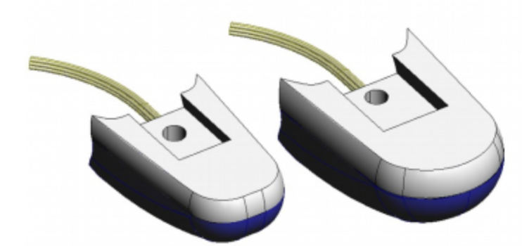
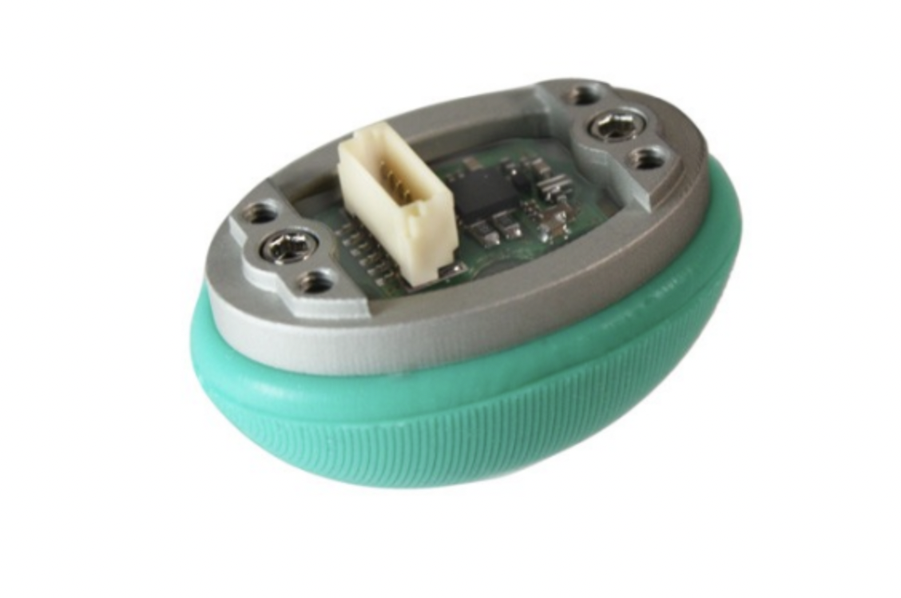

Fingertips
============

PST Sensor
----------
These are simple sensors, fitted as standard, which measure the air pressure within a bubble at
the finger tip. When the finger tip presses on an object, the pressure in the bubble increases.
The sensor incorporates an automatic drift and temperature compensation algorithm
(essentially a high pass filter with an extremely low cut off frequency).

    
Topics
^^^^^^

PST sensor data will be published on the following topics:

  .. code-block::

     /rh/tactile

Example topic message when using PST sensors:

 
  .. code-block::

         header:
         -
         seq: 6306
         stamp: .
         secs: 1660831064
         nsecs: 585176249
         frame_id: "rh_distal"
         pressure: [ 22560, 256, 22560, 22560, 22560 ]
         temperature: [ 32635, 637, 32635, 32635, 32635 ]
         -

BioTacs
-------
The BioTacSP® is a biologically inspired tactile sensor from SynTouch LLC. It consists of a rigid
core surrounded by an elastic skin filled with a fluid to give a compliance similar to the human
fingertip. The BioTac is capable of detecting the full range of sensory information that human
fingers can detect: forces, microvibrations, and thermal gradients. The skin is an easily
replaced, low-cost, moulded elastomeric sleeve.

+-------------------------+-------------------+
|Sensor                   | Update rate       |
+=========================+===================+
| Pressure AC signal      | 2000Hz            |
+-------------------------+-------------------+
| Pressure DC signal      | 90Hz              | 
+-------------------------+-------------------+
| Temperature AC & DC     | 90Hz              |
+-------------------------+-------------------+
| 19 Normal force sensors | 90Hz each         |
+-------------------------+-------------------+

Topics
^^^^^^

* This topic is published by the driver at 100 Hz with data from tactile sensors:

  .. code-block::

     /rh/tactile

  Example topic message when using BioTac fingertip sensors:

  .. code-block::

          tactiles:
          -
          pac0: 2048
          pac1: 2054
          pdc: 2533
          tac: 2029
          tdc: 2556
          electrodes: [2622, 3155, 2525, 3062, 2992, 2511, 3083, 137, 2623, 2552, 2928, 3249, 2705, 3037, 3020, 2405, 3049, 948, 2458, 2592, 3276, 3237, 3244, 3119]
          -
          pac0: 0
          pac1: 0
          pdc: -9784
          tac: 32518
          tdc: 0
          electrodes: [0, 0, 0, 0, 0, 0, 0, 0, 0, 0, 0, 0, 0, 0, 0, 0, 0, 0, 0, 0, 0, 0, 0, 0]
          -
          pac0: 0
          pac1: 0
          pdc: -9784
          tac: 32518
          tdc: 0
          electrodes: [0, 0, 0, 0, 0, 0, 0, 0, 0, 0, 0, 0, 0, 0, 0, 0, 0, 0, 0, 0, 0, 0, 0, 0]
          -
          pac0: 0
          pac1: 0
          pdc: -9784
          tac: 32518
          tdc: 0
          electrodes: [0, 0, 0, 0, 0, 0, 0, 0, 0, 0, 0, 0, 0, 0, 0, 0, 0, 0, 0, 0, 0, 0, 0, 0]
          -
          pac0: 0
          pac1: 0
          pdc: -9784
          tac: 32518
          tdc: 0
          electrodes: [0, 0, 0, 0, 0, 0, 0, 0, 0, 0, 0, 0, 0, 0, 0, 0, 0, 0, 0, 0, 0, 0, 0, 0]

* The following topics are specific for each sensor and update at 100 Hz with data from the biotac sensors, which comprises their pressure,
  temperature and electrode resistance. This topic is published from the */biotac_republisher* node which receives this
  data from the driver via the */rh/tactile* topic.

  .. code-block::

     /rh/biotac_

  Example */rh/biotac_*** topic message:

  .. code-block::

     pac0: 2056
     pac1: 2043
     pdc: 2543
     tac: 2020
     tdc: 2454
     electrodes: [2512, 3062, 2404, 2960, 2902, 2382, 2984, 138, 2532, 2422, 2809, 3167, 2579, 2950, 2928, 2269, 2966, 981, 2374, 2532, 3199, 3152, 3155, 3033]

Optoforce
----------

If the hand has optoforce sensors installed, it is recommended to use the one liner to install the docker container using the “-o true” option. Doing this, everything will be set up automatically.

For more information on setup and getting started with the optoforce sensors, `look here <https://github.com/shadow-robot/optoforce/tree/indigo-devel/optoforce>`_.

Topics
^^^^^^^

Optoforce sensor data will be published on the following topics:

.. code-block::

   /rh/optoforce_**
