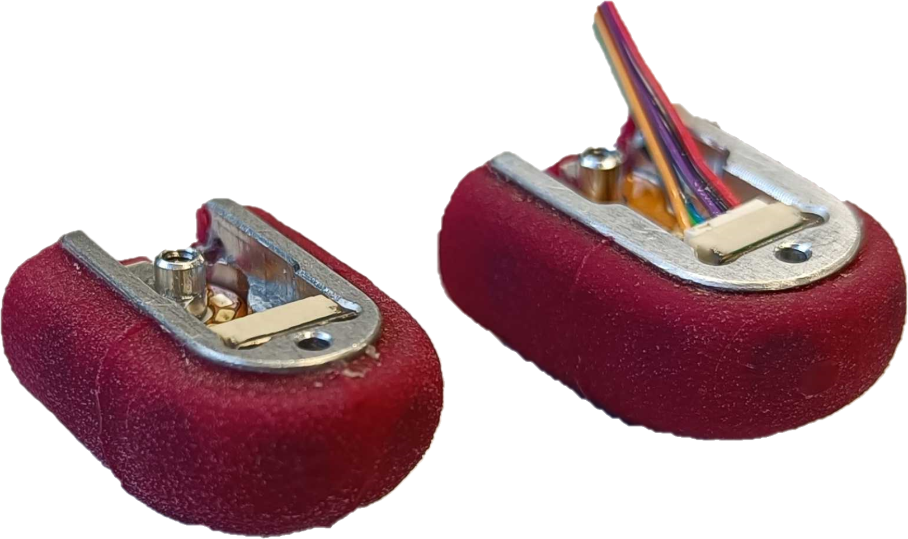
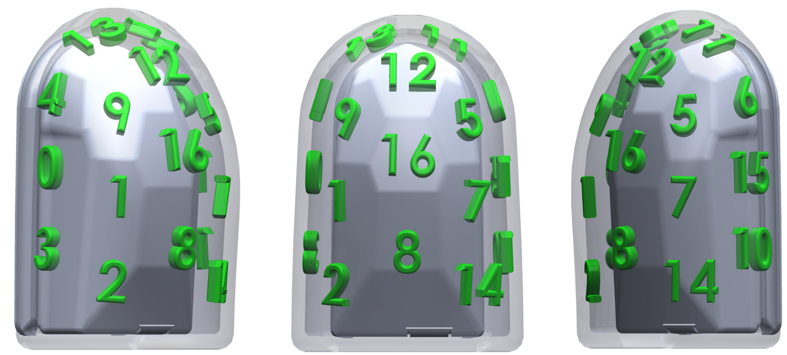
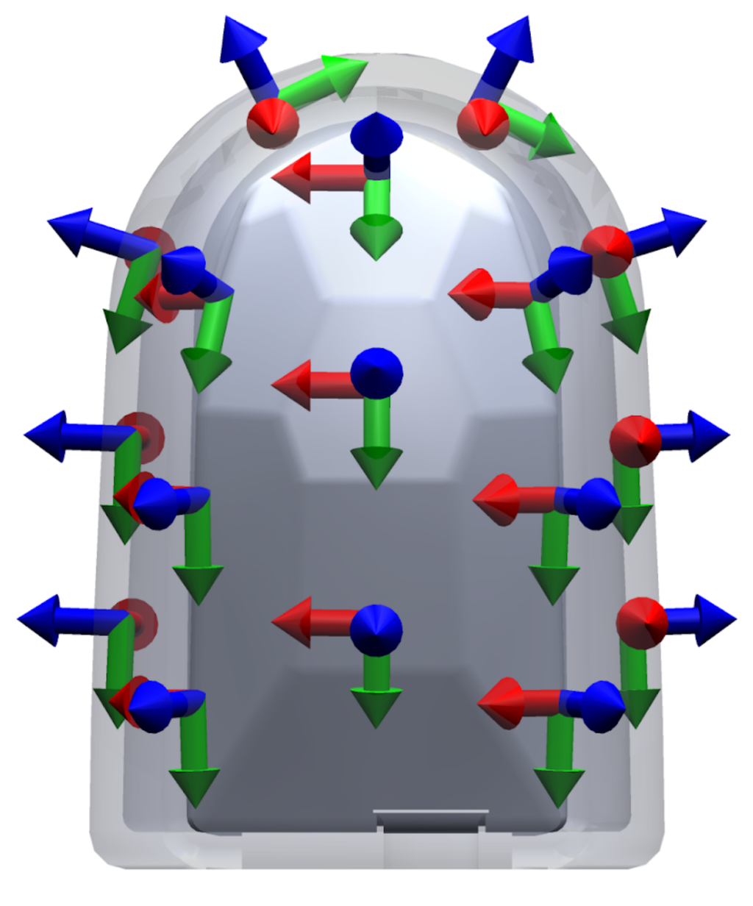
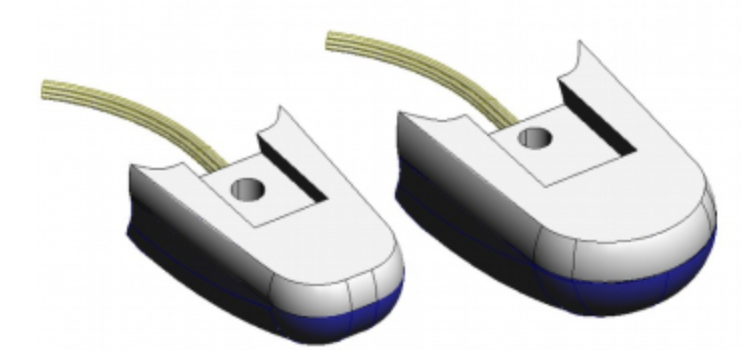
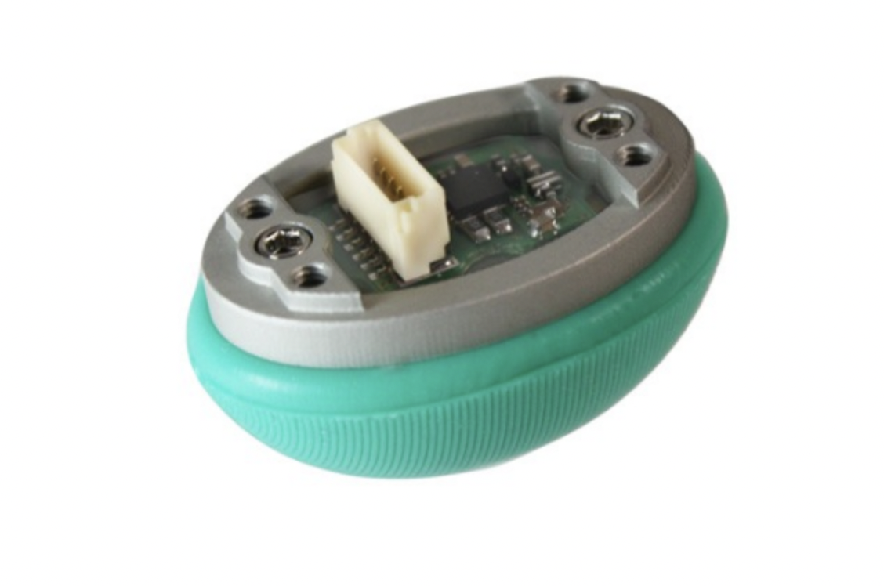

Fingertips
============

STF Sensor
----------

.. important:: The STF sensors are prototype devices provided "as is".
   A few caveats should be considered when operating these sensors:

   • When powered up, the electronic components of the sensors warm up until they reach a stable temperature. During this period, the sensors' magnetic readings are prone to changes.
   • Upon powering up the hand, allow 30 minutes for the sensors' internal temperatures to stabilise.
   • Changes to the room temperature and between the room temperature and the temperature of the interacted objects may also incur changes in the magnetic readings until the internal temperature of the sensors stabilises.
   • The sensors are protected against cross-interference with each other. However, the sensors' magnetic readings are prone to interference from strong external magnetic fields, including interference from the magnetic sensors installed in Shadow hands' joints.

The Shadow Tactile Fingertip (STF) sensors are magnetic-based tactile sensors fitted in the
standard fingertips or (slightly bigger) thumb shapes.

It comprises 17 magnetic sensors evenly distributed at its core. For each sensor, a magnet
is placed on top of a layer of silicone (flesh) that is then covered by another layer of
silicone (skin). That way, any displacement of the magnet will induce a change in the
magnetic field sensed by the magnetic sensor underneath. Each pairing of one magnetic
sensor with a magnet is referred to as a "taxel", and each STF sensor has 17 taxels
(numbered from 0 to 16).

Each magnetic sensor outputs the measured 3D magnetic induction (in respective components x,
y and z), as well as its own temperature. The direction of the fields for each taxel is
represented below, where red represents its x-axis, green represents its y-axis, and blue
represents its z-axis.

    
Topics
^^^^^^

The STF sensor(s) data will be published on the following ROS topics:

  .. code-block:: shell

     /rh/tactile # (on right hands)
     /lh/tactile # (on left hands)

Example topic message when using STF sensors (truncated for simplicity):

  .. code-block:: shell

         header: 
            seq: 49002
            stamp: 
               secs: 1723221458
               nsecs: 531000000
            frame_id: ''
            tactiles: 
            -  ## First finger (FF) Sensor data
               timestamp: 
                  secs: 1723221458
                  nsecs: 531000000
               magnetic_data: 
                  - ## Taxel 0 measured x, y, z magnetic inductions
                  x: -109.0
                  y: 21.0
                  z: -385.0
                  - ## Taxel 1 measured x, y, z magnetic inductions
                  x: -84.0
                  y: 41.0
                  z: -264.0
                - 
                  (...) ## Measured x, y and z magnetic inductions of remaining 15 taxels
               ## Taxels 0-16 temperature data
               temperature_data: [30.76, 30.76, 25.0, 27.87,
                                  26.92, 28.84, 29.79, 26.92,
                                  30.76, 27.87, 27.87, 33.63,
                                  27.87, 34.59, 25.0, 28.84, 29.79]
               status: 0 ## Sensor status information (for debugging purposes)
            - ## Middle finger (MF) Sensor data
               timestamp: 
                  secs: 1723221458
                  nsecs: 531000000
               magnetic_data: 
                  - ## Taxel 0 measured x, y, z magnetic inductions
                  x: -71.0
                  y: 16.0
                  z: -256.0
                  - 
                  (...) ## Measured x, y and z magnetic inductions of remaining 16 taxels
            (...) ## Magnetic and temperature data of remaining RF, LF, and TH
                  ## fingertip sensors, in this order.

The data retrieved by STF sensors installed in each fingertip, first finger (FF), middle finger
(MF), ring finger (RF), little finger (LF), and Thumb (TH) are published in this order. For each
sensor, the 3D **magnetic data** measured at each taxel are first displayed (sequentially, from
taxel 0 to 16), followed by the **temperature data** (in Celsius) measured at each taxel.
Finally, a **status** flag describes whether any issues have been found within the sensor data
or with the sensor itself. If set to -1, this feature is deactivated, and if set to 0, no issues
have been found. If one of your sensors' **status flags** is set to anything other than 0 or -1,
please get in touch with support@shadowrobot.com.

.. note:: If an STF sensor is not installed on any of the fingers, its information is still published but all **magnetic_data** and **temperature_data** will be set to 0.0 (and **status** will be -1).

PST Sensor
----------

.. important:: The PST sensors are no longer in production but will continue to be supported as legacy devices.

The Pressure Sensor Tactile (PST) are simple sensors, fitted as standard, which measure the air pressure within a bubble at
the finger tip. When the finger tip presses on an object, the pressure in the bubble increases.
The sensor incorporates an automatic drift and temperature compensation algorithm
(essentially a high pass filter with an extremely low cut off frequency).

    
Topics
^^^^^^

PST sensor data will be published on the following topics:

  .. code-block:: shell

     /rh/tactile

Example topic message when using PST sensors:

 
  .. code-block:: shell

         header:
         -
         seq: 6306
         stamp: .
         secs: 1660831064
         nsecs: 585176249
         frame_id: "rh_distal"
         pressure: [ 22560, 256, 22560, 22560, 22560 ]
         temperature: [ 32635, 637, 32635, 32635, 32635 ]
         -

BioTacs
-------

.. important:: The BioTac sensors are no longer in production but will continue to be supported as legacy devices.

The BioTacSP® is a biologically inspired tactile sensor from SynTouch LLC. It consists of a rigid
core surrounded by an elastic skin filled with a fluid to give a compliance similar to the human
fingertip. The BioTac is capable of detecting the full range of sensory information that human
fingers can detect: forces, microvibrations, and thermal gradients. The skin is an easily
replaced, low-cost, moulded elastomeric sleeve.

+-------------------------+-------------------+
|Sensor                   | Update rate       |
+=========================+===================+
| Pressure AC signal      | 1000Hz            |
+-------------------------+-------------------+
| Pressure DC signal      | 90Hz              | 
+-------------------------+-------------------+
| Temperature AC & DC     | 90Hz              |
+-------------------------+-------------------+
| 19 Normal force sensors | 90Hz each         |
+-------------------------+-------------------+

Topics
^^^^^^

* This topic is published by the driver at 100 Hz with data from tactile sensors:

  .. code-block:: shell

     /rh/tactile

   
   

  Example topic message when using BioTac fingertip sensors:

  .. code-block:: shell

          tactiles:
          -
          pac0: 2048
          pac1: 2054
          pdc: 2533
          tac: 2029
          tdc: 2556
          electrodes: [2622, 3155, 2525, 3062, 2992, 2511, 3083, 137, 2623, 2552, 2928, 3249, 2705, 3037, 3020, 2405, 3049, 948, 2458, 2592, 3276, 3237, 3244, 3119]
          -
          pac0: 0
          pac1: 0
          pdc: -9784
          tac: 32518
          tdc: 0
          electrodes: [0, 0, 0, 0, 0, 0, 0, 0, 0, 0, 0, 0, 0, 0, 0, 0, 0, 0, 0, 0, 0, 0, 0, 0]
          -
          pac0: 0
          pac1: 0
          pdc: -9784
          tac: 32518
          tdc: 0
          electrodes: [0, 0, 0, 0, 0, 0, 0, 0, 0, 0, 0, 0, 0, 0, 0, 0, 0, 0, 0, 0, 0, 0, 0, 0]
          -
          pac0: 0
          pac1: 0
          pdc: -9784
          tac: 32518
          tdc: 0
          electrodes: [0, 0, 0, 0, 0, 0, 0, 0, 0, 0, 0, 0, 0, 0, 0, 0, 0, 0, 0, 0, 0, 0, 0, 0]
          -
          pac0: 0
          pac1: 0
          pdc: -9784
          tac: 32518
          tdc: 0
          electrodes: [0, 0, 0, 0, 0, 0, 0, 0, 0, 0, 0, 0, 0, 0, 0, 0, 0, 0, 0, 0, 0, 0, 0, 0]

* The following topics are specific for each sensor and update at 100 Hz with data from the biotac sensors, which comprises their pressure,
  temperature and electrode resistance. This topic is published from the */biotac_republisher* node which receives this
  data from the driver via the */rh/tactile* topic.

  .. code-block:: shell

     /rh/biotac_

  Example */rh/biotac_*** topic message:

  .. code-block:: shell

     pac0: 2056
     pac1: 2043
     pdc: 2543
     tac: 2020
     tdc: 2454
     electrodes: [2512, 3062, 2404, 2960, 2902, 2382, 2984, 138, 2532, 2422, 2809, 3167, 2579, 2950, 2928, 2269, 2966, 981, 2374, 2532, 3199, 3152, 3155, 3033]

Optoforce
----------

If the hand has optoforce sensors installed, it is recommended to use the one liner to install the docker container using the “-o true” option. Doing this, everything will be set up automatically.

For more information on setup and getting started with the optoforce sensors, `look here <https://github.com/shadow-robot/optoforce/tree/indigo-devel/optoforce>`_.

Topics
^^^^^^^

Optoforce sensor data will be published on the following topics:

.. code-block:: shell

   /rh/optoforce_**
