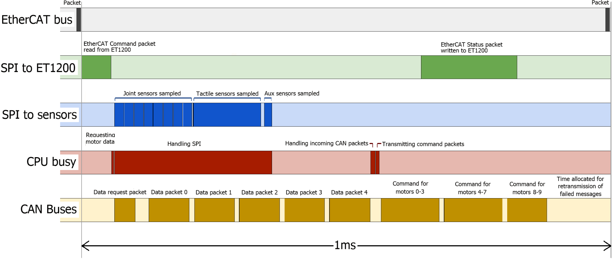
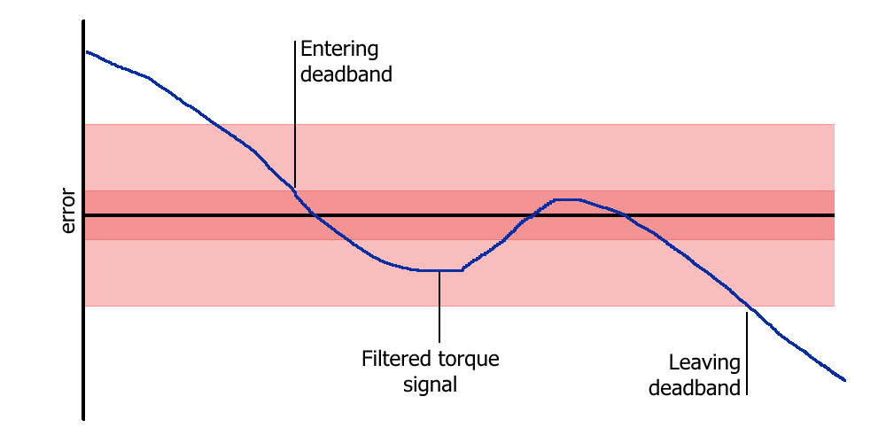
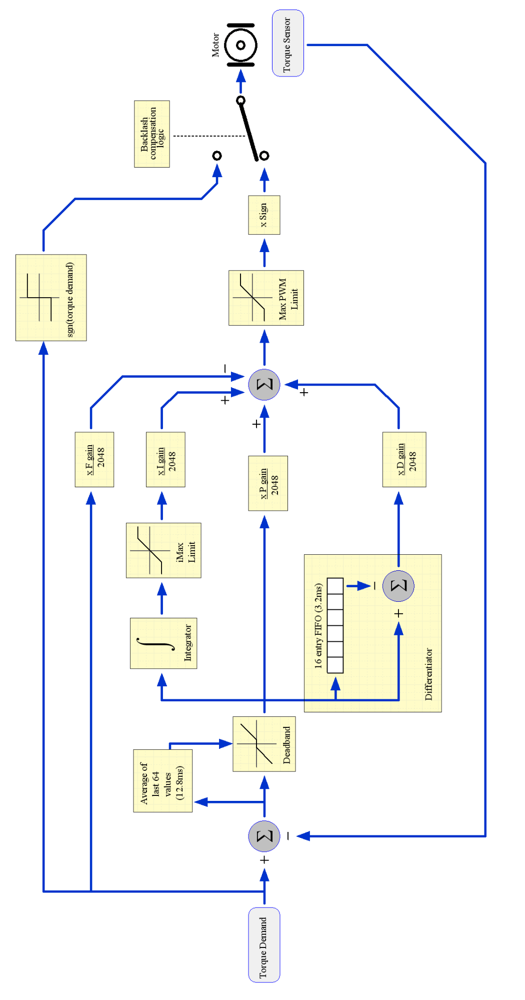

Firmware
==========

Palm firmware
--------------

The palm firmware is responsible for the following:

• Managing the ET1200 EtherCAT ASIC and EtherCAT state

• Receiving command data from the ET1200

• Transmitting the contents of the command packet to the motors

• Receiving data from the motors

• Sampling data from the joint sensors

• Sampling data from the Tactile sensors

• Loading status data into the ET1200

Command data for motor hand
---------------------------

Command data is sent from the host, and received by the palm. It consists of the following:

+----------------------------------+---------------+---------------------------------------------+
| Item                             | Size          | Description                                 |
+==================================+===============+=============================================+
| EDC_Command                      | 32 bits       | Used for switching the palm into test mode  |
+----------------------------------+---------------+---------------------------------------------+
| Motor data type request          | 32 bits       | Which sensor data should the motors return? |
+----------------------------------+---------------+---------------------------------------------+
| Even or Odd motors?              | 16 bits       | Which motors should return data?            |
+----------------------------------+---------------+---------------------------------------------+
| Type of motor demand             | 32 bits       | Are we demanding torque or PWM? Can also    |
|                                  |               | be used to send config values to the motors.|
+----------------------------------+---------------+---------------------------------------------+
| Motor demand data                | 16 bits x 20  | All 20 torque or PWM demands.               |
|                                  |               | May also contain config data for the motors.|
+----------------------------------+---------------+---------------------------------------------+
| Tactile sensor data type request | 32 bits       | Which type of sensor data should            |
|                                  |               | the tactile sensors return?                 |
+----------------------------------+---------------+---------------------------------------------+

Status data for motor hand
--------------------------

Status data is sent from the palm, and received by the host. It consists of the following:

+----------------------------------+---------------+-------------------------------------------------+
| Item                             | Size          | Description                                     |
+==================================+===============+=================================================+
| EDC_Command                      | 32 bits       | Copy of the same value from command data        |
+----------------------------------+---------------+-------------------------------------------------+
| Joint sensor/IMU data            | 16 bits x 37  | All of the joint sensors, the                   |
|                                  |               | Auxiliary Analog channels, and the IMU sensors. |
+----------------------------------+---------------+-------------------------------------------------+
| Motor data type                  | 32 bits       | Copy of the same value from command data        |
+----------------------------------+---------------+-------------------------------------------------+
| Even or Odd motors ?             | 16 bits       | Copy of the same value from command data        |
+----------------------------------+---------------+-------------------------------------------------+
| Which motor data arrived         | 32 bits       | Flags indicate which CAN messages were seen     |
+----------------------------------+---------------+-------------------------------------------------+
| Which motor data had errors      | 32 bits       | Flags indicate that the wrong type of data was  |
|                                  |               | sent by this motor.                             |
+----------------------------------+---------------+-------------------------------------------------+
| Motor data                       | 16 bits x2 x10| Torque + one other sensor from 10 motors.       |     
+----------------------------------+---------------+-------------------------------------------------+
| Tactile sensor data type         | 32 bits       | Copy of the same value from command data        |
+----------------------------------+---------------+-------------------------------------------------+      
| Which tactile data is valid ?    | 16 bits       | Flags indicate which tactile data is valid.     |
+----------------------------------+---------------+-------------------------------------------------+
| Tactile sensor data              |  16 bits x8 x5|                                                 |
+----------------------------------+---------------+-------------------------------------------------+

Time frame
----------

The Palm firmware has a considerable amount of work to complete in the 1 millisecond time frame:

• Detect the incoming EtherCAT packet

• Download the command data from the ET1200

• Request sensor data from the motors

• Sample all of the joint sensors

• Request data from the tactile sensors

• Receive sensor data from the motors

• Transmit demand data to the motors

• Upload status data into the ET1200

In this diagram, we can see a breakdown of the time frame:

**SPI to ET1200:** All of the data must be written to the ET1200, before the next EtherCAT packet arrives. If it does not, then the packet's status data will be filled with zeros.

**SPI to Sensors:** The SPI bandwidth is really the limiting factor in the time frame. Data cannot be written back to the ET1200 until it has been collected by the MCU.

**CPU Busy:** We can see that the CPU is busy for most of the time, communicating with the ET1200, sampling sensors etc.

**CAN buses:** The CAN buses are close to maximum utilization. A little time is left during each frame to allow for re-transmission attempts. The time frame begins with a request-for-data message from the palm. The motors drivers respond immediately with their data. As soon as all 10 messages have been received, the palm sends out the demand values to all motor drivers.

Tactile sensors
---------------

The palm firmware supports different types of tactile sensor. The type of sensor is automatically detected, and the correct protocol is used between the hand and the sensor. The host PC is also informed of the sensor type so that it can interpret the data correctly. If more than one type of sensor is connected, then it is not possible to communicate with any of them, and no tactile sensor information will be available. The host will be informed of the conflict.

Motor Firmware
--------------

The motor firmware is responsible for the following:

• Ensuring the safety of the motor

• Actively controlling the force applied to the tendons by the motor

• Returning sensor data to the host

Safety
------

The motor will be halted under the following circumstances:

• The measured temperature of the motor exceeds 60oC

• The A3950 H-bridge reports a fault

• The CRC for the FPID configuration is bad

• No demand values are seen for 20ms

Sensors
-------

Every motor returns two 16-bit sensor values every 2ms. The first sensor value is usually Torque, and the second is requested by the host. Therefore it is possible for the host driver to modify the transmission rates of the sensors on the fly. By default, the rates are set in the file sr_robot_lib/config/motor_data_polling.yaml , and can be changed by the customer. The customer may also wish to modify the driver to have real-time control over the rates.

Demands
-------

Two types of demand may be sent to the motors, depending on the type of control / debugging desired.
**PWM demand:** This is used for basic position control, and is used by default on a new hand. The PWM demand value is sent straight to the motor, unless there is a safety cutout.

**Torque demand:** This is an alternative method of control. The motor MCU will use its FPID algorithm to maintain the demanded torque at the tendons.

Control
-------

The motor firmware implements an FPID algorithm, running at 5kHz. FPID is a Feed-forward, Proportional, Integral, Derivative algorithm, where a proportion of the torque demand is fed forward to the output. The algorithm supports a number of other features to ensure the safety of the motor, stability of the control and speed of response. See next page for a flow diagram of the control algorithm.

**Deadband:** When the torque is sufficiently close to its target position, ideally we would like the motor to stop, drawing no power, and preventing oscillation. This is achieved with the deadband. This deadband algorithm uses the average of the last 64 torque readings (equivalent to 12.8ms) to decide whether or not the torque target has been reached. It also includes hysteresis to prevent chattering when close to the deadband.

**Derivative:** The derivative is implemented using a 16-entry FIFO (equivalent to 3.2ms). The derivative is the difference between the first and last entries in the FIFO.

**Backlash Compensation:** Due to the mechanical nature of the hand, there must be some slack in the tendons. When the motor changes direction, there will be a short time period while the spool winds in the slack. This is known as backlash, and is a known problem in machine control. Therefore, in order to improve the response time of the controller, the motor is driven at full power when the torque demand changes sign. This takes up the slack as fast as possible. Normal control is resumed as soon as tension is felt on tendon.

