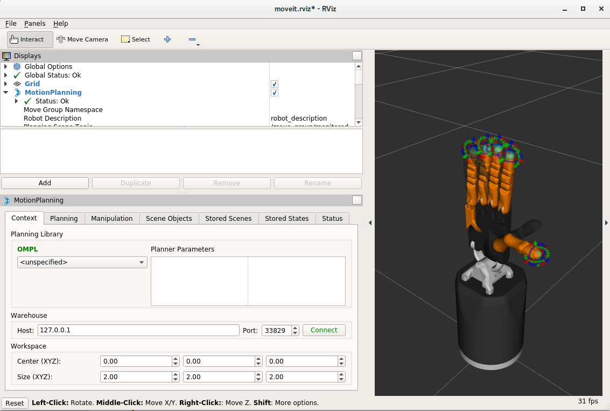
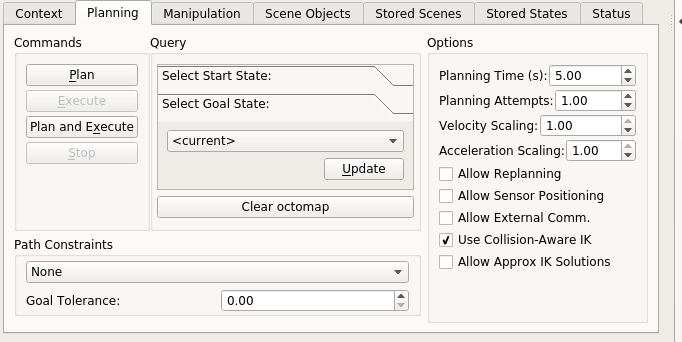
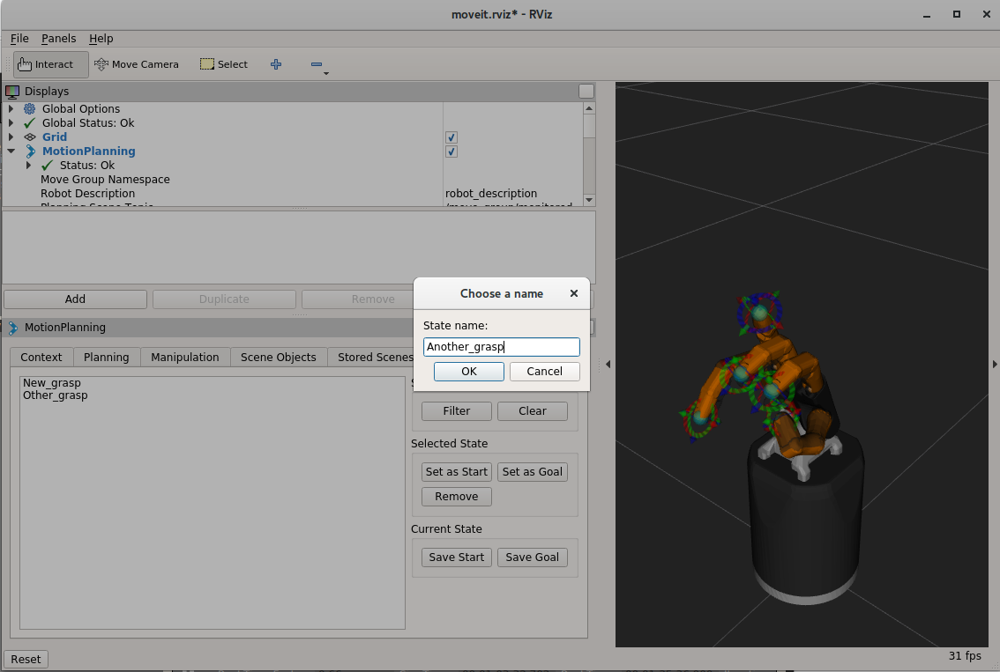
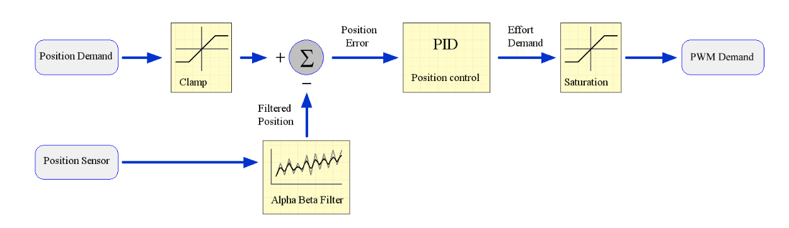

Hand Data
----------

Accessing Data from the Hand
^^^^^^^^^^^^^^^^^^^^^^^^^^^^^

There are three main ways to access data from the hand:

* :doc:`/user_guide/sd_graphical_ui` 
* :doc:`/user_guide/sd_command_line_ui`
* :doc:`/user_guide/sd_application_programming_interface`

Examples of each can be found on the above pages. 

Recording ROS Bags
~~~~~~~~~~~~~~~~~~

A rosbag or bag is a file format in ROS for storing ROS message data. These bags are often created by subscribing to one or more ROS topics, and storing the received message data in an efficient file structure.

The different ways to record and playback ROS bags can be found `here <http://wiki.ros.org/rosbag>`_

Example: Recording and playing a ROS Bag of joint states
********************************************************

To record a ROS Bag of the /joint_states topic for 1 minute and name it `joint_state_bag.bag`. The `command-line tool <http://wiki.ros.org/rosbag/Commandline>`_ can be used:

.. code-block:: bash

  rosbag record --duration=1m joint_state_bag.bag /joint_states

To find information about the rosbag `joint_state_bag.bag`:

.. code-block:: bash

  rosbag info joint_state_bag.bag

To play back this ROS Bag:

.. code-block:: bash

  rosbag play joint_state_bag.bag

The rosbag command-line has many options of how to record and playback various topics that are published, these can be found `here <http://wiki.ros.org/rosbag/Commandline>`_.

Copying data out of the dexterous hand container
************************************************

`docker cp` is a way to copy files/folders between a container and the local filesystem. An extended description can be found `here <https://docs.docker.com/engine/reference/commandline/cp/>`_.

Coping FROM the container TO the file system:

.. code-block:: bash

  docker cp [OPTIONS] CONTAINER:SRC_PATH DEST_PATH

Copying FROM the file system TO the container:

.. code-block:: bash

  docker cp [OPTIONS] DEST_PATH CONTAINER:SRC_PATH

Some of the `[OPTIONS]` include:

+-----------------------------------+------------------------------------------------------------+
|      Name, shorthand              |                 Description                                |
+===================================+============================================================+
| --archive , -a                    |      Archive mode (copy all uid/gid information)           |
+-----------------------------------+------------------------------------------------------------+
| --follow-link , -L                |      Always follow symbol link in SRC_PATH                 |
+-----------------------------------+------------------------------------------------------------+

Saving Robot States
-------------

To save a state you must first be connected to the warehouse. After launching the hand, click the green **Connect** button in the 'Context' tab of rviz.

If you have connected successfully you should see two new buttons, **Reset database** and **Disconnect**, as can be seen in the following picture:

Next, go to the 'Stored States' tab in 'Motion Planning'. Here you have full control over the saved states in the warehouse. You can then follow these steps:

* move the hand to the grasp position
* Go to the 'Planning' tab and in the 'Select Goal State' select 'current' and click **update**.

* Finally, go to the 'Stored States' tab and click the button **Save Goal** under the 'Current State' group. A prompt will appear to ask you to name the state. Once named, you can plan to and from this state.

Controlling the Hand
^^^^^^^^^^^^^^^^^^^^

Control Modes
~~~~~~~~~~~~~

Effort and Torque
******************

ROS uses the concept of effort as something that actuators provide. The word effort is used,
rather than torque, because it can be applied to any type of actuator (rotary, linear, pressure,
etc.), whereas torque only applies to rotary actuators. Since all motors on the Shadow hand are
rotary, we use the words effort and torque interchangeably.

Controller options
********************

The host supports two types of control for the Shadow Hand: torque (effort) control or position
control.

**Teach mode**: No control is implemented on the host. The Effort demand is sent to the motor
which implements it using a 5kHz control loop. See :doc:`/user_guide/sd_firmware`  for details of the
Effort control algorithm.

**Position**: This uses a PID position controller. The output of the host side PID controller is sent
to the motor as a PWM demand. No effort controller is used for position control.

**Trajectory**: This controller allows the user to define a joint space trajectory, that is a series of
waypoints consisting of joint positions. Each waypoint has an associated time. The trajectory
controller uses quintic spline interpolation to produce a position target every 1ms, so that the
position control loop for each joint runs at 1KHz. This allows the user to define a smooth
trajectory and control the speed of the joint.

Writing controllers
~~~~~~~~~~~~~~~~~~~

Rather than use the ROS topics to access sensor data, you will need to write a plugin for the Controller Manager. 
This will give you access to the sensor data at the full 1kHz rate, and allow you to create your own control algorithms 
for the hand. Please see this page for more information about the `Controller Manager <http://wiki.ros.org/ros_control>`_.

The Controller Manager is the node that talks to the hardware via EtherCAT and provides a facility for hosting plugins. The position controllers you have already used are examples of this. Note that the Controller Manager can host any number of running controllers but one should be loaded at a time for a given joint so they don't fight for control.

Deeper settings
~~~~~~~~~~~~~~~

Editing PID settings
********************

The motor controller PID settings are stored in YAML files. You can find the files in the following folder in the
subfolder of your specific hand:

.. prompt:: bash $
          
	roscd sr_hand_config

Changing motor data update rates
*********************************

Each motor can return two sensor readings every 2ms. The first is always the measured torque. The second is requested by the host. This allows the host to decide on the sensor update rate of each sensor. Currently, the rates cannot be adjusted at run-time, and are specified in a file that you can edit. To edit the file:

.. prompt:: bash $
          
   roscd sr_robot_lib/config
   gedit motor_data_polling.yaml

The complete list of motor sensors appears in the file, along with a number

=======     ===========================
Number      Meaning
=======     ===========================
-2          Read once when the driver is launched
-1          Read as fast as possible
 0          Do not use zero
>0          Read period in seconds
=======     ===========================

Sensors set to -1 will be read in turn, unless it's time to read another sensor. Usually 5 sensors are set to -1, meaning that they are sampled at 100Hz.

Fingertips
^^^^^^^^^^

PST Sensor
~~~~~~~~~~~
These are simple sensors, fitted as standard, which measure the air pressure within a bubble at
the finger tip. When the finger tip presses on an object, the pressure in the bubble increases.
The sensor incorporates an automatic drift and temperature compensation algorithm
(essentially a high pass filter with an extremely low cut off frequency).

.. figure:: ../img/sd_pst.png
    :width: 50%
    
Topics
********

PST sensor data will be published on the following topics:

  .. code-block::

     /rh/tactile

Example topic message when using PST sensors:

 
  .. code-block::

         header:
         -
         seq: 6306
         stamp: .
         secs: 1660831064
         nsecs: 585176249
         frame_id: "rh_distal"
         pressure: [ 22560, 256, 22560, 22560, 22560 ]
         temperature: [ 32635, 637, 32635, 32635, 32635 ]
         -

BioTacs
~~~~~~~~
The BioTacSP® is a biologically inspired tactile sensor from SynTouch LLC. It consists of a rigid
core surrounded by an elastic skin filled with a fluid to give a compliance similar to the human
fingertip. The BioTac is capable of detecting the full range of sensory information that human
fingers can detect: forces, microvibrations, and thermal gradients. The skin is an easily
replaced, low-cost, moulded elastomeric sleeve.

.. figure:: ../img/sd_biotacs.png
    :width: 50%

+-------------------------+-------------------+
|Sensor                   | Update rate       |
+=========================+===================+
| Pressure AC signal      | 2000Hz            |
+-------------------------+-------------------+
| Pressure DC signal      | 90Hz              | 
+-------------------------+-------------------+
| Temperature AC & DC     | 90Hz              |
+-------------------------+-------------------+
| 19 Normal force sensors | 90Hz each         |
+-------------------------+-------------------+

Topics
********

* This topic is published by the driver at 100 Hz with data from tactile sensors:

  .. code-block::

     /rh/tactile

  Example topic message when using BioTac fingertip sensors:

  .. code-block::

          tactiles:
          -
          pac0: 2048
          pac1: 2054
          pdc: 2533
          tac: 2029
          tdc: 2556
          electrodes: [2622, 3155, 2525, 3062, 2992, 2511, 3083, 137, 2623, 2552, 2928, 3249, 2705, 3037, 3020, 2405, 3049, 948, 2458, 2592, 3276, 3237, 3244, 3119]
          -
          pac0: 0
          pac1: 0
          pdc: -9784
          tac: 32518
          tdc: 0
          electrodes: [0, 0, 0, 0, 0, 0, 0, 0, 0, 0, 0, 0, 0, 0, 0, 0, 0, 0, 0, 0, 0, 0, 0, 0]
          -
          pac0: 0
          pac1: 0
          pdc: -9784
          tac: 32518
          tdc: 0
          electrodes: [0, 0, 0, 0, 0, 0, 0, 0, 0, 0, 0, 0, 0, 0, 0, 0, 0, 0, 0, 0, 0, 0, 0, 0]
          -
          pac0: 0
          pac1: 0
          pdc: -9784
          tac: 32518
          tdc: 0
          electrodes: [0, 0, 0, 0, 0, 0, 0, 0, 0, 0, 0, 0, 0, 0, 0, 0, 0, 0, 0, 0, 0, 0, 0, 0]
          -
          pac0: 0
          pac1: 0
          pdc: -9784
          tac: 32518
          tdc: 0
          electrodes: [0, 0, 0, 0, 0, 0, 0, 0, 0, 0, 0, 0, 0, 0, 0, 0, 0, 0, 0, 0, 0, 0, 0, 0]

* The following topics are specific for each sensor and update at 100 Hz with data from the biotac sensors, which comprises their pressure,
  temperature and electrode resistance. This topic is published from the */biotac_republisher* node which receives this
  data from the driver via the */rh/tactile* topic.

  .. code-block::

     /rh/biotac_

  Example */rh/biotac_*** topic message:

  .. code-block::

     pac0: 2056
     pac1: 2043
     pdc: 2543
     tac: 2020
     tdc: 2454
     electrodes: [2512, 3062, 2404, 2960, 2902, 2382, 2984, 138, 2532, 2422, 2809, 3167, 2579, 2950, 2928, 2269, 2966, 981, 2374, 2532, 3199, 3152, 3155, 3033]

Optoforce
~~~~~~~~~

If the hand has optoforce sensors installed, it is recommended to use the one liner to install the docker container using the “-o true” option. Doing this, everything will be set up automatically.

For more information on setup and getting started with the optoforce sensors, `look here <https://github.com/shadow-robot/optoforce/tree/indigo-devel/optoforce>`_.

Topics
********

Optoforce sensor data will be published on the following topics:

.. code-block::

   /rh/optoforce_**

Robot descriptions (URDF)
^^^^^^^^^^^^^^^^^^^^^^^^^

We currently have modular xacro files for our robots including hands and arms setups, allowing the robots to start in various configurations. They can be found in our `sr_description <https://github.com/shadow-robot/sr_common/tree/noetic-devel/sr_description>`_ and `sr_interface <https://github.com/shadow-robot/sr_common/tree/noetic-devel/sr_interface>`_ packages.

Shadow Hands
~~~~~~~~~~~~

Unimanual
********

The main xacro file to use is `sr_hand.urdf.xacro <https://github.com/shadow-robot/sr_common/tree/noetic-devel/sr_description/robots/sr_hand.urdf.xacro>`_ when you are using only one of our hands.

The following arguments are available:

* ``side`` - defines the side of the hand. Allowed options: ``right``/``left``
* ``hand_type`` - defines the type of the hand. Allowed options: ``hand_e``/``hand_g``/``hand_c``
* ``hand_version`` - defines version for particular type of hand.
* ``fingers`` - defines which fingers does the hand have, can be ``all`` or a string in a format of ``th,ff,mf,rf,lf`` 

Current allowed configurations are the following:

+--------------+----------------+---------------------+---------------------------+--------------------------+
|              | Dexterous Hand | Dexterous Hand Lite | Dexterous Hand Extra Lite | Muscle_hand (deprecated) |
+==============+================+=====================+===========================+==========================+
| hand_type    |     hand_e     |        hand_g       |           hand_g          |          hand_c          |
+--------------+----------------+---------------------+---------------------------+--------------------------+
| hand_version |   E3M5, E2M3   |         G1M5        |            G1M5           |           C6M2           |
+--------------+----------------+---------------------+---------------------------+--------------------------+
| fingers      |       all      |         all         |            all            |            all           |
|              +----------------+---------------------+---------------------------+--------------------------+
|              | th,ff,mf,rf,lf |     th,ff,mf,rf     |          th,ff,mf         |      th,ff,mf,rf,lf      |
+--------------+----------------+---------------------+---------------------------+--------------------------+

There are also arguments that define where and which sensors are located on the hand. It allows placement of sensors on tip, mid and proximal parts of the fingers as well as the palm. Argument names: ``tip_sensors``, ``mid_sensors``, ``prox_sensors``, ``palm_sensor``. Currently, only sensors at the fingertips are available. There are three fingertip sensor types: ``pst``/``bt_sp``/``bt_2p``.

+-------------+-----+------------------+
|             | PST | Syntouch Biotacs |
|             |     +---------+--------+
|             |     |    2p   |   sp   |
+=============+=====+=========+========+
| tip_sensors | pst |  bt_2p  |  bt_sp |
+-------------+-----+---------+--------+

Bimanual
********

If you have a setup with two robot hands, this is the xacro to use: `sr_hand_bimanual.urdf.xacro <https://github.com/shadow-robot/sr_common/tree/noetic-devel/sr_description/robots/sr_hand_bimanual.urdf.xacro>`_

The following arguments are available (similar to the hand-only scenario but with the side prefix to specify every configuration):

* ``right_hand_type``
* ``right_hand_version``
* ``right_fingers``
* ``right_tip_sensors``
* ``right_mid_sensors``
* ``right_prox_sensors``
* ``right_palm_sensor``
* ``left_hand_type``
* ``left_hand_version``
* ``left_fingers``
* ``left_tip_sensors``
* ``left_mid_sensors``
* ``left_prox_sensors``
* ``left_palm_sensor``

Shadow Hands mounted on UR arms
~~~~~~~~~~~~~~~~~~~~~~~~~~~~~~~~
The main xacros for Universal Robot Arms and Shadow hand systems are: 

Unimanual
********

* `srhand_ur.urdf.xacro <https://github.com/shadow-robot/sr_interface/tree/noetic-devel/sr_multi_description/urdf/srhand_ur.urdf.xacro>`_ 

Additional parameters:

* ``robot_model`` - defines which robot model is used. Allowed options: ``ur10``/``ur10e``/``ur5``/``ur5e``
* ``initial_z`` - defines how high above the ground the robot is spawned

Bimanual
********

* Bimanual arms: `bimanual_ur.urdf.xacro <https://github.com/shadow-robot/sr_interface/tree/noetic-devel/sr_multi_description/urdf/bimanual_ur.urdf.xacro>`_
* Bimanual arms and hands; `bimanual_srhand_ur.urdf.xacro <https://github.com/shadow-robot/sr_interface/tree/noetic-devel/sr_multi_description/urdf/bimanual_srhand_ur.urdf.xacro>`_
  
Additional parameters:

* ``robot_model`` - defines which robot model is used. Allowed options: ``ur10``/``ur10e``/``ur5``/``ur5e``
* ``arm_1_z`` - defines how high above the ground the right robot arm is spawned
* ``arm_2_z`` - defines how high above the ground the left robot arm is spawned
* ``arm_x_separation`` - x separation of the left arm with respect to the right arm
* ``arm_y_separation`` - y separation of the left arm with respect to the right arm

Usage
~~~~~~

For usage example, refer to the xacro files themselves or the `unimanual <https://github.com/shadow-robot/sr_interface/tree/noetic-devel/sr_robot_launch/launch/load_robot_description.launch>`_ and `bimanual <https://github.com/shadow-robot/sr_interface/tree/noetic-devel/sr_robot_launch/launch/load_robot_description_bimanual.launch>`_ launchfiles that use them.
When used with Shadow Hands all the hand parameters are automatically set for you with the autodetection. However, if you are running in simulation or just want to omit the autodetection and set them manually, you can pass the args directly to the launchfile or xacro command. The following are examples on how to use them.

* Launch file:

  .. code-block::

     roslaunch sr_robot_launch srhand.launch side:=right hand_type:=hand_g hand_version:=G1M5 fingers:=th,ff,mf,rf,lf tip_sensors:=ff=bt_2p,lf=bt_sp,mf=pst,rf=pst,th=bt_sp mid_sensors:=none prox_sensors:=none palm_sensor:=none sim:=true

* Xacro command:

  .. code-block::

     xacro <xacro file> side:=right hand_type:=hand_g hand_version:=G1M5 fingers:=th,ff,mf,rf,lf tip_sensors:=ff=bt_2p,lf=bt_sp,mf=pst,rf=pst,th=bt_sp mid_sensors:=none prox_sensors:=none palm_sensor:=none

As far as SRDF’s are concerned, all necessary ones are autogenerated from ``robot_description`` ros parameters spawned to the parameter server.

Autodetection parameters
~~~~~~~~~~~~~~~~~~~~~~~~

For each of the hands, there is a ``general_info.yaml`` file that contains information about the hand and will be used to pass correct arguments to the launchfiles, and further to the xacros. When hand is being autodetected, the script will look into that file, extract all necessary arguments and provide them to the launchfile as a command suffix. All of the "general info" files can be found in `sr_hand_config <https://github.com/shadow-robot/sr_hand_config>`_ repository, inside hand serial folder corresponding to each particular hand.

Hand autodetection 
^^^^^^^^^^^^^^^^^^

This feature (**new in Noetic**) allows users to detect Shadow Hands without knowing the Ethernet interface or the hand serial and run launchfiles without needing to provide detailed information about the hands. It is implemented in the `sr_hand_detector package <https://github.com/shadow-robot/sr_hand_detector>`_ and consists of two scripts.

Installation
~~~~~~~~~~~~~

In all Shadow's docker images the feature will be available out of the box, however, for custom setups, you might need to install it manually. Recommended way is just to use debian installation:

.. code-block:: bash

   sudo apt update && sudo apt install ros-noetic-sr-hand-detector

If for some reason a manual installation is required, you can follow steps below:

1. Clone the repository to your ROS workspace
2. Compile the code
3. Copy both executables of the sr_hand_detector package (found in ``<your_workspace>/devel/lib/sr_hand_detector``) to ``/usr/local/bin``.
4. Give one of the executables capability to access Ethernet devices:

.. code-block:: bash

   sudo setcap cap_net_raw+ep sr_hand_detector_node

Finally, if you want to use the autodetection feature with our launchfiles, you need to clone `sr_hand_config package <https://github.com/shadow-robot/sr_hand_config>`_ into your workspace.

sr_hand_detector_node
~~~~~~~~~~~~~~~~~~~~~
The script is purely for hand detection. Usage: 

.. code-block:: bash

   sr_hand_detector_node

Example output:

.. code-block:: bash

   Detected hand on port: enx000ec653b31a
   Hand's serial number: 634

Apart from the console output, all detected hand Ethernet port names together with corresponding hand serial numbers will be set inside of the /tmp/sr_hand_detector.yaml file.

If there are no hands detected on any of the ports, a warning will be shown:

.. code-block:: bash

   No hand detected on any of the ports!

sr_hand_autodetect
~~~~~~~~~~~~~~~~~~

This script is a launchfile wrapper, and allows users to run Shadow Robot launch files without providing information like hand serial, ethercat port or hand side. Example usage:

.. code-block:: bash

   sr_hand_autodetect roslaunch sr_robot_launch srhand.launch sim:=false

which will effectively run:

.. code-block:: bash

   roslaunch sr_robot_launch srhand.launch sim:=false eth_port:=<eth_port> hand_serial:=<hand_serial> side:=<hand_side> hand_type:=<hand_type> mapping_path:=<mapping_path>

When using the wrapper, all the necessary information is extracted from the `sr_hand_config package <https://github.com/shadow-robot/sr_hand_config>`_.
