Graphical User Interface
-------------------------

The majority of functionality is provided by the software Application Programmer Interface (API). However, a few simple functions are provided in the Graphical User Interface (GUI) to test the hand, validate that it is working correctly, and adjust some of its settings.

Starting the interface
^^^^^^^^^^^^^^^^^^^^^^^
You may open the Graphical User Interface to try out some functions of the hand. From the Docker terminal, type:

.. prompt:: bash $

   rqt

This interface contains a number of plugins for interacting with the EtherCAT hand. Most of them are available from the **Plugins >> Shadow Robot** menu.

Starting the interface with namespaces
**************************************

Namespaces are very useful in ROS because they allow users to isolate elements of the network to prevent accidental 
errors as explained `here <http://wiki.ros.org/Names>`_. In order to open the Graphical User Interface within a certain 
namespace, type:

.. prompt:: bash $

   rosrun rqt_gui rqt_gui __ns:=<namespace>

Robot Monitor
^^^^^^^^^^^^^^
We can check that everything on the robot is working correctly using the Diagnostic Viewer.

**Plugins >> Robot Tools >> Diagnostic Viewer**

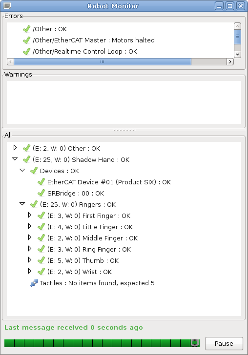

This brings up a dialog box containing a tree of all parts of the robot. All parts should be marked with a green tick.

You can examine one motor in detail by double-clicking on it. This brings up the Motor Monitor dialog. This window can be used to check the status of a motor, or debug any problems.

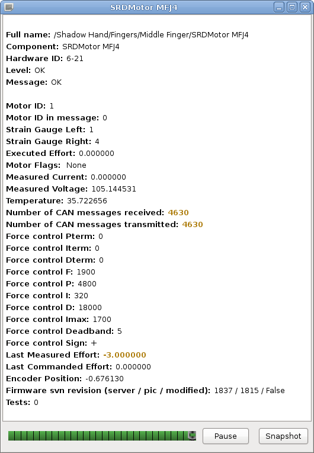

The following table has some more information on what each of these fields means.

+------------------------------------------------+-------------------------------------------------------------------------------------------------------------------------+
|                   Item                         |                                                       Description                                                       |
+================================================+=========================================================================================================================+
| Full Name                                      |                                                                                                                         |
+------------------------------------------------+-------------------------------------------------------------------------------------------------------------------------+
| Component                                      |                                                                                                                         |
+------------------------------------------------+-------------------------------------------------------------------------------------------------------------------------+
| Hardware ID                                    |                                                                                                                         |
+------------------------------------------------+-------------------------------------------------------------------------------------------------------------------------+
| Level                                          |                                                                                                                         |
+------------------------------------------------+-------------------------------------------------------------------------------------------------------------------------+
| Message                                        | Any error or status messages                                                                                            |
+------------------------------------------------+-------------------------------------------------------------------------------------------------------------------------+
| Motor ID                                       | This is the motor number. Range [0..19]                                                                                 |
+------------------------------------------------+-------------------------------------------------------------------------------------------------------------------------+
| Motor ID in message                            | For debugging only                                                                                                      |
+------------------------------------------------+-------------------------------------------------------------------------------------------------------------------------+
| Strain Gauge Left / Right                      | These are the ADC readings from the two gauges                                                                          |
+------------------------------------------------+-------------------------------------------------------------------------------------------------------------------------+
| Executed Effort                                |                                                                                                                         |
+------------------------------------------------+-------------------------------------------------------------------------------------------------------------------------+
| Motor Flags                                    | See motor flags table below                                                                                             |
+------------------------------------------------+-------------------------------------------------------------------------------------------------------------------------+
| Measured current                               | Current flowing through the motor (Amps)                                                                                |
+------------------------------------------------+-------------------------------------------------------------------------------------------------------------------------+
| Measured Voltage                               | The motor power supply voltage. Not the voltage at the motor                                                            |
+------------------------------------------------+-------------------------------------------------------------------------------------------------------------------------+
| Temperature                                    | The temperature measured near the motor. The actual motor winding temperature will be higher than this. (ºC)            |
+------------------------------------------------+-------------------------------------------------------------------------------------------------------------------------+
| Number of CAN messages                         | Received messages should be twice the transmitted messages                                                              |
+------------------------------------------------+-------------------------------------------------------------------------------------------------------------------------+
| Force control P, I, D terms                    | These are the PID terms from inside the motor's torque controller. They may be useful for debugging if plotted.         |
+------------------------------------------------+-------------------------------------------------------------------------------------------------------------------------+
| Force control F, P, I, D, Imax, Deadband, Sign | These are the FPID gain settings used by the motor's torque controller. They can be changed using the Hand Tuning.      |
+------------------------------------------------+-------------------------------------------------------------------------------------------------------------------------+
| Last Measured Effort                           | Difference between the two gauge readings (Torque)                                                                      |
+------------------------------------------------+-------------------------------------------------------------------------------------------------------------------------+
| Last Commanded Effort                          | Torque requested by the host-side control algorithms                                                                    |
+------------------------------------------------+-------------------------------------------------------------------------------------------------------------------------+
| Encoder Position                               | The angle of the joint in radians (ROS always calls this Encoder position, even if the robot uses Hall effect sensors)  |
+------------------------------------------------+-------------------------------------------------------------------------------------------------------------------------+
| Firmware svn revision                          | xxxx: The latest version of the firmware available at build time                                                        |
+------------------------------------------------+-------------------------------------------------------------------------------------------------------------------------+
|                                                | xxxx: The version of the firmware in the motor MCU                                                                      |
+------------------------------------------------+-------------------------------------------------------------------------------------------------------------------------+
|                                                | False: There are no un-checked-in modifications to this firmware. This should never be true.                            |
+------------------------------------------------+-------------------------------------------------------------------------------------------------------------------------+

Hand Tuning
^^^^^^^^^^^^

It is possible to adjust the settings for any of the Position or Force (Motor) controllers.

**Plugins >> Shadow Robot >> Advanced >> Hand Tuning**

Position controller
********************

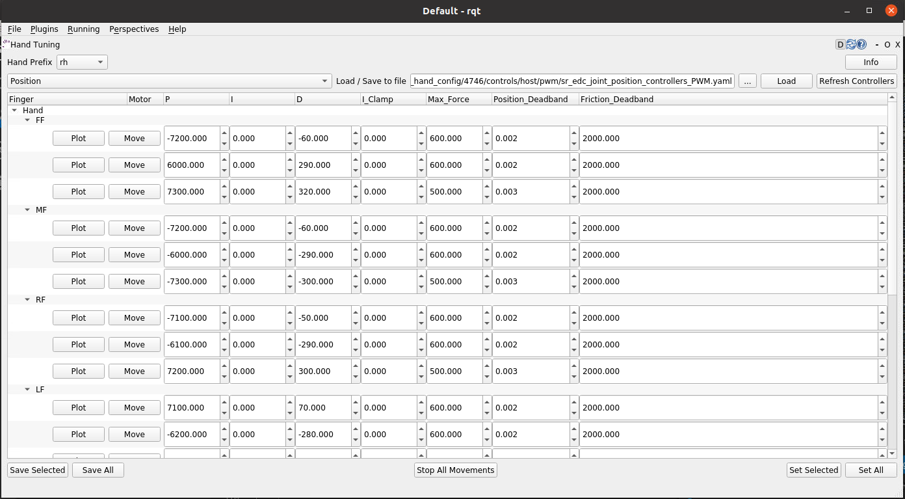

Here you can select a finger, thumb or wrist joints, and adjust the different position control parameters. Click ```Set Selected``` to send the new values to the motors and make them take effect.

* **“P”, “I” & “D” terms:**  Gain parameters of the position PID controller. By default, Shadow tunes the parameters using P or PD combinations. The user can add “I” gains in the control if they consider it necessary.

* **Max_force:** This puts a limit on the output (PWM) value that will be sent from the host to the motor by the position controller. It can be useful when setting up a controller for the first time to limit the motor power to a safe level.

* **Position_Deadband:** The error is considered to be zero if it is within ±deadband. This value should be set as a little more than the noise on the sensor. The units of deadband are the same as the value being controlled. So, the deadband for a position controller is in radians.

Force controller
*****************

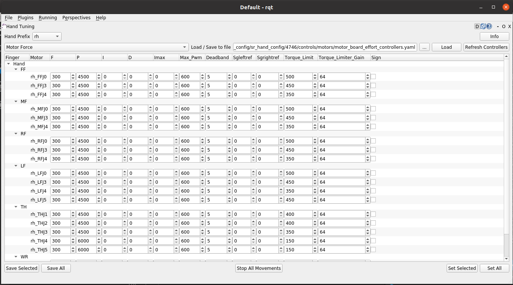
* **“P”, “I” & “D” terms:** Gain parameters of the torque PID controller. By default, Shadow tunes the paramenters using just P gain for the torque control.

* **Max_PWM:** This puts a limit on the final PWM value that will be sent to the motor by the torque controller. It can be useful when setting up a controller for the first time to limit the motor power to a safe level.

* **Deadband:** The error is considered to be zero if it is within ±deadband. This value should be set as a little more than the noise on the sensor. The units of deadband are the same as the value being controlled. The deadband for a torque controller is in the units of the strain gauges.

* **Torque_Limit:** This value is used to limit the PWM at the end of the control loop. The control algorithm reduces the final PWM that goes to the motor making sure that the force in the strain gauge doesn’t overcome this limit value.

Click ```Save``` to save your settings.

Bootloader
^^^^^^^^^^^

The firmware in the motors MCUs can be updated from the PC, without opening up the motor base. This can be done from the GUI. Shadow will send you a new HEX if there is an update.

**Plugins >> Shadow Robot >> Advanced >> Motor Bootloader**

You will see a window listing each motor board, along with its current firmware SVN revision number.

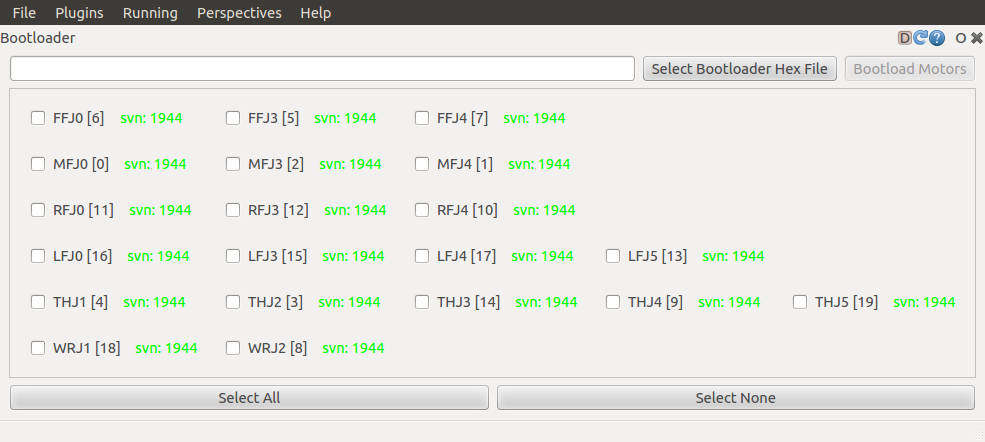
* **Select Bootloader Hex File:** Next, tell the plugin which firmware to use. The file you should choose here is the one sent by Shadow.

* **Select your motors:** Now you may choose which motors to program. Either select one or more motors using the tick boxes, or click the ```Select All``` or ```Deselect All``` button.

* **Program Motors:** Now you can click the ```Bootload Motors``` button. The process is fairly slow, and takes about a 30 second per motor.

.. DANGER:: The change of file should be previously confirmed with us to ensure that is compatible with your hardware. **A wrong motor firmware update can crash the system of the robot**.

Change Robot Control Mode
^^^^^^^^^^^^^^^^^^^^^^^^^^

Use the **Change Robot Control Mode** plugin to load one of the 4 different types of controllers set by default. Simply 
click on a controller type, and it will call a service from the controller_manager to unload the currently running 
controller if necessary, and load the one you've selected.

**Plugins >> Shadow Robot >> Change Robot Control Mode**

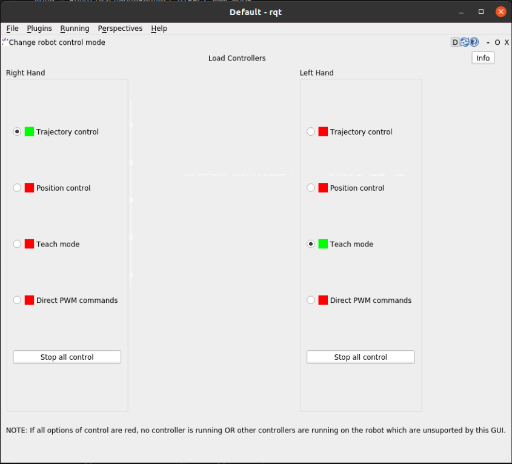
.. note:: Please allow some time between control changes!

Motor Resetter
^^^^^^^^^^^^^^^

If for some reason you need to reset the firmware on a motor, you can either press the reset button on the PCB itself (which requires removal of the base covers), or use this plugin.

**Plugins >> Shadow Robot >> Advanced >> Motor Resetter**

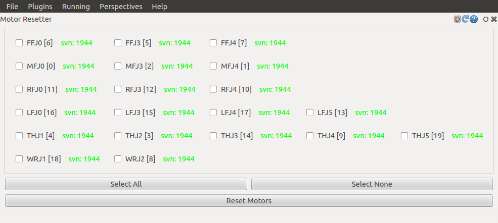
Tick the motors you wish to reset, and click ```Reset Motors```. You should see the corresponding joints jiggle as the motors auto-zero the strain gauges.

Joint Sliders
^^^^^^^^^^^^^^
A simple interface has been provided to control the position of each joint using a slider. 

**Plugins >> Shadow Robot >> Joint Sliders**

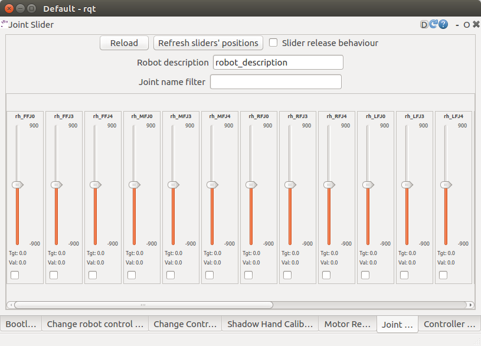
A window with twenty sliders will appear. Moving any slider will cause the corresponding joint on the hand to move. You have to start the hand in either position control or teach mode. If the control is changed, reload the plugin to make sure that the sliders correspond to the control that is running at this moment.

Hand Calibration
^^^^^^^^^^^^^^^^

This plugin is used internally by Shadow to calibrate the raw data from the position sensors. The calibration has to be run on the NUC machine, therefore rqt has to be started from it. To do that, you can use a desktop icon prepared for this purpose (see the ```Shadow NUC RQT``` icon and explanation `here <https://dexterous-hand.readthedocs.io/en/master/user_guide/1_2_10_icons_for_hand.html#main-desktop-icons>`_)

Within rqt, go to:

**Plugins >> Shadow Robot >> Advanced >> Hand Calibration**

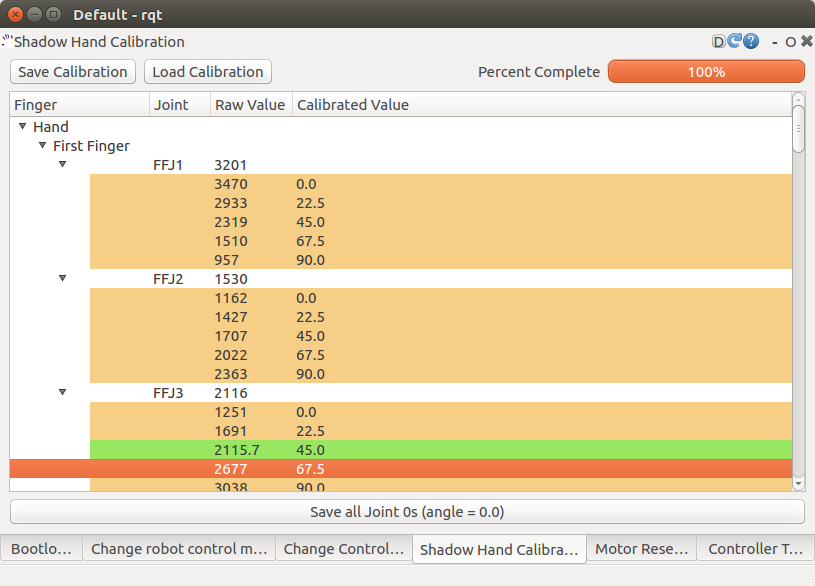
It’s very unlikely that the sensors moved inside the hand, BUT, if you find misalignments with the model and you require a re-calibration, contact Shadow Robot Company `here <support@shadowrobot.com>`_.
  
Data Visualizer
^^^^^^^^^^^^^^^^

A GUI is provided to show all the data available for the Dexterous Hand. 

**Plugins >> Shadow Robot >> Dexterous Hand Data Visualizer**

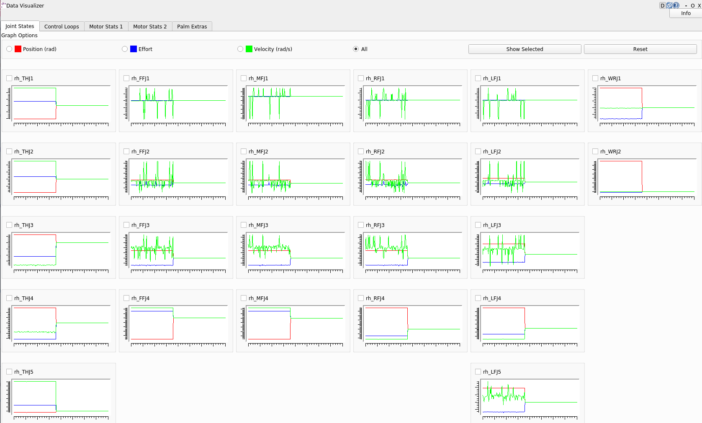
You also can launch it separately from rqt with an optional rosbag by running the following command:

.. prompt:: bash $

   roslaunch sr_data_visualization data_visualizer.launch rosbag_path:=<absolute_path>

In each tab, you can find information about:

* Joint states (position, effort, velocity)
* Control loops (setpoint, input, dinput/dt, output, error)
* Motor stats (Strain Gauge Left, Strain Gauge Right, Measured PWM, Measured Current, Measured Voltage, Measured Effort, Temperature, Unfiltered position, Unfiltered force, Last Commanded Effort, Encoder Position)
* Palm extras (Accelerometer, Gyro-meter, Analog inputs)
* Tactile sensor data (Pressure AC 0, Pressure AC 1, Pressure DC, Temperature AC, Temperature DC)
* Tactile sensor visualizer

The radio buttons let you choose specific data to show (scaled) or you can choose "All" to see several graphs being displayed at the same time (unscaled).

The check buttons next to each graph name allow you to show the graphs you select in larger detail by checking the boxes of the graphs you want to see and clicking “Show Selected”. To return to the full graph view click “Reset”.

This plugin supports a connected hand or a recorded ROS bag. Currently, only 1 hand at a time is supported - in case of two hands connected, the plugin will populate its plots for the first detected hand.

This plugin supports a connected hand or a recorded ROS bag. Currently, only 1 hand at a time is supported - in case of two hands connected, the plugin will populate its plots for the first detected hand.

.. note:: The more graphs that are on show on the data visualizer will be slower and can be unreadable. To be able to see a full scaled view of a specific data type, toggle the correct radio button and check the graphs you want to see clearer.

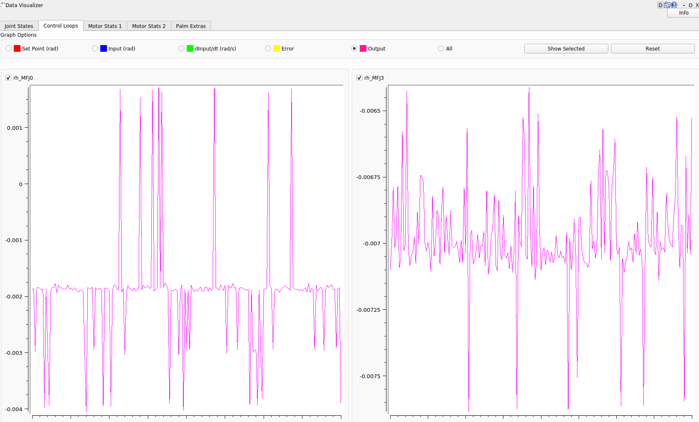

Fingertip visualization
^^^^^^^^^^^^^^^^^^^^^^^^

This is a package to graphically display data coming from the tactile sensors of the Dexterous Hand. 

**Plugins >> Shadow Robot >> Fingertip Visualization**

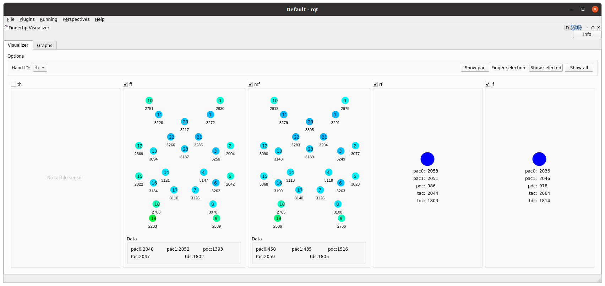

There are 2 available tabs:

* **Visualizer**
* **Graphs**

As a user you can select which hands and corresponding sensors you would like to inspect by selecting the **HandID**.
Selecting a specific finger will enable or disable the refreshing. You have also the possibility to present only selected fingers by pressing **Show selected** or bring back all of the fingers to the tab by pressing **Show all**.

The **Visualizer** tab represents the data in the form of tactile points changing their colours based on the value coming from the sensors. In the case of a Dexterous Hand equipped with Biotacs as tactile sensors, there is also a button which will allow you to switch the visual representation mode of the tactile points between **electrodes** or **pac** values coming from the sensor.

The **Graphs** tab represents the data in the form of plots for all of the data coming from the sensors. Ticking the corresponding checkbox for the datatype will either add or remove the plot from the graph of the finger.

How to use it
**************

The gui can be started via roslaunch with an optional robag. The rosbag will be played with the -l option (infinite loop):

.. prompt:: bash $

   roslaunch sr_fingertip_visualization tactile_visualizer.launch rosbag_path:=<absolute_path>

or as an rqt plugin:

.. prompt:: bash $

   rqt

and go to **Plugins -> Shadow Robot -> Fingertip Visualizer**

This plugin supports presenting the data coming in real time from the Dexterous Hand or from a ROSbag.

Health Check
^^^^^^^^^^^^^^^^^^^^^^^^

The purpose of this GUI is to allow the user to run health checks on a Shadow Hand in order to get its health status. 

**Plugins >> Shadow Robot >> Health Check**

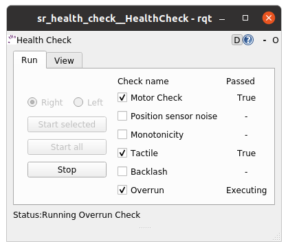

The information can be used to understand the hand's current state and if any issues might require support from the Shadow team.
The `Run` tab allows the user to select which tests are to be executed and can also stop their execution. 

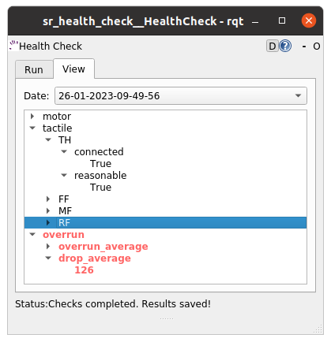

The `View` tab reports the data collected for the health checks at different points in time. In case of a failed check, its font will be red coloured and expanding the tree will allow the user to understand the cause of each problem. 
Checks failing are not an unequivocal sign of the hand malfunctioning, but in case of any performance issues, run the checks and contact the Shadow team for support.
