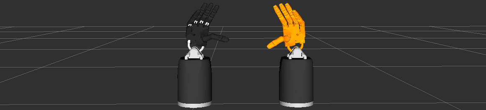
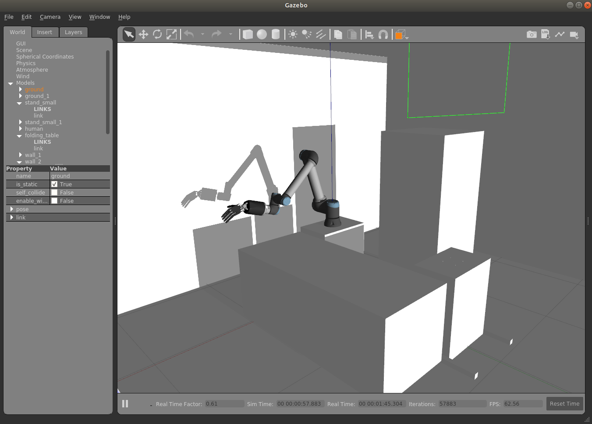
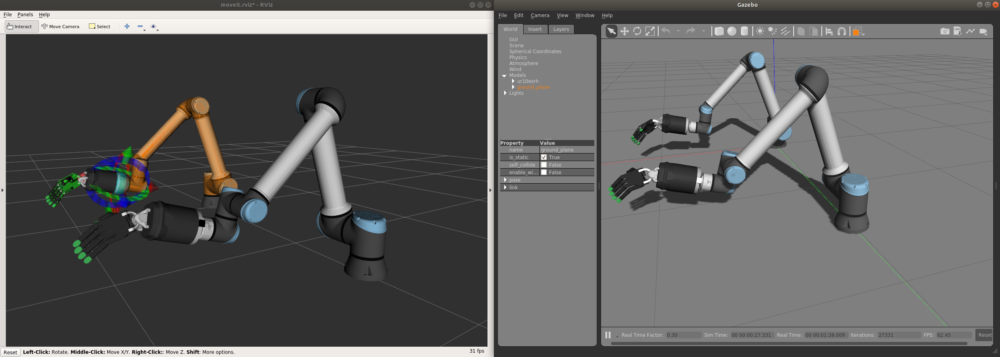
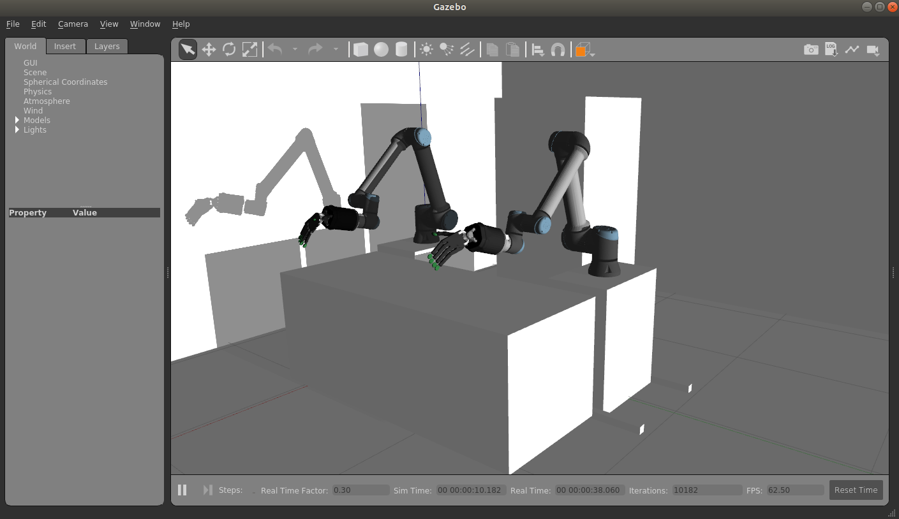

Gazebo
=======

`Gazebo <http://gazebosim.org/>`_ is our default simulator. Follow the instructions on the next section to install and run a simulation of our robot hands using Gazebo.

Starting a robot simulation
------------------------------

First you need to start the hand container by either double clicking the icon ``1 - Launch Server Container`` in the "Shadow Advanced Launchers" folder.

Shadow Dexterous hands
^^^^^^^^^^^^^^^^^^^^^^^

* To start the simulation, you can run:

  .. prompt:: bash $

     roslaunch sr_robot_launch srhand.launch sim:=true 

* If it is a left hand, ``side:=left`` should be added. For example:

  .. prompt:: bash $

     roslaunch sr_robot_launch srhand.launch sim:=true side:=left

* Moveit will enable advanced behaviour (inverse kinematics, planning, collision detectection, etc...), but if it is not needed, you can set ``use_moveit:=false``

Bimanual hand system
^^^^^^^^^^^^^^^^^^^^

To start the simulation of a bimanual system, you can run:

.. prompt:: bash $

   roslaunch sr_robot_launch sr_bimanual.launch sim:=true
   
Unimanual arm and hand system
^^^^^^^^^^^^^^^^^^^^^^^^^^^^^^^
.. figure:: ../img/sim_unimanual_arm_and_hand.png
    :align: center

To start the simulation of a unimanual right system, you can run:

.. prompt:: bash $

   roslaunch sr_robot_launch sr_right_ur10arm_hand.launch sim:=true
  
To add a scene, you can add ``scene:=true`` and you our default scene. You can also add your own scene adding a ``scene_file`` parameter.

Similarly, to start the simulation of a unimanual left system, you can run:

.. prompt:: bash $

   roslaunch sr_robot_launch sr_left_ur10arm_hand.launch

Bimanual arm and hand system
^^^^^^^^^^^^^^^^^^^^^^^^^^^^^

To start the simulation of a bimanual arm and hand system, you can run:

.. prompt:: bash $

   roslaunch sr_robot_launch sr_right_ur10arm_hand.launch sim:=true
  
To add a scene, you can add ``scene:=true`` and you will see our default scene. 

You can also add your own scene adding a ``scene_file`` parameter.
    
Installing the simulator in a different computer
--------------------------------------------------

Follow these instructions if do not have a real hand but would like to use our hand in simulation or you want to install only the simulator in a different computer.

* ROS Noetic (Recommended):

  .. prompt:: bash $

     bash <(curl -Ls bit.ly/run-aurora) docker_deploy product=hand_e sim_hand=true container_name=dexterous_hand_simulated  tag=noetic-release launch_hand=true nvidia_docker=true
     
* ROS Melodic:

  .. prompt:: bash $

     bash <(curl -Ls bit.ly/run-aurora) docker_deploy product=hand_e sim_hand=true container_name=dexterous_hand_simulated  tag=melodic-release launch_hand=true nvidia_docker=true
     
You can also add ``reinstall=true`` true in case you want to reinstall the docker image and container. When it finishes it will show:

.. prompt:: bash $

   Operation completed

and it will create two desktop icons that you can double-click to launch the hand or save the log files from the active containers to your desktop.

If you do not have an Nvidia graphics card, you can set ``nvidia_docker=false`` to avoid using nvidia-docker.

More params and their explanation can be found `here. <https://github.com/shadow-robot/aurora/blob/master/ansible/inventory/local/group_vars/docker_deploy.yml>`_
